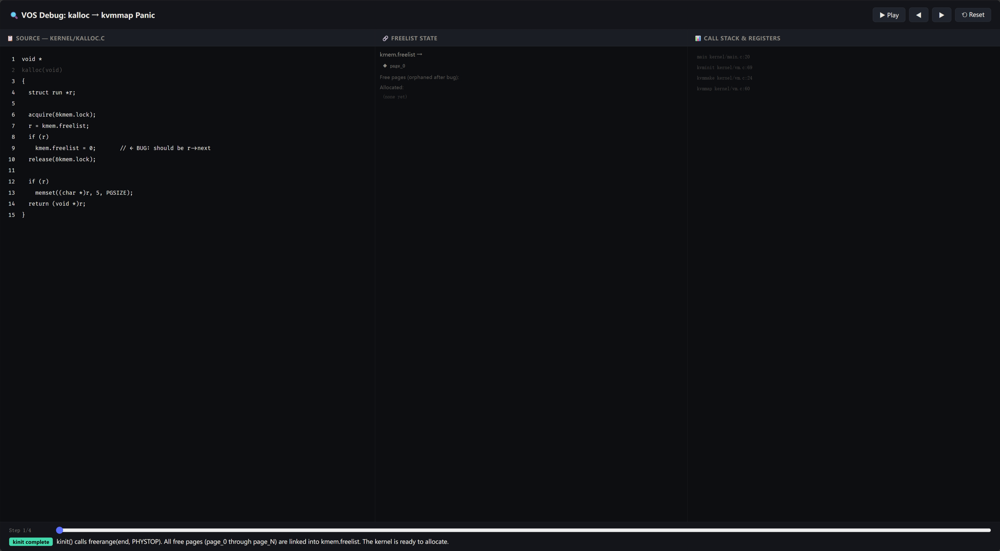
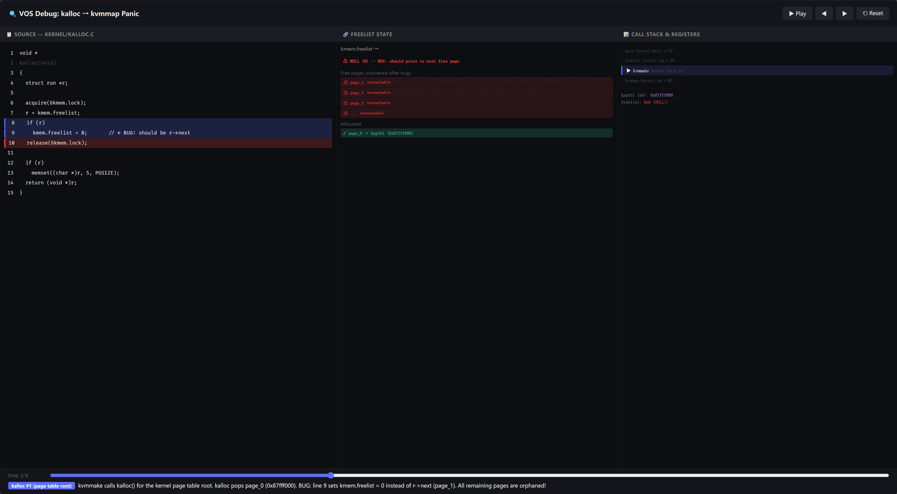
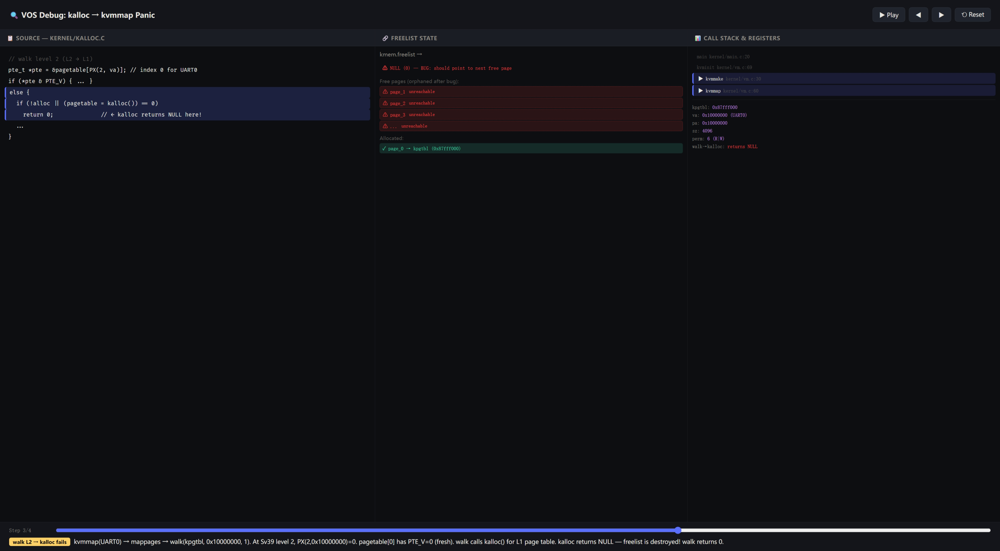
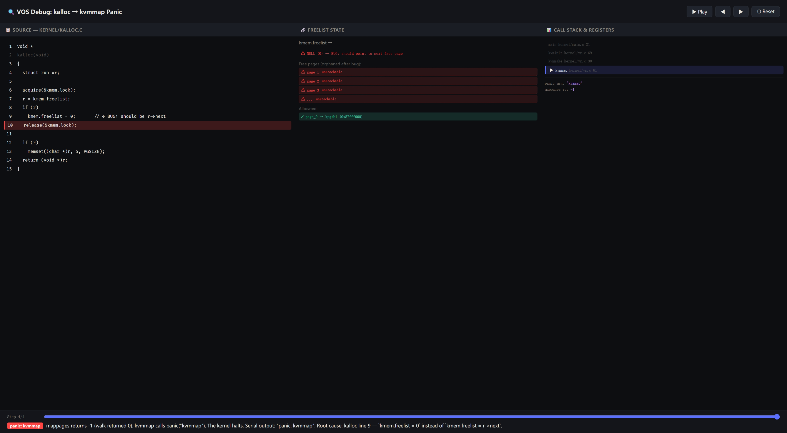

# VeriSpecOSLab：AI 辅助、规格驱动的个性化操作系统教学实验方案

> 参赛队伍：Glenda 指导教师：陈渝，石亮

## 目录

- [第一章 项目概述](#第一章-项目概述)
  - [1.1 项目定位](#11-项目定位)
  - [1.2 三个根本问题](#12-三个根本问题)
- [第二章 背景与问题分析](#第二章-背景与问题分析)
  - [2.1 学生端：OS 实验的"千人一面"](#21-学生端os-实验的千人一面)
  - [2.2 教师端：两个被忽视的痛处](#22-教师端两个被忽视的痛处)
  - [2.3 AI 时代的双重挑战](#23-ai-时代的双重挑战)
  - [2.4 相关工作对比](#24-相关工作对比)
- [第三章 核心设计理念](#第三章-核心设计理念)
  - [3.1 范式转变](#31-范式转变)
  - [3.2 三条线的依存关系](#32-三条线的依存关系)
  - [3.3 交汇点：OperationContract](#33-交汇点operationcontract)
  - [3.4 六个核心能力目标](#34-六个核心能力目标)
- [第四章 个性化：让每个学生定义自己的 OS](#第四章-个性化让每个学生定义自己的-os)
  - [4.1 五个维度的自主设计空间](#41-五个维度的自主设计空间)
  - [4.2 ArchitectureSeed：系统的第一份结构化设计文档](#42-architectureseed系统的第一份结构化设计文档)
  - [4.3 ADR：教师最重要的评价窗口](#43-adr教师最重要的评价窗口)
  - [4.4 递进式 ArchitectureSlice](#44-递进式-architectureslice)
  - [4.5 个性化目标：让学生定义"什么是我的成功"](#45-个性化目标让学生定义什么是我的成功)
- [第五章 指导手册与教学设计](#第五章-指导手册与教学设计)
  - [5.1 "设计导航"型指导书](#51-设计导航型指导书)
  - [5.2 历史驱动的教学](#52-历史驱动的教学)
  - [5.3 分层挑战设计](#53-分层挑战设计)
  - [5.4 跨 ISA 与跨语言](#54-跨-isa-与跨语言)
  - [5.5 物理硬件移植](#55-物理硬件移植)
- [第六章 Agent 治理框架](#第六章-agent-治理框架)
  - [6.1 治理的核心问题](#61-治理的核心问题)
  - [6.2 七个 Agent 身份](#62-七个-agent-身份)
  - [6.3 StageGate：梯度释放](#63-stagegate梯度释放)
  - [6.4 Agent 审计](#64-agent-审计)
  - [6.5 AI Policy 配置](#65-ai-policy-配置)
- [第七章 Agent 核心能力](#第七章-agent-核心能力)
  - [7.1 知识库：可审计引用削减 AI 幻觉](#71-知识库可审计引用削减-ai-幻觉)
  - [7.2 自动插桩调试与可视化](#72-自动插桩调试与可视化)
  - [7.3 ToolchainSpec：消除环境不一致](#73-toolchainspec消除环境不一致)
  - [7.4 KnowledgeBaseAgent：学生的设计问答伙伴](#74-knowledgebaseagent学生的设计问答伙伴)
- [第八章 教师角色升维](#第八章-教师角色升维)
  - [8.1 三个角色转变](#81-三个角色转变)
  - [8.2 六阶段审核表](#82-六阶段审核表)
  - [8.3 评分工具箱](#83-评分工具箱)
  - [8.4 教学 Analytics](#84-教学-analytics)
  - [8.5 差异化教学](#85-差异化教学)
- [第九章 VOS 工具链](#第九章-vos-工具链)
  - [9.1 自动插桩调试](#91-自动插桩调试)
  - [9.2 可视化展示](#92-可视化展示)
  - [9.3 基于 Git commit 的全程追踪](#93-基于-git-commit-的全程追踪)
  - [9.4 自动生成测例与评测](#94-自动生成测例与评测)
  - [9.5 内置 Agent REPL](#95-内置-agent-repl)
  - [9.6 向量知识库 MCP](#96-向量知识库-mcp)
- [第十章 平台架构](#第十章-平台架构)
- [第十一章 参考实现：xv6-spec](#第十一章-参考实现xv6-spec)
- [第十二章 综合对比](#第十二章-综合对比)
- [第十三章 总结与展望](#第十三章-总结与展望)
  - [13.3.1 SpecLab 通用平台架构](#1331-speclab-通用平台架构)
  - [13.3.2 SpecDBLab](#1332-specdblab规格驱动的数据库实验)
  - [13.3.3 SpecLangLab](#1333-speclanglab规格驱动的编译器实验)
  - [13.3.6 形式化验证深度集成](#1336-形式化验证深度集成)
  - [13.3.7 CaseLab](#1337-caselab真实案例驱动的-os-实验)
- [参考文献](#参考文献)

---

## 第一章 项目概述

### 1.1 项目定位

VeriSpecOSLab 是一套面向操作系统课程与系统软件实践的教学实验方案。名字由四个核心要素组成：Veri（可验证）、Spec（规格驱动）、OS（操作系统）、Lab（教学实验）。目标是让每个学生设计并实现一个真正属于自己的操作系统，同时让 AI 作为受约束的协作者参与整个过程，让教师从重复劳动中解放出来，把精力集中到只有教师才能做的事情上——审视学生的设计思维。

这套方案不预设任何内核形态。学生从一份 ArchitectureSeed（架构种子）出发，定义自己系统的五个核心维度——内核组织模型、执行模型、保护模型、通信模型和资源模型——然后在九个递进阶段中持续演化设计，通过 ADR（架构决策记录）为每一个关键设计选择留下理由。AI 不在这个过程中替代学生思考，而是在规格的约束下提供定制化的辅助，且每一步行为都被审计。

方案的核心闭环是：个性化架构设计 → 规格约束 AI → Agent 受控辅助 → 多层级验证反馈 → 教师审核设计思维 → 学生迭代演化。

### 1.2 三个根本问题

这个方案最核心的驱动力来自三个问题。

**学生的困惑**：我能做出一个真正属于我的 OS 吗？传统 OS 实验——比如 MIT 的 6.S081——给学生一套约 9000 行的 xv6 源码框架，学生在预留的代码缺口里补全实现。学完了，学生能写内核模块，但那个内核不是他自己的设计。VeriSpecOSLab 的回答是：从 ArchitectureSeed 开始，不提供任何预制框架，学生在五个维度上自主决策，做出的是带着自己设计印记的系统。

**时代的挑战**：AI 能写完整内核了，学生还需要学什么？这个问题的关键不在于"要不要用 AI"——AI 一定会被用起来，禁止是徒劳的——而在于"怎么用才能保证学生真的学到了"。VeriSpecOSLab 的回答是：不禁止 AI，也不放任 AI。用Agent 身份加能力限制划定 AI 能做什么，用 StageGate 控制 AI 什么时候能做，用完整审计链路记录 AI 做了什么。AI 是受控协作者，不是自由代写者。

**教师的困境**：五十个学生写出五十个不同的 OS，我怎么教、怎么看、怎么评？传统实验中，教师和助教的大量时间被重复劳动吞噬——帮学生排查内存越界、回答"怎么配 QEMU"、判断"这份代码是不是 AI 写的"。VeriSpecOSLab 的回答是：Agent 扛掉重复劳动（自动验证、自动诊断、知识库问答），ArchitectureSeed 和 ADR 提供了审查设计思维的客观材料，证据体系支撑从"终结性评价"到"过程性指导"的转变。

---

## 第二章 背景与问题分析

### 2.1 学生端：OS 实验的"千人一面"

MIT 的 6.S081 是操作系统教学领域最有影响力的实验课程之一。它基于 xv6——一个为教学重新实现的 Unix V6 风格内核，代码量约 9000 行，干净、可读、精心裁剪。学生在 xv6 的框架上完成一系列实验任务：添加系统调用、实现 copy-on-write fork、构建简单的文件系统特性。

这个模式有一个隐蔽的代价：学生学到的是"在别人框架里写代码"，而不是"为什么框架长这样"。全班五十个学生交出五十份代码，但架构是一样的——都是 xv6 的宏内核结构，都是 xv6 的文件系统组织，都是 xv6 的进程模型。教师看到的差异只在于代码实现的细节：这个学生的 syscall 处理更简洁，那个学生的锁用得更小心。但教师看不到学生的设计思维——因为这个实验根本没有要求学生做设计。

清华大学的 rCore 走了另一条路。它基于 Rust 语言和微内核架构，同样提供了完整的框架代码。学生在上面完成实现任务。这条路解决了内存安全问题，但没有解决个性化问题——所有学生还是在同一个预设架构上工作。

共性症结是：学生关注"怎么实现教师的答案"，而不是"为什么这是我的设计"。更深层地说，学生没有机会经历一个系统设计师最核心的训练——面对一个开放的设计问题，在多个可行方案之间做出有理由的选择，从零构建一个真正属于自己的操作系统。

### 2.2 教师端：两个被忽视的痛处

讨论 OS 教学改革时，大家习惯从学生角度看问题——难度太大、框架太复杂、调试太痛苦。但教师端的困境同样严重，而且很少被认真讨论。

**第一个痛处：大量时间消耗在低价值重复劳动上。** 一个典型的 OS 实验课程中，教师和助教要做的事情包括：帮学生排查"为什么我的 QEMU 启动不了"、反复回答"RISC-V 工具链怎么装"、维护各平台版本的安装指南、在学生报 page fault 时帮他们找"页表第三级少了一项"、判断"这份代码是自己写的还是 AI 生成的"。这些事情不是不重要，但它们消耗的是教师最稀缺的资源——时间和注意力。一个教师每周能分给每个学生的时间可能只有十几分钟，这些时间如果都花在 debug 上，就没有时间讨论设计了。

**第二个痛处：评分缺乏设计维度的客观依据。** 传统实验中，教师看到的最终产物是一份代码和一个测试通过率。"48 个测试过了 45 个"——这个分数反映的是正确性，不是设计能力。两个学生都过了 45 个测试，但一个独立设计了内存分配策略并记录了决策理由，另一个照搬了参考实现——在传统评价体系里，他们拿到相同的分数。更麻烦的是，教师很难区分"真懂"和"刚跑通"。一个不理解页表原理的学生，完全可以在 xv6 框架里修改已有代码把测试跑通——因为框架已经把最难的设计决策替他做完了。

总结起来：教师在传统 OS 实验中的角色被挤压到了两个极端——要么花费大量时间在重复劳动上，要么只关注最终结果。中间最重要的角色——用自己的经验与知识帮助引导学生形成自己的操作系统设计思维——被忽视了。

### 2.3 AI 时代的双重挑战

2022 年以来，AI 编程工具的进步速度超出了大多数人的预期。Claude、GPT、DeepSeek 等模型已经能够生成完整的内核模块——启动代码、页表管理、调度器、文件系统，甚至包含并发控制和错误处理。这对 OS 教学构成了两重挑战。

对学生的挑战是：AI 越强，跳过思考的诱惑越大。一个学生在面对"实现 kalloc"的任务时，有三个选择。选择一：读 xv6 源码、理解 freelist 原理、手动实现、反复调试。选择二：把任务描述粘贴到 Claude 里，拿到一段能跑的代码，改改变量名。选择二省时间、省痛苦、得分可能还更高——至少在传统评分体系下如此。但选择二的学生没有学到任何东西。长期来看，他可能变成 prompt engineer——善于描述想要什么，但不知道想要的东西为什么长这样。

对教师的挑战是：AI 代写的代码从最终产物中无法识别。传统的学术诚信判断依赖于"代码风格不一致""变量命名像 AI"这类主观猜测。在 AI 时代，这种猜测既不可靠也不公平——一个认真写代码的学生可能被误判，一个全靠 AI 的学生可能侥幸逃脱。再者如今的 AI 模型智能到已经可以写出质量足够高的代码以通过测试——教师无法再用"测试通过率"来判断学生是否真正的掌握了操作系统的知识。

放任 AI 的后果是学生丧失学习动力，教师丧失评价依据。禁止 AI 的后果是学生失去最有价值的学习工具——AI已经极大的提升了编码效率，并且已经被工业界接纳。未来他们毕业后，会被要求熟练使用 AI 编程工具，如果学校禁止，教学与现实之间的鸿沟将进一步扩大。

我们的回答是：不禁止 AI，也不放任 AI。用一套治理框架让 AI 成为透明、可控、可审计的协作者。这一思路受到 **SYSSPEC 论文**[1] 的直接启发——SYSSPEC 的核心主张是把系统开发的重心从低层代码编写移到高层规格设计，用结构化规格约束代码生成，再用验证反馈修正生成结果。VeriSpecOSLab 将这一思想从文件系统单一模块扩展到了完整操作系统教学实验的全链路。

### 2.4 相关工作对比

| 对比维度 | MIT 6.S081 | rCore | 裸 AI 编程 | VeriSpecOSLab |
|---------|-----------|-------|-----------|---------------|
| 内核形态自由度 | 固定（宏内核） | 固定（微内核） | 不限 | 5 维度自主设计 |
| AI 使用方式 | 未涉及 | 未涉及 | 无约束 | 7 身份 + 能力包受控 |
| AI 治理机制 | 无 | 无 | 无 | StageGate + 审计链路 |
| 验证层次 | 公开测试 | 公开测试 | 无 | 6 层（public→fuzz） |
| 个性化目标 | 不支持 | 不支持 | 无系统支持 | 10 类 + GoalContract |
| 过程性评价 | 无 | 无 | 无 | commit ledger + evidence map |
| 学术诚信保障 | 人工判断 | 人工判断 | 无 | Agent 审计链路 |
| 教师设计审查 | 无专门支持 | 无专门支持 | 无 | ArchitectureSlice + ADR 审核 |
| 教学分析 | 无 | 无 | 无 | 5 类 Analytics 输出 |

---

## 第三章 核心设计理念

### 3.1 范式转变

VeriSpecOSLab 试图推动的不是某个工具的改进，而是一次范式转变。三条线各自对应一种角色的工作方式变化。

**学生线**：传统实验的逻辑是"教师给框架 → 学生补代码 → 跑通测试 → 期末交"。新逻辑是"学生提架构 → 写规格 → Agent 受控辅助 → 持续验证 → 设计演化"。关键变化在于起点——学生不是从一份教师写的代码框架出发，而是从自己对 OS 应该是什么样的思考出发。

**Agent 线**：传统上，AI 在教学中的角色只有两种——要么被禁止（"不准用 ChatGPT"），要么被放任（学生随便用，教师假装不知道）。VeriSpecOSLab 在这两个极端之间开出了第三条路：AI 作为受控协作开发者。它的每一个动作都被严格限制：绑定一个身份（七个之一）、一个能力包（定义能做什么不能做什么）、一个阶段门禁（什么时候可以做）、一条审计记录（做了什么）。

**教师线**：传统上，教师的工作是"检查代码过没过测试 + 帮学生 debug + 期末统一评分"。新定位是"审核设计文档 + 配置治理规则 + 差异化指导 + 基于过程证据的评价"。教师从执行者变成了治理者和指导者。

### 3.2 三条线的依存关系

这三条线相互依存，构成一个不可分割的整体。

**个性化赋予教师"审视设计思维"的可能。** 如果所有学生做同一个内核、填同一套代码缺口，教师只能看"代码对不对"——这只需要一个测试脚本就能判断，教师的专业判断力没有用武之地。但当学生 A 借鉴了 L4 的 Capability 机制但拒绝了它的 IPC 模型，学生 B 保留了 L4 IPC 但选择了完全不同的资源抽象——教师对比的就不是代码相似度，而是设计思维的深度和理由的充分性。个性化制造了差异，差异让教师的专业判断有了发挥空间。

**Agent 把教师从重复劳动中解放。** 自动验证扛掉重复性检查——"48 个公开测试不用教师一个个跑"；自动诊断扛掉常见 debug——"page fault 的原因不用教师帮学生查"；知识库扛掉基础问答——"怎么配 QEMU 不用教师反复回答"。教师被解放出来的时间和精力，投向只有教师才能做的事——审视设计决策、讨论架构权衡、引导设计方向。

**教师是 Agent 治理规则的制定者。** 教师通过 StageGate 配置 Agent 的能力释放节奏——boot 阶段只开放 spec-author 和 knowledgebase，到 memory 阶段才开放 implementer，到 trap 阶段才开放 debugger。教师通过 AI Policy 划清 Agent 的行为边界——"这个实验我想让学生自己设计调度器，所以禁止 Agent 在 process 阶段生成调度代码"。教师不是对 AI 说"不准"，而是说"什么时候可以、可以到什么程度"。

**教师是设计思维的引导者。** 通过阶段审核——ArchitectureSeed 方向审核、ArchitectureSlice 设计审核、ADR 决策审核——教师引导学生在设计空间中前行。零基础的学生按主线走，聚焦"理解原理、完成基本实现"；有经验的学生深入挑战路线——"如果选微内核，IPC 性能如何保证？""如果选 Exokernel，libOS 边界怎么划？"材料相同，深度因人而异。

**Agent 让个性化可规模化。** 五十个学生走五十条不同的设计路线，传统教学力量——一个教师加几个助教——无法为每条路线提供足够的定制化辅助。Agent 可以为每个学生的设计路径提供个性化的规格审查、代码生成、错误诊断和知识问答。个性化不再是一对一辅导才能实现的奢侈。

**个性化让 Agent 使用可评价。** 如果所有学生做同一个内核，Agent 代写的代码千篇一律，教师无法判断谁的代码是 AI 写的。但在个性化架构下，每个学生的 ArchitectureSeed、ADR、ModuleSpec 都是独一无二的——Agent 只能在这些约束下生成代码。教师审查的是"这个学生的设计思维是否体现在这些代码中"，而不是"这段代码和其他四十九份像不像"。

### 3.3 交汇点：OperationContract

三条线在同一个地方交汇：OperationContract（操作契约）。

学生写 OperationContract："我的 kalloc 必须在无可用物理页时返回 NULL，而不是 panic"——这是他的设计意图。

Agent 读 OperationContract——这是它的执行边界。它生成的代码必须满足：无可用物理页时返回 NULL，不 panic。

教师审查 OperationContract——这个设计合理吗？Agent 生成的代码是否在这个边界内工作？

一份 OperationContract 同时回答三个问题：你想做什么（学生）、你能做什么（Agent）、你做对了吗（教师）。这是整个方案中最精巧的设计——它不是一条额外的文档要求，而是三条线自然交汇的枢纽。

### 3.4 六个核心能力目标

方案最终要训练学生的六种能力，每种都对应一套"谁来做什么、谁来审什么"的分工：

- **定义什么是正确**：学生产出 ModuleSpec 和 OperationContract；Agent 做格式检查与一致性审查；教师审查规格是否反映了学生的设计意图，而不是 Agent 的"标准答案"。
- **说明为什么这样设计**：学生产出 ArchitectureSeed 和 ADR；Agent 提供参考系统对比建议；教师追溯决策过程，判断理由是否充分。
- **约束 AI 如何实现**：学生绑定 codegen.targets 到 OperationContract；Agent 以此作为执行边界；教师检查 Agent 是否在边界内工作。
- **验证实现是否满足规格**：学生执行验证并收集证据；Agent 自动执行验证矩阵；教师审查证据而非代码。
- **解释架构取舍**：学生写 ADR 和 FinalSynthesis；Agent 辅助撰写报告素材；教师评价取舍是否经过深思熟虑。
- **维护和演化复杂系统**：学生通过 SpecPatch 演化设计；Agent 分析变更影响范围；教师追踪演化历程，看设计一致性。

---

## 第四章 个性化：让每个学生定义自己的 OS

### 4.1 五个维度的自主设计空间

VeriSpecOSLab 最根本的设计决定是：不预设任何内核形态。学生在五个维度上自主决策，每个维度都不是"选 A 还是选 B"的单选题，而是一个需要给出理由的设计判断。

**第一个维度：内核组织模型。** 学生需要回答一个最根本的问题：哪些东西放在内核里，哪些放在用户空间？选项从宏内核（内核包揽一切）到微内核（内核只做最少的事）形成一个连续谱。选宏内核，IPC 开销低但内核膨胀、bug 影响面大；选微内核，内核精简但 IPC 是性能瓶颈。Exokernel 更进一步，内核只做资源隔离和复用，libOS 在用户空间做抽象。Library OS 和 Unikernel 则走了另一条路——把 OS 功能编译进应用本身，不再有一个独立的"内核"。学生需要说明选择理由、引用经典参考系统、评估预期优势与代价。

**第二个维度：执行模型。** 你的系统里最基本的执行单元是什么——进程、线程、任务、Fiber 还是 Actor？怎么调度——抢占还是协作？用什么优先级模型？阻塞时怎么处理？create、destroy、wait、signal 这些生命周期操作怎么定义？这些问题的答案决定了整个系统的并发行为。

**第三个维度：保护模型。** 特权级怎么设计——RISC-V 的 M/S/U 三级、ARM 的 EL3 到 EL0 四级、还是 x86 的 Ring 0-3？地址空间怎么隔离？用什么权限机制——传统页表、Capability、Handle 权限、还是命名空间权限？用户指针要不要验证？内核对象访问策略是什么？

**第四个维度：通信模型。** 用户态怎么跟内核说话——传统的系统调用、IPC 消息传递、共享内存、还是事件通道？同步还是异步？数据怎么拷——全拷贝、零拷贝、还是共享页？安全检查放在哪一层？通信失败怎么处理？

**第五个维度：资源模型。** 你的系统用什么来表示"一个打开的文件"或"一个网络连接"——FD、Handle、Capability、Port、Object？生命周期怎么管理——引用计数还是所有权转移？资源怎么回收——主动释放还是垃圾回收？能不能撤销一个已经授予的权限？

这五个维度给了教师五个评判学生设计能力的独立视角。两个学生都选了微内核——一个借鉴 L4 的 Capability 但拒绝了它的 IPC 模型，另一个保留了 L4 IPC 但选择了完全不同的资源抽象。教师对比的不是代码相似度，而是设计思维的深度和理由的充分性。

### 4.2 ArchitectureSeed：系统的第一份结构化设计文档

ArchitectureSeed 是每个学生写下的第一份结构化设计文档。它不是"介绍一下你的 OS"的自由作文，而是一份严格格式的 YAML 声明。核心字段包括：

```yaml
# examples/xv6-spec/spec/architecture/seed.yaml
id: xv6-riscv-seed
project: xv6-riscv-kernel
domain: teaching-operating-system
target_platform: riscv64-qemu-virt
architecture_name: xv6-riscv-layered
architecture_summary: >
  A layered RISC-V 64-bit teaching kernel inspired by MIT xv6.
  Core subsystems are built incrementally: boot, memory, trap,
  process, and syscall.

reference_systems:
  - system: xv6-riscv (MIT 6.S081)
    borrowed_concepts:
      - physical page allocator with freelist
      - three-level RISC-V page table (Sv39)
      - trap frame for user/kernel context switch
      - round-robin scheduler
      - syscall dispatch table
      - buffer-cache block I/O layer with LRU eviction
      - logging/journaling for file-system crash safety
    modified_concepts:
      - simplified boot path (single-hart, no S-mode init)
      - spec-driven code generation instead of hand-written C
    rejected_concepts:
      - COW fork (left to later stages)
      - multi-core support (left to later stages)

goals:
  - boot to supervisor mode and print a banner
  - manage physical memory with a page allocator
  - set up Sv39 virtual memory with kernel page table
  - handle traps (interrupts, exceptions, syscalls)
  - create and schedule user processes
  - expose a minimal syscall interface

constraints:
  - riscv64-unknown-elf-gcc toolchain
  - qemu-system-riscv64 virt machine
  - no_std bare-metal (no libc)
  - all code must be traceable to a spec clause
```

`reference_systems` 字段是 ArchitectureSeed 中信息密度最高的部分。学生不仅要说明借鉴了什么，还要说明修改了什么、拒绝了什么、为什么。这四个问题的答案比"代码能不能跑"更能反映学生的研究深度。一个学生写"我参考了 xv6 的文件系统但拒绝了它的 buffer cache 设计，因为我选了日志结构文件系统"——教师一眼就能看出，这个学生不是在照搬参考实现，而是在做有理由的设计选择。

ArchitectureSeed 对教师的价值在于：教师第一次看到了学生的"设计起点"，而不是"代码终点"。传统实验里，教师直到期末才看到完整代码，发现问题为时已晚。现在教师可以在第一周就审核 ArchitectureSeed，发现方向性问题立即纠正。

### 4.3 ADR：教师最重要的评价窗口

ADR（Architecture Decision Record，架构决策记录）是每条关键设计选择的正式记录。格式很简单：背景是什么、做了什么决策、考虑过哪些替代方案、为什么拒绝它们、这个决策会带来什么后果。

两个学生都选了 Sv39 分页。一个写"因为 RISC-V 支持它"。另一个写"因为教学内核只需要 39 位虚地址，Sv48 的额外一级页表遍历开销在教学场景中无收益，而且物理内存只有 128MB，Sv39 的 256GB 地址空间绰绰有余"。同一技术选择，两份 ADR 折射的理解深度完全不同。教师审查的不是"技术选型对不对"，而是"决策过程有没有思维"。这是传统实验中完全缺失的评价维度。

教师判断一份 ADR 质量的标准很简单：理由具体不具体？替代方案被认真考虑了吗？后果被预见了吗？三个问题，比任何测试用例都更能反映学生的真实水平。

### 4.4 递进式 ArchitectureSlice

九个 ArchitectureSlice 对应九个教学阶段，设计不是一次性完成的，而是随课程递进逐步揭示：从 architecture-seed（你的 OS 大致什么样），到 boot（启动路径怎么走），到 memory（物理内存谁来管、虚拟内存怎么映射），到 trap（异常怎么处理），到 process（执行单元是什么、怎么调度），到 syscall（ABI 怎么设计），到 filesystem（持久化怎么组织），到 ipc（消息怎么传），最后到 final-synthesis（整个设计自洽吗）。

递进式 Slice 让教师的审核随教学过程分九个时间节点进行，而非期末一次性。问题早发现、早纠正。教师可以配置哪些阶段必须人工审核、哪些自动放行——这是传统实验中无法实现的教学节奏控制。

### 4.5 个性化目标：让学生定义"什么是我的成功"

个性化目标是 VeriSpecOSLab 最重要的创新之一。在传统 OS 实验中，"成功"只有一个定义——代码跑通了教师给的测试。不管学生的兴趣是性能优化还是安全加固，不管学生的职业方向是嵌入式系统还是云计算基础设施，评价标准完全相同。个性化目标把这个单一标准拆成了十条可选的路。

这个设计的要害在于：它不只是在"做同一个内核"的基础上加几个加分项，而是从根本上改变了学生与实验的关系。当学生选择了"系统调用延迟优化"作为目标，整个系统的设计重心会随之偏移——从数据结构的选择到锁的粒度到 syscall 路径上的每一条指令，都被这个目标重新审视。当另一个学生选择了"镜像体积优化"，他面对的设计问题是完全不同的——哪些功能可以裁剪、哪些数据结构可以压缩、哪些初始化流程可以延迟。同一个实验，不同的目标，导向的是不同的设计思维训练。

#### 4.5.1 十类目标的完整设计空间

十类个性化目标覆盖了操作系统设计的主要价值维度：

**性能类**（三类）。二进制兼容——运行标准 ABI 测试套件，验证系统能正确加载和执行第三方程序。系统调用性能——降低 syscall 延迟和吞吐量开销，目标如"syscall 延迟 < 500 cycles"。IPC 性能——优化跨进程通信路径，目标如"单次 IPC round-trip < 1000 cycles"。

**工程类**（四类）。文件系统优化——提升 IOPS 或降低延迟，目标如"随机读 IOPS > 10000"。镜像体积优化——裁剪不必要的功能和数据，目标如"内核镜像 < 1MB"。启动速度优化——压缩从 bootloader 到 shell 的延迟，目标如"从上电到 shell < 100ms"。硬件移植——将内核从 QEMU 迁移到真实 RISC-V 或 ARM 开发板，验证在真实硬件约束下的正确性。

**安全性类**（两类）。安全隔离——通过渗透测试和权限验证，确保用户态程序无法访问内核内存或绕过权限检查。可验证性增强——通过不变量检查、fuzz 覆盖率和模型检查，提升系统正确性的可证明程度，目标如"fuzz 覆盖率 > 80%"。

**实时性类**（一类）。实时性优化——测量和优化中断延迟和调度 jitter，目标如"最大中断延迟 < 10μs"，要求学生在调度器设计和中断处理路径上做更精确的控制。

这些目标是可组合的。学生可以选择"系统调用性能 + 安全隔离"——一个追求快，一个追求稳，两个目标的张力本身就是优秀的设计训练。

#### 4.5.2 GoalValidationContract：让目标可验证

个性化目标的关键挑战不是"让学生选一个方向"，而是"让教师能客观判断这个方向有没有达成"。GoalValidationContract 是这一挑战的答案——它是一份结构化的验证合约，把模糊的"做得好"翻译成可测量、可复现的量化标准。

一份完整的 GoalValidationContract 包含以下字段：

```yaml
goal_validation_contract:
  goal_id: "syscall-performance"
  goal_name: "系统调用延迟优化"
  student_declaration: "我将 syscall 延迟从基线值 X cycles 降低至 < 500 cycles"
  
  baseline_measurement:
    method: "rdcycle 指令在 syscall 入口和出口采样，取 10000 次调用的中位数"
    baseline_value: 1200  # cycles
    measurement_artifact: ".vos/runs/baseline-syscall-latency.json"
  
  target:
    metric: "syscall_latency_p50"
    operator: "lt"
    value: 500  # cycles
    tolerance: 5  # 允许 5% 的测量误差
  
  verification:
    command: "vos verify goal --contract spec/goals/syscall-performance.yaml"
    required_evidence: ["latency-histogram.json", "methodology-notes.md"]
    reproducibility: "连续 3 次独立运行均满足 target"
  
  design_constraints:
    must_preserve: ["所有公开测试继续通过", "不引入 unsafe 代码"]
    may_modify: ["syscall 分发路径", "参数拷贝策略", "锁粒度"]
```

这份合约解决了三个层面的问题。对学生——你选择的不是一个模糊的方向，而是一个精确的、可验证的承诺。对 Agent——你的辅助必须在这些约束内工作，不能为了降低延迟而破坏安全性约束。对教师——你不需要猜测"这个学生做得怎么样"，你有一份结构化的证据来判断目标是否达成。

#### 4.5.3 目标驱动的测试矩阵

个性化目标不只是"额外跑几个测试"。它会驱动整个验证矩阵的重新派生。

传统的测试矩阵只有一个维度：Base Tests——所有学生都跑同样的公开验证。VeriSpecOSLab 增加了两个派生维度。Design-Driven Tests：从学生的 ArchitectureSpec 自动派生——选了微内核的学生需要额外的 IPC 压力测试，选了宏内核的学生需要额外的内核模块隔离测试。Goal-Specific Tests：从学生的 GoalValidationContract 自动派生——选了系统调用性能的学生需要延迟基准测试，选了安全隔离的学生需要渗透测试套件。

`vos arch derive-tests` 命令读取 ArchitectureSpec 和 GoalValidationContract，自动生成完整的测试矩阵。两个学生的"验证通过"可能有完全不同的含义——一个学生的满分包括性能基准的达成，另一个学生的满分包括安全渗透的全部防御。验证不是在统一的尺度上排名，而是在各自选择的维度上衡量。

#### 4.5.4 目标与评价的深层联系

个性化目标从根本上改变了评分的性质。传统评价只有一个维度——正确性——所以评分就是对正确性程度的连续映射。个性化目标引入了两个新维度：难度（目标本身的技术挑战有多大）和达成度（学生离目标有多近）。

一个选了"镜像体积优化"并成功将内核从 2MB 缩减到 800KB 的学生，和一个选了"系统调用性能优化"并成功将 syscall 延迟从 1200 cycles 降到 480 cycles 的学生——他们不应该被放在同一把尺子上比较。前者的工作重心在编译优化、功能裁剪、数据结构压缩；后者的工作重心在热路径分析、锁优化、缓存友好设计。两种能力都值得肯定，但它们是不同的能力。

评分机制支持这种多维评价：正确性维度（公开测试通过率）人人平等；设计维度（ADR 质量、ArchitectureSlice 评审）看思维深度；目标难度维度——实时性优化 > 性能优化 ≈ 安全隔离 > 镜像体积优化 > 兼容性验证，权重不同；目标达成度维度——是否达到声明的量化标准，证据是否完整可复现。四个维度加权综合，但每个学生的权重分布因其目标选择而异。

个性化目标是教师角色升维最直接的体现。传统实验里，教师说"你的代码跑过了 45 个测试所以 94 分"——学生问"为什么扣了 6 分"，教师说"因为 3 个测试没通过"。这个对话没有教育价值。现在教师说"你的代码正确性满分，你的内存管理 ADR 质量很高，但你选择的系统调用性能优化目标只达成了 80%——我看了你的 latency histogram，发现你的参数拷贝策略还有优化空间，可以参考 L4 的 zero-copy IPC 设计"。这个对话才是教师应该参与的。

#### 4.5.5 目标选择的时机与约束

个性化目标不是开学第一天就选的。学生在 Stage 0 写 ArchitectureSeed 时对自己的系统只有一个模糊的方向感，此时选目标等于盲选。目标选择安排在 Stage 8（personalized-goal），此时学生已经完成了从 boot 到 device 的七个阶段，对自己的系统有了深入的理解，对自己的兴趣和能力也有了清醒的认识。

选择也有约束。选了"硬件移植"的学生需要证明自己有可用的开发板。选了"实时性优化"的学生需要先通过基础的中断延迟测试——证明自己的系统至少具备了可测量的中断处理路径。选了"安全隔离"的学生需要先通过基础权限测试——证明自己的系统至少具备了特权级隔离。这些约束防止学生选择自己无法完成的目标，也防止学生选择与自己的 ArchitectureSeed 矛盾的目标——一个选了宏内核的学生选择"微内核 IPC 性能优化"是不合理的，目标必须与架构设计自洽。

#### 4.5.6 为什么这是个根本性创新

传统 OS 教学实验——包括 MIT 6.S081 和清华 rCore——完全不支持个性化目标。这不是一个"忘了加"的功能，而是传统实验范式本身的限制：当所有学生都在同一个框架里填同一个代码缺口时，客观上不存在个性化目标的空间——因为"成功"的定义已经被框架锁死了。

个性化目标之所以是根本性创新，是因为它倒逼了整个方案的其他设计。有了个性化目标，验证体系就不能只有一套统一测试——所以需要 Goal-Specific Tests。有了个性化目标，评分就不能只有正确性一个维度——所以需要多维评分。有了个性化目标，Agent 就不能对所有学生做同样的辅助——所以需要 ArchitectureSeed 和 OperationContract 作为约束边界。有了个性化目标，教师就不能用同一个标准衡量所有学生——所以需要差异化评价。

个性化目标不是方案的一个"附加模块"。它是整个方案的验证机制：如果你的规格体系、验证体系、Agent 治理、教师评价都做对了，个性化目标就能运转起来；如果其中任何一环有问题，个性化目标就会暴露出矛盾。传统 OS 实验没有个性化目标，不是因为不需要，而是因为做不到——剩下的那套体系撑不起它。

传统实验给学生一套约 9000 行的 xv6 源码框架。学生不理解页表原理，也能靠修改已有代码把测试跑通。从零构建不是增加难度，而是堵住"不理解也能通过"的漏洞。

学生必须先写 ModuleSpec 和 OperationContract——把前置条件、后置条件、不变量和失败语义交代清楚——然后通过 `vos agent generate` 让 Agent 在这些约束下生成代码骨架。这个"先规格、后代码"的流程直接受到 **SYSSPEC 论文**[1] 的启发：SYSSPEC 证明了结构化规格（操作级 rely/guarantee 契约）比自然语言 prompt 更能约束代码生成的质量和正确性。规格是学生理解的外化证据。"能写出规格"比"能跑通代码"更能证明学习效果。

对教师而言，从零构建是角色转变的基础设施。如果不从零构建，学生没有 ArchitectureSeed 可交、没有 ADR 可审、没有 OperationContract 供 Agent 约束——教师就只能回到"看代码对不对"的老路。

---

## 第五章 指导手册与教学设计

### 5.1 "设计导航"型指导书

传统实验指导书是操作手册：第一步装软件，第二步改哪个文件，第三步跑什么命令。VeriSpecOSLab 的指导书换了一种定位——它是一份设计导航。三条核心约束：

第一，描述设计问题，不预设实现方案。指导书说"这个阶段必须解决资源命名和生命周期管理的问题"，不说"用 file descriptor table"。

第二，定义质量门禁，不指定通过方式。指导书说"分配器不能返回已被分配的页"，不说"用 freelist 还是 buddy"。

第三，要求设计理据，不接受"就是这样"。每个决策必须写入 ADR——借鉴了什么、修改了什么、拒绝了什么、为什么。

对教师来说，三条约束等于一个审核框架。教师检查的不是"学生做的是不是和我预想的一样"，而是"学生是否回答了设计问题、是否通过了质量门禁、是否记录了设计理据"。

### 5.2 历史驱动的教学

操作系统的每个机制都不是从天而降的数学定理，而是特定历史条件下的决策。把它们教成"定义+原理+实现"三件套，就切断了学生和这些决策之间的真实联系。

以虚拟内存为例。传统教材的开头通常是"虚拟内存是指将辅存当作内存来使用的技术"。但 1961 年曼彻斯特大学 Atlas 计算机的故事更有教学力量：在此之前，程序员必须手动管理物理内存位置，"我的数据放在 0x2000 到 0x3000，你的程序不能碰那里"——这种约定在批处理时代勉强可行，在多道程序时代完全失控。Atlas 的洞见是让硬件做地址翻译。六十年后，Sv39 三级页表延续了 Atlas 开创的地址翻译思路。

再以 fork 为例。1971 年，PDP-7 只有 8KB 内存，Ken Thompson 和 Dennis Ritchie 做了一件事——"复制当前进程，然后让子进程自己去替换程序"。这个临时方案后来成为 Unix 组合性的基础：fork 和 exec 之间的窗口让 Shell 能偷偷修改子进程的文件描述符和环境变量。Windows NT 走了另一条路——CreateProcess 一步完成 spawn。两种选择都合理，也都有代价。

Meltdown 和 Spectre 被引入教学时，不是作为"安全章节的附录"，而是作为"为什么页表隔离不再是可选的"的教学锚点。一段 2018 年的漏洞披露报告，比十页教科书更有效地回答了"为什么需要页表隔离"。

对教师而言，历史驱动改变了课堂叙事。教师不是在念定义，而是在解释"人类工程师如何一步步做出这些决策"。学生在历史语境中理解权衡，教师在历史语境中展示工程思维。

### 5.3 分层挑战设计

每章标注两条路线。主线：零基础学生聚焦"理解原理、完成基本实现"。挑战路线：有经验学生深入更难的问题——"如果选微内核，IPC 性能如何保证？""如果选 Rust 写内核，unsafe 的边界在哪里？""你现在的设计决策如何影响未来的扩展空间？"

对教师而言，一套材料覆盖了不同层次的学生。挑战路线既是差异化评分的依据，也是一种信号——让学生知道"你现在做的不是这个阶段的全部可能性"。

### 5.4 跨 ISA 与跨语言

方案不绑定特定技术栈。RISC-V、ARM、x86-64 三种 ISA 的关键差异——启动链、特权级、页表结构、中断控制器——以对比表格的形式标注在各章节中。C、Rust、Zig 三种系统编程语言的优劣势同样以对比方式呈现。

不同学校可以根据硬件条件和教学传统选择 ISA 和语言，核心设计方法保持不变。同一班级内也可以允许不同选择——只要学生在 ArchitectureSeed 中声明并论证选择。


### 5.5 物理硬件移植

物理硬件移植是 VeriSpecOSLab 的一项独立创新：将内核从 QEMU 模拟环境迁移到真实 RISC-V 或 ARM 开发板。这不只是"换个平台跑同样的代码"——真实硬件引入了 QEMU 默认规避的约束：启动链不再是 OpenSBI 直启，而是真实的 U-Boot 或 UEFI 流程；设备树需要手动配置而非 QEMU 自动生成；中断控制器的初始化和路由需要逐一核对芯片手册；物理内存布局不再是可以随意假设的平坦模型。这些约束迫使学生在"为什么 QEMU 上能跑但板子上不行"的排查中，深入理解硬件抽象层存在的理由。它是从"教学操作系统"到"真实系统"的关键一步，也是传统 OS 实验（MIT 6.S081、清华 rCore）完全不支持的维度。

---

## 第六章 Agent 治理框架

### 6.1 治理的核心问题

教师对 AI 最大的担忧不是"学生用 AI"，而是三个"不知道"：不知道学生怎么用的——是让 AI 审查规格格式，还是让 AI 代写全部代码？不知道用了多少——90% 的代码是 AI 生成的还是 10%？不知道学到了没有——学生是理解了设计然后让 AI 辅助实现，还是完全不理解全靠 AI 输出？

治理框架要回答三个问题：AI 能做什么（能力边界——七种身份加能力包）、什么时候能做（阶段门禁——StageGate 梯度释放）、做了什么（审计追溯——完整审计链路）。

教师从"禁止 AI 但禁不了"的困境中解脱，变成 AI 使用规则的制定者和审计者。不是对学生说"不准用 AI"，而是说"这个阶段你只能用 AI 帮你审查规格格式，不能让它帮你写规格——因为你现在需要先学会自己做内存模型的设计决策"。

### 6.2 七个 Agent 身份

Agent 不是"一个 AI 助手"，而是七个不同的身份，每个身份绑定一套严格的能力包。学生每次会话必须选择一个身份，身份决定了 Agent 能读什么、能写什么、能执行什么命令。

在实现中，每个 Agent 身份通过 `AgentTaskProfileConfig` 精确定义，身份和能力的绑定在编译时确定，运行时不可越权：

```ts
// vos/apps/vos-agent/app/agent/profiles.ts
const PROFILE_CONFIGS: AgentTaskProfileConfig[] = [
  {
    promptId: "spec-assistant.v1",
    mode: "deep",
    taskKinds: ["spec_revision", "spec_patch"],
    toolProfile: "readonly-spec",        // 能力包：只读 spec
    skills: ["os-spec-authoring"],
    outputSchema: "spec_revision_draft.v1",
    visibilityScope: "agent-public",
  },
  {
    promptId: "debug-agent.v1",
    mode: "smart",
    taskKinds: ["debug", "explain_log", "failure_triage"],
    toolProfile: "readonly-debug",       // 能力包：只读调试
    skills: ["gdb-debug", "qemu-monitor", "visualization"],
    outputSchema: "debug_output.v1",
    visibilityScope: "student-public",
  },
  // ... 共 11 个 task profile，每个绑定唯一的 toolProfile + skills
];
```

`Spec-author` 帮学生写 ModuleSpec 时做格式指导和一致性检查——从 Stage 0 就开放，因为写规格是学生自己的事，Agent 只是格式助手。教师审查的不是格式对不对，而是规格是否表达了学生的设计意图，而非 Agent 的"标准答案"。

`Implementer` 在规格审核通过后生成代码骨架——Stage 1 才开放，必须先写好规格。教师审查的是代码是否偏离了规格，而不是代码是否"看起来对"。

`Debugger` 在 QEMU panic 时自动分析日志定位问题，并且可以帮助学生进行调试，并以可视化的方式展现——Stage 3 才开放，因为 boot 和 memory 阶段的 bug 相对简单，鼓励学生自己排查。教师看的是学生是否理解了 Agent 的诊断，而非盲目照改。

`Reviewer` 在提交前做自查——实现是否偏离了规格？Stage 5 开放，到 syscall 阶段代码量变大，人工审查规格一致性变得困难。教师看审查报告中的风险标记是否合理。

`Reporter` 在阶段末自动生成设计报告——Stage 5 开放。教师审查报告是否准确反映了学生的设计，而非 Agent 的"美化"。

`Toolchain-author.` 维护构建语义——Stage 1 开放，Agent 根据学生的语义描述生成 Makefile 或 CMake。教师不审查构建系统——它是工具，不是学习目标。

`Knowledgebase` 回答设计问题——"微内核和宏内核在内存管理上的核心取舍是什么？"从 Stage 0 就开放，因为理解设计需要知识。但它是只读的——不能写工作区。教师审查引用来源是否准确，防止被 AI 幻觉误导。

这个表格是教师配置 AI Policy 的操作手册。每行回答三个问题：这个身份让学生干嘛？我应该什么时候给学生用？我怎么看学生用得对不对？

### 6.3 StageGate：梯度释放

StageGate 是教师手中最核心的治理工具。它不是二元开关——"用 AI"或"不用 AI"——而是一个七级的梯度：

Stage 0（architecture-seed）：只开放 spec-author 和 knowledgebase。学生从第一天就可以让 AI 帮助理解设计问题，但 AI 绝对不能替学生写第一行代码，直到学生自己先写出了规格。

Stage 1（boot）：加入 implementer 和 toolchain-author。学生已经写出了 ArchitectureSeed 和 boot 阶段的 ModuleSpec，AI 可以在这些约束下生成代码。

Stage 3（trap）：加入 debugger。boot 和 memory 的 bug 相对简单，鼓励学生自己排查。到了 trap 阶段，异常处理的调试复杂度上升，Agent 的诊断能力才被释放。

Stage 5（syscall）：加入 reviewer 和 reporter。代码量变大，人工审查规格一致性变得困难，Agent 辅助审查和报告生成变得合理。

Stage 6+（filesystem/device）：全部身份开放。

这个释放节奏体现了核心教学理念：早期阶段保护设计思维训练的空间，后期阶段释放效率工具。教师可以根据教学需要灵活调整——如果发现某个阶段全班都在滥用 debugger，就把 debugger 的开放推迟一个阶段。

### 6.4 Agent 审计

审计链路从 Agent 会话记录开始，经过工具调用序列、代码变更 diff、验证结果，最终落在 commit ledger 中。每次 Agent 代码生成操作从 clean tree 开始，生成后自动创建 VOS 管理的 Git commit。人类 commit 也需要声明 `collaboration_intent`——是否基于 Agent 输出、AI 辅助到什么程度。

教师不再靠"代码风格像不像 AI"做主观判断。审计不是不信任，是可追溯。"AI 写的是 AI 写的，我写的是我写的"——学术诚信不再依赖于学生的自觉，而建立在可追溯的证据之上。

教师还能从审计数据中发现教学问题：某个学生过度依赖 Agent？某个阶段全班 AI 使用率异常高？这些信号比"我感觉这届学生用 AI 多了"更有价值，也更能支撑教学调整。

### 6.5 AI Policy 配置

教师通过 AI Policy 定义 AI 的行为边界：允许哪些 Agent 身份、允许哪些 vos 命令、允许访问哪些路径、允许引用哪些知识来源。Policy 可以版本化——教师根据教学反馈随时调整。

AI Policy 是教学意图的技术表达。"这个实验我想让学生自己设计调度器，所以禁止 Agent 在 process 阶段生成调度代码"——这样的教学意图通过 Policy 得到强制执行，而不是靠口头提醒。"别忘了自己写调度器"——学生可能"忘记"。"Agent 在 process 阶段不可用 implementer 身份"——学生没法"忘记"。

---

## 第七章 Agent 核心能力

### 7.1 知识库：可审计引用削减 AI 幻觉

vos-kb 是整个方案对抗 AI 幻觉的核心机制。知识来源分三类：course 源——课程讲义和实验手册，教师审核过的权威知识；project 源——学生自己项目的 spec、公开证据和代码文件；external 源——批准的网页快照、标准文档和参考源码。

每次 Agent 回答必须附带引用来源——source_id、title、object_ref。学生和教师都可以追溯信息的真实出处。学生 ADR 中如果引用了某个不存在的研究，教师可以追溯到是 KB 中哪个外部源出了问题。

对教师而言，知识库解决了四个问题。第一，教师从"反复回答基础问题"中解放——学生先问 KB，KB 引用讲义回答，教师只处理 KB 无法回答的深层问题。第二，教师可以分析学生的搜索和引用模式——全班在"虚拟内存的 copy-on-write"这个知识点上普遍困惑，据此调整下周教学重点。第三，教师通过 KB 源的质量控制确保 AI 不会给学生灌输未经审核的信息。第四，强制引用让教师能检查学生是否被 AI 的错误信息带偏。

### 7.2 自动插桩调试与可视化

debugger.v2 承担了传统实验中教师和助教最耗时间的工作。Agent 读取 QEMU panic 日志，自动推断失败原因，在隔离的 Git worktree 中注入诊断代码，重建运行，分析输出，自动清理。

`vos debug explain-log` 把"page fault at 0xdeadbeef"翻译成"你的页表在 0x1000 处缺少了 L2 条目，可能是因为 kvmalloc 没有为这个范围建立映射"。学生看到的不再是冰冷的寄存器 dump，而是"你的设计在这里出了问题"。

QMP（QEMU Machine Protocol）集成让 Agent 能获取寄存器状态、内存映射、页表遍历等运行时信息。教师可以在课堂上通过可视化演示调度策略效果、页表遍历过程，让抽象的系统行为变得直观可观察。

对教师而言，这些能力把省下的时间投向设计层面的指导——跟学生讨论"你的 IPC 设计为什么在高负载下性能退化"，而不是"你的页表第三级为什么少了一项"。

### 7.3 ToolchainSpec：消除环境不一致

ToolchainSpec 把构建系统拆成两层：学生写一份语义 spec——源文件、编译标志、链接约束、依赖关系；Agent 为不同场景起草不同工具链实现——Makefile、CMake、xtask、Bazel、Cargo。`vos build` 在执行前做五重校验：路径、spec hash、manifest、ledger、dry-run。环境自动探测在校验阶段完成——工具版本、target triple、ABI 在 build 前自动确认。

"在我电脑上能跑"是传统 OS 实验最常见的教学障碍。ToolchainSpec 把环境一致性问题从学生手上接过来。教师不再需要维护各平台安装指南的冗长附录。

### 7.4 KnowledgeBaseAgent：学生的设计问答伙伴

KnowledgeBaseAgent 被刻意设计为"不直接给答案"。它遵循五条教学契约：始终命名当前阶段与规格范围、指出被保护的教学目标、引用 KB 来源、建议下一步设计检查、不绕过学习目标给完整解决方案。

它的成功标准不是回答流利度，而是帮助学生达到阶段设计目标并保持教学效果。学生问"微内核和宏内核在内存管理上的核心取舍是什么"——它从课程讲义和参考文档中提取关键信息，附上来源引用，然后建议"先把这个取舍写入你的 ADR-002，再决定你的内核组织模型"。

对教师而言，KnowledgeBaseAgent 像一个可以同时服务五十个学生的设计问答伙伴，能处理设计阶段遇到的基础问题，但不会直接给出完整答案。教师的答疑时间从"回答基本概念问题"变为"讨论深层设计权衡"。

---

## 第八章 教师角色升维

### 8.1 三个角色转变

VeriSpecOSLab 给教师带来的变化可以浓缩为三次转变。

**第一次转变：从"批改作业的人"到"设计审核者"。** 以前教师看到的是学生期末提交的最终代码，做的是跑测试脚本、看通过率、打分。现在教师从 Week 1 的 ArchitectureSeed 开始，审核的是设计文档——方向对不对？取舍有没有理由？前后一致吗？教师不是判断"代码能不能跑"（这件事 AI 也能做），而是判断"设计思维好不好"（这件事只有教师能做）。

**第二次转变：从"高级调试员"到"规则制定者"。** 以前教师的时间花在帮学生排查内存越界、页表错误、环境问题上。现在 Agent 扛掉了这些重复劳动，教师的时间投向配置 StageGate 释放节奏、AI Policy 边界、Rubric 评分权重——这些都是教学治理层面的决策，考验的是教师的专业判断力，而非调试技巧。

**第三次转变：从"终结性评价者"到"过程性指导者"。** 以前教师只在期末做一次评分——事后宣判。现在教师从九个阶段持续追踪——ArchitectureSeed、ADR、Slice、实现、证据、AI 使用模式都是评价对象。教师不是等到期末才说"你的设计有问题"，而是在 Week 2 就指出"你的 ArchitectureSeed 中目标范围太大，non-goals 不够清晰"。

### 8.2 六阶段审核表

| 阶段 | 教师看什么 | 与传统实验的区别 |
|------|-----------|----------------|
| architecture-seed | 目标范围合理吗？设计方向有理由吗？ | **传统中这一步不存在。教师第一次看到学生作品就是最终代码** |
| boot-minimum | boot chain 设计合理吗？可观察性足够吗？ | 传统：只看能不能打出 Hello World |
| memory-management | 内存模型自洽吗？分配器不变量完整吗？ | 传统：只看 allocator 测试过没过 |
| syscall-ipc | ABI 设计合理吗？错误语义完整吗？ | 传统：只看 syscall 测试过没过 |
| personalized-goal | SpecPatch 合法吗？目标验证合约可测量吗？ | **传统：个性化目标不存在** |
| final-synthesis | 设计历程可追溯吗？证据完整吗？ | 传统：一次考试或最终代码提交 |

最关键的是第一个阶段。传统实验中 architecture-seed 根本不存在——教师整个学期对学生的设计思维一无所知，直到期末看到最终代码。而现在教师从第一周就开始审视学生的设计方向。

### 8.3 评分工具箱

评分来自三个来源。自动验证结果——公开加隐藏加 fuzz 加不变量检查，客观、即时、不可伪造。人工审核结果——ADR 质量、ArchitectureSlice 审核、FinalSynthesis 评审，主观但可结构化。AI 审计与过程证据——commit ledger、Agent 使用模式、阶段迭代次数，反映过程质量。

每个评分项都通过 evidence_type 和 source_entity 绑定到具体证据对象。教师的评分不再是"你跑过了 48 个测试中的 45 个，所以 94 分"，而是"该生在内存管理阶段提出了有创意的分配策略（ADR-003），但在 IPC 设计中低估了同步复杂度（ADR-007），个性化目标——系统调用延迟优化——取得了 40% 的提升（goal contract evidence），Agent 使用模式合理（设计阶段高频使用 knowledgebase，实现阶段适度使用 implementer）"。评分变成了对设计能力的综合评判，而非对代码通过率的简单换算。

### 8.4 教学 Analytics

五类分析输出支撑教师的决策。阶段通过率——识别哪些阶段是集体瓶颈，下学期调整教学重点。失败热区——哪些模块是普遍薄弱环节，课堂加强。AI 使用强度——发现过度依赖 AI 的学生，早期干预；评估 AI Policy 的有效性。目标选择分布——了解学生兴趣偏好，评估各类目标的难度设置。门禁松紧评估——哪个门禁全班都卡（太紧），哪个门禁无人受阻（太松）。

课程复盘有了数据支撑而非凭感觉。"这届学生在 IPC 设计上比上届强了 15%""AI 使用率和上学期比更合理了还是更依赖了"——这些问题现在可以回答，而不只是猜测。

### 8.5 差异化教学

教师对比不同学生的 ArchitectureSeed 时，会发现一些模式：哪些设计方向更受欢迎、哪些更容易成功。发现优秀学生时，推荐挑战路线、深入讨论架构决策。"你考虑过 L4 的 IPC 批处理优化吗？"发现困难学生时，在早期 ADR 中找到问题所在。"你的内存模型中分配器和回收器之间的不变量不完整。"

这是角色升维的最终体现：教师不再对全班说同样的话，而是对每个学生说最需要的话。在传统实验中这只能是理想——一个教师面对五十个学生不可能做到。但 Agent 扛掉了基础问答和重复劳动，证据体系提供了每个学生的精准画像，教师终于可以把专业判断力用到最需要的地方。

---

## 第九章 VOS 工具链

vos 是 VeriSpecOSLab 的统一命令入口，背后是五个共享包和四个应用的 TypeScript monorepo。它暴露固定的四十多个子命令，不允许任意 shell 转发。本章聚焦 VOS 工具链中六个最具技术亮点的实现。

### 9.1 自动插桩调试

传统 OS 实验中最消耗教师和助教时间的工作，不是讲设计，而是帮学生排查运行时错误。一个 page fault——学生拿着这条信息找到教师，教师打开 GDB，逐级排查页表，定位问题，解释原因。这个过程通常需要十几分钟到半小时，而且几乎每个学生都会反复遇到类似的问题。

vos 的自动插桩调试机制把这个过程自动化了。它的工作流程分为四步。第一步，Agent 读取 QEMU 串口输出和 panic 日志，从中提取错误类型（page fault、非法指令、段错误等）、触发地址、寄存器快照和调用栈。第二步，Agent 推断可能的失败原因——"页表在 0x1000 缺少 L2 条目"、"系统调用号超出分发器范围"、"kfree 被调用时对应页已经在 freelist 中"。第三步，Agent 在隔离的 Git worktree 中注入诊断代码——在疑似问题路径上插入不变量断言、关键变量打印和调用链追踪——然后重新构建运行，采集诊断输出。第四步，Agent 分析诊断输出，生成一份自然语言诊断报告，将底层错误映射回学生的设计概念。

`vos debug explain-log` 是这个流程的入口命令。学生只需运行它，就能得到一份类似"page fault at 0xdeadbeef → 你的页表在 0x1000 处缺少 L2 条目 → 可能是因为 kvmalloc 没有为这个范围建立映射 → 建议检查 kvmalloc 在地址 0x80000000 到 0x81000000 范围内的调用"的诊断报告。整个诊断过程在隔离 worktree 中进行，调试代码分析完成后自动清理，不污染主工作区。

### 9.2 可视化展示

操作系统的很多核心概念是抽象的——页表遍历、调度决策、IPC 消息流、中断路由。学生读代码能理解数据结构和算法，但很难直观感受"调度器在 100ms 内切换了 200 次进程"或"这个页表映射了 512GB 虚地址但只用到了前 4 个 L2 条目"。

vos 的可视化不是预先写死的图表工具，而是通过内置的 visualization skill 和 bret-victor-tutor skill，让 Agent 根据当前调试场景**动态生成可交互的 HTML 网页**。整个机制分为数据采集层和可视化生成层。

数据采集层负责获取运行时状态。vos 通过 QMP（QEMU Machine Protocol）集成提供了 `qmp_query` 和 `hmp_info` 两个工具——前者通过结构化 JSON 查询寄存器值、CPU 状态、内存映射和设备信息，后者通过人类可读文本获取页表遍历路径和 TLB 状态。GDB 集成提供符号级调试信息——调用栈、变量值、断点位置的源码上下文。串口日志提供系统启动和运行时的完整输出流。三种数据源互补构成完整的运行时观测能力。

可视化生成层是这套机制的核心。Agent 根据当前任务——比如"解释为什么 page fault 发生在 0xdeadbeef"——自主决定需要哪些数据（从 QMP 取页表信息、从 GDB 取调用栈、从串口日志取 panic 上下文），然后生成一个**独立的、自包含的 HTML 文件**，其中包含预计算的所有状态快照、交互式时间轴和多个同步视图。

bret-victor-tutor skill 为这些可视化网页定义了一套严格的设计系统。核心原则是"预计算所有状态"。Agent 把系统状态变化的每个步骤提前计算好，存入 `states[]` 数组，所有视图从 `states[currentStep]` 渲染。用户可以通过拖拽时间洗涤器前后移动，观察系统在任何时刻的完整状态，类似 Bret Victor 在"Inventing on Principle"演讲中展示的交互式调试体验。

设计系统规定了具体的交互模式：禁止"下一步"按钮，改用完整宽度的可拖拽时间轴滑块；支持键盘控制（方向键逐帧、空格键播放/暂停）；至少两个同步视图（例如代码视图 + 页表可视化视图，或规格视图 + 跟踪视图）。视觉风格采用暗色主题，使用语义颜色区分不同状态——活跃的寄存器高亮、新分配的页面闪烁、即将释放的页面变暗。布局采用并排模板（代码与可视化左右分栏）或多面板模板（三个以上视图同步滚动）。

发布机制有两种路径。在 debug 任务中，Agent 的 structured output schema 包含 `visualization_html` 必填字段——LLM 直接将生成的完整 HTML 文档填入此字段，随诊断报告一起返回。在知识库问答场景中，Agent 调用 `mcp__http-server__publish_html` 工具，将 HTML 发布到本地临时 HTTP 服务器（`http://127.0.0.1:<port>/viz-<uuid>`），返回可访问的 URL。

这些可视化不仅服务学生。教师可以在课堂上现场演示——"大家看，当我们把调度器的时间片从 10ms 改到 1ms，上下文切换频率会从每秒 100 次升到 1000 次，拖动时间轴可以看到 CPU cache 命中率从 95% 跌到 70% 的渐变过程"。抽象概念变成了可拖拽、可回放、可探索的交互式网页，复杂系统行为变得直观可观察。

### 9.3 基于 Git commit 的全程追踪

vos 的核心设计原则之一是"一切可追溯"。这个原则通过 Git commit 的严格绑定来实现。

每次 Agent 代码生成操作必须从 clean tree 开始。生成完成后，vos 自动创建带完整元数据的 Git commit。从实现层面，每条 commit 通过以下类型定义在 `.vos/commit-ledger.jsonl` 中记录为一行 JSON：

```ts
// vos/packages/vos-core/src/types.ts
export interface CommitLedgerEntry {
  commit_sha: string;
  parent_sha?: string;
  actor: "human" | "agent";          // 区分人类还是 Agent
  agent_session_id?: string;
  run_id?: string;
  spec_refs: string[];                // 生成代码依据的规格条款
  changed_targets: string[];
  evidence_refs: EvidenceRef[];       // 生成后触发的验证结果
  created_at: string;
  collaboration_intent: string;       // 人类 commit 的 AI 辅助声明
  based_on_agent_output?: boolean;
}
```

项目的 commit DAG 因此不再是单纯的代码历史，而是一条完整的开发过程记录。每行代码都可以追溯到它的产生背景。

每次 vos 命令执行（build、run qemu、verify public、agent generate 等）都有一个唯一的 `run_id`，在 `.vos/runs/<run-id>/` 下保存完整证据包：`manifest.json`、`events.jsonl`、`artifacts/`（构建日志、串口输出、验证摘要、性能数据）。验证复现以 `commit_sha` 为唯一锚点。

教师审查学生项目时，看到的不是一份孤立的期末提交，而是一条从 ArchitectureSeed 到 FinalSynthesis 的完整演化链，每一步谁做的、为什么做的、做对了吗，都在 commit ledger 和证据包中有据可查。

### 9.4 自动生成测例与评测

传统 OS 实验的测试往往是教师手工编写的几个固定用例——"启动后串口应输出 Hello World""kalloc 应返回非 NULL 指针""fork 的子进程应返回 0"。这些测试覆盖了基本功能，但难以适应五十个学生五十种不同架构的需求。一个选了微内核的学生需要的 IPC 压力测试，和一个选了宏内核的学生需要的模块隔离测试，是完全不同的。

vos 的测试矩阵是自动派生的。`vos arch derive-tests` 命令读取 ArchitectureSpec、ModuleSpec、OperationContract 和 GoalValidationContract，从三个来源自动生成完整的测试矩阵。核心推导逻辑如下：

```ts
// vos/packages/vos-spec/src/index.ts
export function deriveTestMatrix(
  bundle: NormalizedSpecBundle, targetStage?: string
): DerivedTestMatrix {
  const composition = composeArchitecture(bundle, targetStage);
  const enabled = new Set(composition.enabled_operations);
  const ops = bundle.operations.filter(op => enabled.has(op.id));
  const publicTests = new Map();    // Base Tests
  const generatedTests = new Map(); // Design-Driven Tests
  const hiddenTags = new Map();     // Goal-Specific hidden verifications

  for (const op of ops) {
    for (const test of op.public_tests)
      publicTests.set(test, { id: test, related_specs: [op.path, op.id] });
    for (const test of op.generated_tests)
      generatedTests.set(test, { id: test, related_specs: [op.path, op.id] });
    for (const tag of op.hidden_tags)
      hiddenTags.set(tag, { id: tag, related_specs: [op.path, op.id] });
  }
  return { target_stage, public_tests, generated_tests, hidden_tags };
}
```

评测不止报告"通过"或"失败"。对性能目标，报告包含完整的延迟分布直方图、中位数与 P99 的对比、多次独立运行的稳定性分析。对安全目标，报告包含每次渗透测试的具体路径、防御成功的原因分析和防御失败的漏洞描述。对正确性测试，失败时报告包含失败断言的源码位置、触发失败的操作序列和相关的规格条款引用。

### 9.5 内置 Agent REPL

vos 与 vos-agent 深度集成，提供了一套完整的 Agent REPL（Read-Eval-Print Loop）环境。学生不需要离开命令行，就可以在 vos 的统一界面下与 AI 进行交互式协作。三个核心命令覆盖了主要的 Agent 使用场景。

`vos agent ask "微内核和宏内核在内存管理上的核心取舍是什么？"`——单次问答，Agent 以 knowledgebase.v1 身份回答，附带 KB 来源引用，回答中不包含完整代码实现。`vos agent ask -i`——进入持续对话模式，Agent 保持 knowledgebase.v1 身份跨轮次，学生可以连续追问、深挖一个设计话题，直到理解清楚为止。`vos agent plan --stage boot`——Agent 以 implementer.v2 身份生成当前阶段的实现计划，列出需要修改的 OperationContract、预计生成的源文件清单和阶段验证策略。

REPL 的关键设计约束是身份不混用。`vos agent ask` 永久锁定 knowledgebase.v1 身份——只读 KB 和公开证据，不能写工作区。`vos agent plan` 和 `vos agent generate` 使用 implementer.v2 身份——可以写代码，但必须绑定 spec。`vos agent debug` 使用 debugger.v2 身份——可以读日志、执行诊断命令、注入调试代码，但不能修改核心逻辑。学生不能在 knowledgebase 会话中让 Agent 生成代码——身份切换需要显式退出当前会话并启动新命令。

这种设计不是技术限制，而是教学保护。它防止了"先让 AI 回答设计问题、然后顺手让它把代码也写了"的无意识滑坡。

### 9.6 向量知识库 MCP

vos-kb 是 vos 的知识库模块，技术实现基于 sqlite-vec 向量索引和 MCP（Model Context Protocol）服务。

知识摄取支持多种来源：本地文件（Markdown、YAML、C/Rust 源码，按段落和标题自动分块）、Git 仓库（克隆参考实现如 xv6、seL4 并按文件建立索引）、网页快照（经教师批准的 URL）和二进制文档（PDF、Word、PPT 通过 officeparser 解析后分块）。所有内容通过 OpenAI 兼容的 embedding 模型生成向量，存入 `.vos/kb/vectors.sqlite`。

MCP 服务接口暴露六个工具，核心分发逻辑如下：

```ts
// vos/packages/vos-kb/src/mcp.ts
async function callTool(projectRoot: string, params: unknown) {
  const raw = params as { name?: unknown; arguments?: unknown };
  if (raw.name === "kb_search") {
    // 语义搜索，支持按 stage_key 过滤
    const args = searchSchema.parse(raw.arguments);
    return ok(await searchKb(projectRoot, args.query, {
      stage: args.stage_key, limit: args.limit, embedder: embedderFromEnv()
    }));
  }
  if (raw.name === "kb_lookup") {
    return ok(await lookupKb(projectRoot, args.id));
  }
  if (raw.name === "kb_add_source") {
    // 添加新知识源（course/project/external）
    return ok(await addKbSource(projectRoot, { /* uri, source_kind, stage_key */ },
      { embedder: embedderFromEnv() }));
  }
  // kb_list_sources, kb_remove_source, kb_clear ...
}
```

Agent 每次回答设计问题时，通过 MCP 调用 `kb_search` 获取相关 chunk，并在回答中强制附带引用。知识库是项目本地的，不同学生互不干扰。教学团队可以通过 `export-manifest` 和 `import-manifest` 为全班预先准备统一的课程知识源。

---

## 第十章 平台架构

### 10.1 边界

Portal 是 control plane——签发身份、project/stage binding、policy snapshot、调度 sandbox runner、归档 evidence 和审计记录。vos-cli 和 vos-agent 是 repo runtime——执行 build、run、test、verify、Agent 工具调用。Portal 不直接执行 QEMU、不解析 ToolchainSpec、不读取本地 spec 语义、不调用 workspace tools。

### 10.2 八子系统

Portal 前端 → Backend API → Spec Service（实验定义与可见性投影）/ Repo Provisioner（仓库自动创建）/ Agent Governance（审计与策略执行）→ Pipeline Orchestrator（CI/CD 与验证编排）→ Runner（vos serve）/ Judge Controller（标准评分）→ Artifact Store（证据归档）+ Analytics（教学分析）。

### 10.3 部署模式

三种模式：单机模式——本地 vos 加 DevBox，适合个人学习和小班试点；课程服务器模式——Portal 加 Backend 加共享 Runner，适合正式课程；集群模式——多租户、高隔离、硬件评测，适合大规模部署。

### 10.4 路线图

MVP 阶段：单课程单实验、仓库自动创建、基础公开验证、vos 本地全流程、Agent 审计。Phase 2：完整阶段门禁与设计审核、标准 Judge 流程、评分证据映射、教师/助教审核工作流。Phase 3：多租户、跨课程 Analytics、硬件评测、自定义实验适配器。

---

## 第十一章 参考实现：xv6-spec

### 11.1 项目全景

xv6-spec 是 VeriSpecOSLab 的参考项目——一个规格驱动的 RISC-V 教学内核。它的规格层包含 67 个 OperationContract（内核 53 个加用户 14 个）、21 个内核子模块、四个用户模块、48 个公开测试、九个架构切片。所有源码都是 `vos agent generate` 从规格生成的。

### 11.2 规格层结构

`spec/architecture/` 包含 ArchitectureSeed、九个 ArchitectureSlice、ArchitectureCompositionSpec、timeline、三个 ADR。`spec/modules/kernel/` 包含二十一个子模块的 ModuleSpec 和 OperationContract——从 boot 到 memory 到 trap 到 process 到 syscall 到 filesystem 到 ipc 到 device。每个 OperationContract 包含 rely/guarantee、preconditions/postconditions、invariants_preserved、failure_semantics、concurrency constraints、security considerations、test_obligations 和 codegen hints。

### 11.3 全流程验证

学生复刻验证记录在 `docs/student-replication-plan.md` 中。九个阶段，每阶段执行统一流程：Spec 审查与裁剪 → Toolchain 验证（`vos toolchain lint`、`vos build generate`）→ 架构检查（`vos arch lint`、`vos arch compose`、`vos arch derive-tests`）→ Agent 生成（`vos agent plan` → `vos agent generate --apply`）→ 构建（`vos build --dry-run` → `vos build`）→ 运行（`vos run qemu`）→ 验证（`vos verify public`）→ 调试（条件触发 `vos debug explain-log`）→ 错误注入与修正 → 知识库操作。

### 11.4 教师视角的审查

如果教师审查这个项目：Stage 0 的 ArchitectureSeed——"目标清晰，non-goals 合理，但 reference_systems 中'拒绝复杂设备驱动'的理由可以更具体"；Stage 2 的 ADR-001——"选择 Sv39 的理由充分，但 risks 中未提到如果未来想支持超过 256GB 物理内存的后果"；Stage 8 的个性化目标——"选择文件系统优化，goal contract 中的 IOPS 基准定义清晰可测量"。

---

## 第十二章 综合对比

| 维度 | MIT 6.S081 | rCore | 裸 AI 编程 | VeriSpecOSLab |
|------|-----------|-------|-----------|---------------|
| 内核自由度 | 固定宏内核 | 固定微内核 | 不限 | 5 维度自主设计 |
| 架构设计文档 | 无 | 无 | 无 | ArchitectureSeed + ADR + Slice |
| 从零构建 | 否（9000 行框架） | 否（完整框架） | 不限 | 是 |
| 个性化目标 | 不支持 | 不支持 | 无系统支持 | 10 类 + GoalContract |
| AI 治理 | 无 | 无 | 无 | 7 身份 + 能力包 |
| AI 阶段控制 | 无 | 无 | 无 | StageGate 梯度释放 |
| AI 幻觉对抗 | 无 | 无 | 无 | 知识库强制引用 |
| AI 审计 | 无 | 无 | 无 | 完整审计链路 |
| 设计审核工具 | 无专门支持 | 无专门支持 | 无 | spec lint + ADR 审查框架 |
| 过程性评价 | 无 | 无 | 无 | commit ledger + evidence map |
| 教学分析 | 无 | 无 | 无 | 5 类 Analytics |
| 差异化教学 | 教师自行解决 | 教师自行解决 | 无支持 | 分层挑战 + 针对性指导 |
| 物理硬件移植 | 不支持 | 不支持 | 不限 | QEMU → 真实 RISC-V/ARM 开发板 |


---

## 第十三章 总结与展望

### 13.1 项目价值

对学生而言，这套方案训练的不是"写代码"的技能——代码是 AI 时代最容易被自动化的部分——而是系统设计能力、AI 协作能力、可验证系统构建能力和设计理据的表达能力。这些才是操作系统课程最应该教的东西。

对教师而言，方案提供了可审查的设计文档、可追溯的过程数据、差异化的教学可能和 AI 时代的学术诚信工具。教师的角色从重复劳动的消耗者变成了专业判断力的释放者。

### 13.2 当前状态

#### 13.2.1 实现完成度

* VOS 工具链已实现大多数功能，支持本地全流程操作——从 spec lint 到 build 到 run qemu 到 verify public 到 agent generate。
* xv6-spec 参考项目已完成九阶段全流程验证。
* Portal 原型（vos-web）已搭建，演示了课程管理、阶段审核、评分和 Analytics 的完整流程，但目前仅限于前端，还未推进到真实实现
* 参考书籍《VeriSpecOSLab 教学手册》已完成初稿，涵盖了课程设计理念、实验规格、Agent 使用指南和教师审查流程。

#### 13.2.2 教学试点
当前因为学期安排等原因，尚未进行任何试点教学。计划借助两位指导老师，在7月份在清华大学和华东师范大学进行小规模的试点教学验证并收集反馈。未来如果试点顺利，将在秋季学期在华东师范大学计算机拔尖班进行教学验证，用于替换现有的操作系统课程实验环节。

### 13.3 未来方向

平台的核心机制——结构化规格、Agent 治理、验证矩阵、证据体系——不局限于操作系统实验。未来可以升级为 **SpecLab 通用平台**，覆盖数据库、编译器、网络协议、运行时、硬件等多个系统领域的实验需求。

#### 13.3.1 SpecLab 通用平台架构

SpecLab 的设计思路是两层分离。核心层（SpecLab Core）提供所有领域共享的通用能力：Project DevBox 沙箱、Spec 解析器与 lint 工具、测试矩阵与评测引擎、报告生成器、AI 协作审计日志、评分框架和个性化目标合约。领域插件层（Domain Lab Plugin）为每个领域定制专属的规格模板、Agent 身份、验证 oracle、基准测试套件和评分 rubric。

不同课程只需要换领域插件，核心的 Agent 治理和验证框架可以完全复用。这份复用的价值在于：一个在操作系统实验中学会了"如何用规格约束 AI、如何用验证保障正确"的学生，转到数据库实验时面对的不是一套完全陌生的工具，而是同一套方法论在另一个领域的自然延伸。

#### 13.3.2 SpecDBLab：规格驱动的数据库实验

数据库系统天然适合规格驱动实验。它有复杂的状态空间（页面、索引、事务日志、缓冲池）、严格的正确性约束（ACID、隔离级别、崩溃恢复）和丰富的验证 oracle（参考 KV 存储、操作日志回放检查器、事务隔离测试套件）。

可选路线从简单到复杂形成一个梯度：KV 存储路线（最简单的状态空间和接口）、B+Tree 存储引擎路线（索引结构、页面管理、并发控制）、LSM-tree 路线（memtable、compaction、tombstone 语义）、事务型数据库路线（ACID、隔离级别、死锁检测）、分布式数据库路线（leader 选举、日志复制、网络分区）。

数据库规格的核心字段与 OS 有所不同。OS 关注 `concurrency`、`isolation`、`hardware_state`、`interrupt`，数据库关注 `persistence`、`transaction`、`recovery`、`index_invariant`。但规格的结构化形式——ModuleSpec 的状态空间、OperationContract 的前后置条件和失败语义、GoalValidationContract 的可测量目标——是完全一致的。

数据库验证矩阵包括 BaseDBTestSuite（SQL/KV API smoke test、存储页读写、缓冲池 pin/unpin、索引增删查、事务提交/回滚、崩溃恢复 smoke test）和 ProfileTestSuite（B+Tree 的分裂/合并压力测试、LSM 的 compaction 正确性、事务的丢失更新和脏读检测、分布式的网络分区测试）。

#### 13.3.3 SpecLangLab：规格驱动的编译器实验

编译器是另一个天然适合 Spec 驱动实验的领域。编译器具有分阶段的 pipeline 结构——每个 pass 都可以精确地写 precondition（输入 IR 必须满足什么）、postcondition（输出 IR 必须满足什么）和 invariant（哪些语义信息在转换中保持不变）。编译器还具有丰富的验证 oracle——源语言解释器、IR 解释器、IR verifier、参考编译器、differential testing——这比 OS 实验的"跑 QEMU 看输出"提供了更多维度的正确性验证手段。

可选路线包括：Tiger/SysY/MiniC 编译器路线（完整前端到后端）、LLVM IR backend 路线（聚焦中端优化和代码生成）、自定义 IR 加自定义 backend 路线（从 IR 设计开始）、JIT 编译器路线（运行时编译和 deoptimization）、优化编译器路线（聚焦 pass 组合和性能）、形式化语义小语言路线（适合理论方向的学生）。

编译器规格的关键字段不同于 OS 和数据库。`ModuleSpec` 中新增 `semantic_preservation`、`IR_invariant`、`type_rule`、`pass_precondition`——每个优化 pass 必须声明它在什么条件下保持语义等价。验证方式以 differential testing 为核心——同一个程序用优化前后的编译器编译，运行结果必须相同。

#### 13.3.4 SpecNetLab 与 SpecRuntimeLab

SpecNetLab 面向网络协议实验。规格的核心是协议状态机、包格式、超时重传规则、拥塞控制和安全性。验证手段包括包序列对比、协议状态模型检查、fuzzing、模拟丢包/重排/复制的网络条件测试和互操作性测试。学生可以实现 TCP-like 协议、可靠传输协议、路由协议或 QUIC-like 协议。

SpecRuntimeLab 面向运行时与虚拟机实验。规格的核心是字节码语义、对象模型、栈帧布局、类型安全、GC 根不变式和 JIT guard 条件。验证手段包括字节码验证器、解释器与 JIT 的 differential testing、GC 压力测试和内存安全检查器。学生可以实现字节码 VM、垃圾回收器、JIT 编译器或协程运行时。

SpecHWLab 面向体系结构与硬件实验。规格的核心是 ISA 语义、流水线不变量、hazard 规则、内存一致性模型和 cache 一致性协议。验证手段包括指令 trace 对比、参考模拟器 differential testing、riscv-tests/arch tests、形式化模型检查和波形断言。学生可以实现 ISA 模拟器、流水线 CPU、cache 子系统或 MMU。

#### 13.3.5 不同领域的验证差异

六个领域共享同一套 SpecLab Core，但各自的核心状态、主要风险和主要验证手段差异显著。OS 的核心状态是内存、执行流、硬件状态和权限，主要风险是隔离失败和并发错误，主要验证手段是 QEMU 运行、trap trace 和不变量检查。数据库的核心状态是页面、索引、事务和日志，主要风险是数据丢失和并发异常，主要验证手段是 oracle compare 和 crash fuzz。编译器的核心状态是 AST、符号表和 IR，主要风险是语义不保持和错误优化，主要验证手段是 differential testing 和 IR verifier。

这种差异恰恰证明了 SpecLab 两层架构的价值：通用层提供一致的 Agent 治理、审计和评分框架，领域层为每个领域定制"什么样的规格是有意义的、什么样的验证是有效的、什么样的 Agent 身份是需要的"。

#### 13.3.6 形式化验证深度集成

另一个方向是将形式化验证方法集成到实验流程中。在不要求学生掌握完整形式化证明工具（如 Coq、Isabelle）的前提下，引入轻量级的形式化方法——模型检查（针对有限状态协议和并发控制逻辑）、局部形式化证明（针对关键不变量如"分配器不会返回已分配的页"）、符号执行（针对系统调用路径的边界条件覆盖）。这些方法嵌入现有的 `vos verify` 框架中，作为更高层的验证选项——学生不需要手写证明脚本，而是通过规格声明触发自动化的形式化检查。

这个方向的灵感来自 **seL4 微内核项目**[2]——seL4 是第一个完成完整形式化正确性证明的通用操作系统内核，它证明了"操作系统可以被形式化地证明正确"这件事是可行的。VeriSpecOSLab 借鉴 seL4 的精神，但选择了更适合教学场景的路径：不要求学生掌握 Isabelle/HOL 等重型证明工具，而是将形式化方法封装为自动化检查器，让学生通过规格声明（而非手写证明）触及形式化验证的核心思想。这个方向让实验从"工程训练"向"科研训练"延伸。

#### 13.3.7 CaseLab：真实案例驱动的 OS 实验

CaseLab 是 SpecLab 在 OS 领域的一个子方向，它与 VeriSpecOSLab 的"从零构建个性化 OS"形成互补——VeriSpecOSLab 训练学生设计并实现一个完整的操作系统，CaseLab 训练学生在已有的真实系统中诊断、理解和修复问题。两者共享同一套 Agent 治理、QEMU 沙箱和自动验证基础设施。

CaseLab 的核心思路是**真实案例驱动、Agent 自动生成、QEMU 真实运行、solver 自动验证**。教师不再手工编写完整实验，而是提供一份真实案例材料——CVE 公告、补丁 diff、事故复盘报告、PoC 引用——加上教学目标说明。Agent 根据这些输入自动生成实验的完整内容：QEMU 镜像（vulnerable、fixed、mitigated 多版本）、分阶段题目（从"观察系统行为"到"修复并验证"的递进式挑战）、checker 判题脚本、教师讲解材料和参考 solver。

学生提交的不是传统实验报告，而是 solver 脚本。平台在 QEMU 沙箱中启动对应镜像，注入随机 nonce 防止硬编码答案，执行学生 solver，并根据 checker 验证结果给出分数和反馈。学生必须理解系统行为、分析漏洞原因、设计修复方案，而不是简单地复制 PoC 或猜测 flag。

分阶段命题是 CaseLab 区别于简单 CTF 的关键设计。以 CopyFail（一个涉及 AF_ALG、splice、page cache 和 setuid 的内核漏洞）为例，实验被拆为六个阶段：提交案例概念图、判断 VM 是否 vulnerable（不能硬编码版本）、证明 page cache 中的内存视图和磁盘文件不同、采集关键系统调用路径、在受控环境中触发 toy target 的安全边界、同一 solver 在 fixed VM 上失败并解释原因。这种设计让学生按照正确的排查思路推进，而不是直接复制 PoC 或猜测 flag。

CaseLab 可覆盖的案例范围很广。从入门级的 Shellshock（理解 `execve` 与环境变量继承）、Docker cp symlink race（理解 TOCTOU 和 `openat`）、Dirty COW（理解 mmap 和 copy-on-write），到进阶级的 Dirty Pipe（理解 pipe buffer 和 page cache 的对象生命周期）、容器逃逸（理解 namespace 不是安全边界）、CopyFail（理解零拷贝 I/O 的安全代价）。每个案例都从真实世界的系统故障或安全漏洞出发，最终落回到 OS 核心概念的深刻理解上。

CaseLab 与 VeriSpecOSLab 的关系是互补的：一个学生在 VeriSpecOSLab 中设计了自己的微内核并实现了 IPC 机制，在 CaseLab 中可以进一步理解"真实系统中的 IPC 相关漏洞是怎么产生的"——两种训练叠加，构成从"建造者"到"诊断者"的完整能力光谱。

## 第十四章 成果展示

### 14.1 视频演示

[百度网盘](https://pan.baidu.com/s/1zjlxaTdZ9d206BvfnXSDOw?pwd=88tm)，视频中展示了在xv6-spec项目中，学生使用vos工具进行真实构建和运行，并使用Agent对一个spec设计中内存freelist的bug进行自动化Debug与可视化展示的全过程，同时展示了使用vos agent ask打开交互式界面对内核设计问题进行问答的过程，以下是视频中生成的可视化内容：





### 14.2 在线Demo

[VOS Demo](https://vos-demo.2018wzh.top/) 是一个在线演示环境，用户可以在浏览器中在真实的xv6-spec项目中体验 vos agent ask 和 vos agent debug 的交互式问答过程。访问代码：8b5f14fd44cf9cb4a34716b91f0c6d8a

## 第十五章 AI使用报告

本项目在开发过程中使用了 OpenAI 的 Codex (GPT-5.5) 工具，在人工编写的文档约束下，生成了部分文档内容和大部分代码内容。所有生成的内容均经过人工审查和修改，确保其符合项目的设计目标和质量标准。在 xv6-spec Demo 项目中，使用了 DeepSeek V4 Pro 模型用于支持 Agent 的运行。

## 参考文献

[1] J. Yang, et al. "SYSSPEC: Structured Specifications for Verified Code Generation from Natural Language." *Proceedings of the 2025 USENIX Annual Technical Conference (ATC)*, 2025.

[2] G. Klein, K. Elphinstone, G. Heiser, et al. "seL4: Formal Verification of an OS Kernel." *Proceedings of the 22nd ACM Symposium on Operating Systems Principles (SOSP)*, 2009, pp. 207-220.
