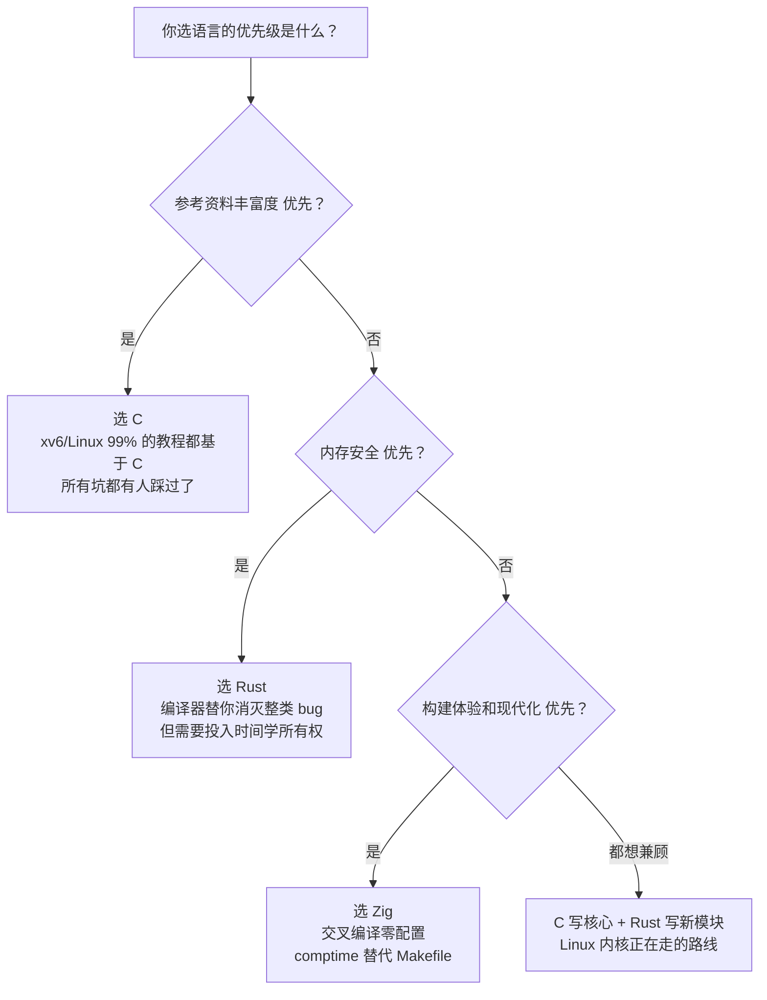

# 第 1 章：操作系统初步 — 定义你要构建什么

> 本章 §1.1–§1.8 是课程概述，帮你理解这门课要做什么、OS 是什么。§1.9–§1.15 聚焦 lab1 的核心决策：为什么先设计、你的 OS 回答哪四个问题、选什么语言和平台、怎么写 ArchitectureSeed。更深入的设计原理——内核架构对比、资源模型范式、参考系统剖析——已分布到后续各章（第 5 章和第 7 章），在你需要做具体决策时出现。

> **对应实验**：[Lab 1: 准备——理解操作系统与选择技术路线](../labs/lab1-seed.md)

## 1.1 你在做什么

这门课的任务很明确：**从零构建一个你自己的操作系统**。

"从零"意味着不基于 Linux 内核修改，不基于任何现有教学内核补代码。你会经历一个操作系统从无到有的完整过程——从 CPU 上电后的第一条指令开始，到最终能跑用户程序、有文件系统、有 Shell。

"你自己的"意味着这个 OS 的设计决策是你做的。它参考了哪些已有系统、拒绝了哪些概念、选择了什么资源模型、追求什么目标——这些都不是教学团队替你做好的选择题。你的 ArchitectureSeed 是你全部后续设计的锚点。

最后你会得到一个能在 QEMU（或真实 RISC-V 硬件）上运行的完整操作系统，以及一套描述它的设计规格、验证证据和演化记录。

## 1.2 操作系统是什么——一个简短的历史视角

理解操作系统最好的方式不是背定义，是看它怎么一步一步变成今天这样的。

**1940s-1950s：没有操作系统的时代。** 程序员直接操作硬件——插拔电缆、设置开关。一台计算机一次只跑一个程序。程序崩溃？整台机器停摆，程序员自己排查。资源利用率这个词还没出现——机器大部分时间在等人。

**1950s：批处理的诞生。** 把多个程序攒成一批，一个接一个地跑，中间不用人插拔电缆。这叫"批处理监控程序"——操作系统的雏形。但它解决的是效率问题，不是易用性问题。程序员提交一叠卡片，几小时后取回结果，中间完全看不到程序在跑。

**1960s：多道程序与分时系统。** IBM 的 OS/360 首次让多个程序"同时"驻留在内存中——一个程序在等 I/O 的时候，CPU 去跑另一个程序。这是操作系统史上的分水岭：CPU 不再等人了。几乎同时，MIT 的 CTSS（兼容分时系统）让多个用户通过终端"同时"使用一台计算机。每个人以为自己独占整台机器，实际上 CPU 在几十个用户之间快速切换。**分时系统的出现，让"隔离"和"保护"成为操作系统的核心命题**——一个用户的程序不能偷看另一个用户的数据，一个崩溃的进程不能拖垮整台机器。

**1970s：Unix 的时代。** Ken Thompson 和 Dennis Ritchie 在贝尔实验室写了 Unix——最初是为了在 PDP-7 上玩一个叫 Space Travel 的游戏。Unix 带来了几个影响深远的设计决定：一切皆文件（用统一的文件描述符操作文件、设备和管道）、层级文件系统、Shell 作为普通用户程序、管道（`|`）作为 IPC 原语。这些决定不是"显然正确"的——它们是在无数替代方案中被证明简洁而强大的。Unix 的哲学凝结成一句话：**"Do one thing and do it well."**

**1980s-1990s：微内核之争。** 1986 年，Andrew Tanenbaum 发布了 Minix——一个微内核教学 OS。1991 年，Linus Torvalds 发布了 Linux——一个宏内核。Tanenbaum 在 1992 年写了一篇著名帖子，声称"Linux is obsolete"，因为微内核才是未来。Linus 反驳说微内核的理论优势在实践中被 IPC 开销抵消。这场论战没有绝对的赢家——Linux 的宏内核在桌面和服务器市场取得了压倒性的成功，但 seL4（一个微内核）实现了完整的形式化验证，在安全和关键任务系统中找到了自己的位置。**这场论战的核心启示是：没有"最好"的内核架构，只有最适合你目标的架构。**

**2000s-至今：虚拟化、容器、Unikernel。** 操作系统设计的边界在持续扩展。虚拟机把整个 OS 打包成可迁移的镜像。容器把应用和它们的依赖打包在一起，共享同一个内核。Unikernel 把应用和内核编译成单一镜像，取消了"用户态 vs 内核态"这条边界。这些新范式说明：**操作系统的设计取决于你对"什么算是一个系统"的定义。**

**2020s-至今：内存安全、硬件 capability、可验证系统和延迟控制。** OS 的新问题不再只是"能不能跑更多程序"。Rust for Linux、Tock 和 Theseus 把语言安全引入内核边界；CHERI 和 CheriBSD 让指针带上边界和权限；Verus、Atmosphere 等工作把验证拉近到系统代码；Linux 的 EEVDF 调度器则把公平性和延迟控制放在同一个模型里讨论。这些案例不会替你选择架构，但会提醒你：每个设计都多了一组约束，也多了一组可以验证的证据。

### 这段历史对你这门课的意义

在 Lab 1，你只需要理解"操作系统是什么"并选择语言和 ISA。具体的架构决策——宏内核还是微内核、fd-based 还是 capability-based、参考什么系统——会在后续 Lab 中逐渐做出，并通过逐 Lab 更新 ArchitectureSeed 来记录设计的演化。你选择宏内核，你站在 Linux 和 xv6 的肩膀上。你选择微内核，你站在 Minix 和 seL4 的肩膀上。**你不知道历史，你的选择就是随机的。你知道历史，你的选择就是有理由的设计判断。**

## 1.3 什么是操作系统——从裸机编程到操作系统的认知跃迁

在讨论内核架构、Unix 哲学和微内核论战之前，有一个更基本的问题需要回答：**操作系统到底是什么？它解决了什么问题？**

如果你只有单片机裸机编程的经验（比如 STM32、Arduino），这个问题可能不太直观——你的程序直接操作硬件，跑得很好，为什么还需要一个叫"操作系统"的东西插在你和硬件之间？

本节用两个具体的编程场景——LED 闪烁与串口输出、多任务交替运行——对比裸机和 OS 环境下的做法。不需要你事先理解任何 OS 概念。你只需要看懂 C 代码。

### 1.3.1 裸机编程体验：一切都要自己来

假设你要在一块 STM32F103 开发板上让 LED 每秒闪烁一次，同时在串口输出 `"Hello"`。

在裸机上，你需要做这些事情：

**第一步：查数据手册。** 打开 STM32F103 参考手册，找到这些信息：
- GPIO 端口的基地址：`0x40010800`（GPIOA）、`0x40010C00`（GPIOC）
- 时钟控制寄存器（RCC）的基地址：`0x40021000`，以及 GPIOA/GPIOC 的时钟使能位
- UART 的基地址：`0x40013800`（USART1），以及波特率寄存器的计算公式

**第二步：手动初始化硬件。** 这些硬件上电后是关闭的——你必须逐个打开：

```c
// ===== 时钟配置（[硬件绑定] 特定芯片的 RCC 寄存器地址）=====
volatile uint32_t *RCC_APB2ENR = (volatile uint32_t *)0x40021018;
*RCC_APB2ENR |= (1 << 2);   // 使能 GPIOA 时钟
*RCC_APB2ENR |= (1 << 4);   // 使能 GPIOC 时钟
*RCC_APB2ENR |= (1 << 14);  // 使能 USART1 时钟

// ===== GPIO 配置（[硬件绑定] 特定芯片的 GPIO 寄存器地址）=====
// 将 GPIOC 的第 13 号引脚（板载 LED）设为推挽输出
volatile uint32_t *GPIOC_CRH = (volatile uint32_t *)0x40011004;
*GPIOC_CRH &= ~(0xF << 20);   // 清除 PC13 的配置位
*GPIOC_CRH |=  (0x2 << 20);   // 设置为 2 MHz 推挽输出

// ===== UART 初始化（[硬件绑定] 特定芯片的 UART 地址和波特率公式）=====
volatile uint32_t *USART1_BRR = (volatile uint32_t *)0x40013808;
*USART1_BRR = 8000000 / 115200;  // 假设 8 MHz 外设时钟 → 115200 波特
volatile uint32_t *USART1_CR1 = (volatile uint32_t *)0x4001380C;
*USART1_CR1 |= (1 << 3) | (1 << 2);  // 使能发送器和接收器
*USART1_CR1 |= (1 << 13);            // 使能 USART
```

**第三步：写最基础的外设操作函数：**

```c
// 串口发送一个字符（[硬件绑定] UART 状态寄存器地址）
void uart_putc(char c) {
    volatile uint32_t *USART1_SR  = (volatile uint32_t *)0x40013800;
    volatile uint32_t *USART1_DR  = (volatile uint32_t *)0x40013804;
    while (!(*USART1_SR & (1 << 7)));  // 等待发送缓冲区空
    *USART1_DR = c;
}

void uart_puts(const char *s) {
    while (*s) uart_putc(*s++);
}
```

**第四步：写出主循环——终于到了"业务逻辑"：**

```c
int main(void) {
    // 所有硬件初始化（[OS 职责] 在 OS 上由内核和驱动完成）
    clock_init();
    gpio_init();
    uart_init();

    volatile uint32_t *GPIOC_ODR = (volatile uint32_t *)0x4001100C;

    while (1) {
        // [应用逻辑] 这部分是真正想做的事
        *GPIOC_ODR ^= (1 << 13);    // 翻转 LED
        uart_puts("Hello\n");

        // [OS 职责] 裸机上只能用忙等循环做延时
        for (volatile int i = 0; i < 500000; i++);
    }
}
```

这个程序大约 50 行。其中有 **40 行是在做硬件初始化和寄存器操作**——这些工作在任何一个稍有规模的裸机项目里都要重复写。而且，这些代码换一块芯片（哪怕是 STM32 同系列的 F407）就要改——寄存器地址变了，时钟树变了，引脚映射变了。

### 1.3.2 同一件事，在操作系统上怎么做

在 Linux（或任何提供标准 C 运行时的 OS）上，LED 闪烁和串口输出的等价程序：

```c
#include <stdio.h>
#include <unistd.h>

int main(void) {
    while (1) {
        // LED 闪烁：通过 sysfs 接口写文件
        FILE *led = fopen("/sys/class/leds/user-led/brightness", "w");
        fputc('1', led);  // 亮
        fclose(led);
        sleep(1);

        led = fopen("/sys/class/leds/user-led/brightness", "w");
        fputc('0', led);  // 灭
        fclose(led);

        // 串口输出：就是普通的 printf
        printf("Hello\n");
    }
}
```

不到 20 行。没有出现任何寄存器地址。没有时钟树配置。没有波特率计算。你甚至不需要知道"LED 连在哪个 GPIO 引脚上"——驱动已经替你的程序处理了这些细节。

一个更惊人的对比：**这份代码可以在 x86 PC、ARM 树莓派、RISC-V 开发板上编译运行**，只要目标平台的 Linux 内核提供了对应的 LED 驱动和终端驱动。而在裸机上，换一块开发板 = 重写 80% 的代码。

### 1.3.3 裸机 vs OS 编程的核心差异

| 维度 | STM32 裸机 | Linux/OS 环境 |
|------|-----------|--------------|
| **硬件访问** | 直接读/写物理寄存器地址（查数据手册） | 通过驱动 + syscall，不直接碰寄存器 |
| **可移植性** | 代码绑定特定芯片型号 | 同一份源码可在不同硬件上编译运行 |
| **多任务** | 不存在——你的 `while(1)` 独占 CPU | 调度器自动分配时间片，多个程序"同时"跑 |
| **内存安全** | 全靠程序员不越界——写飞一个指针直接覆盖外设寄存器 | MMU 隔离——你的程序崩溃不影响其他程序，也不影响内核 |
| **并发模型** | 中断服务函数 + 全局标志位 | 多进程/多线程 + 同步原语（锁、信号量） |
| **调试方式** | JTAG/SWD 硬件调试器，依赖芯片厂商工具 | `gdb` + 日志 + core dump，工具链更通用 |
| **开发效率** | 40 行硬件初始化 / 10 行业务逻辑 | 10 行代码完成全部任务 |

这些差异的根源只有一个：**裸机程序是整块芯片的唯一居民；OS 环境下的程序是硬件资源的租户。** 作为租户，你不需要（也不能）直接管理硬件——那是房东（内核）的事。

### 1.3.4 多任务：裸机手动切换 vs OS 进程抽象

LED 闪烁和串口输出的对比展示了硬件抽象的差异。但操作系统的核心价值远不止"帮你封装寄存器"——**更重要的是，它改变了你组织程序结构的方式。**

考虑这个场景：让两个任务"同时"运行——任务 A 每秒在串口输出 `"Tick"`，任务 B 每三秒翻转 LED。

**在裸机上，你必须手动实现任务切换：**

```c
// [OS 职责] 为两个任务各分配一个独立的栈
#define STACK_SIZE 256
uint8_t stack_a[STACK_SIZE];
uint8_t stack_b[STACK_SIZE];

// [OS 职责] 保存/恢复 CPU 上下文的结构体
typedef struct {
    uint32_t r4, r5, r6, r7, r8, r9, r10, r11;
    uint32_t sp;   // 栈指针
    uint32_t lr;   // 返回地址（即任务被中断时的 PC）
} context_t;

context_t ctx_a, ctx_b;

// [OS 职责] 上下文切换——这是最核心也是最脆弱的代码
__attribute__((naked))
void context_switch(context_t *from, context_t *to) {
    __asm__ volatile(
        "push {r4-r11, lr}      \n"  // 保存当前任务的寄存器
        "str   sp, [r0, #32]    \n"  // 保存栈指针到 from->sp
        "ldr   sp, [r1, #32]    \n"  // 从 to->sp 恢复栈指针
        "pop  {r4-r11, pc}      \n"  // 恢复目标任务的寄存器并跳转
    );
}

// [OS 职责] SysTick 定时器中断——调度器的"心跳"
void SysTick_Handler(void) {
    static int tick = 0;
    tick++;
    if (tick % 100 == 0)           // 每 100 次 SysTick 切换一次
        context_switch(&ctx_a, &ctx_b);
    else if (tick % 100 == 50)
        context_switch(&ctx_b, &ctx_a);
}

// [应用逻辑] 任务 A：每秒输出 Tick
void task_a(void) {
    while (1) {
        uart_puts("Tick\n");
        for (volatile int i = 0; i < 1000000; i++);  // 忙等延时
    }
}

// [应用逻辑] 任务 B：每三秒翻转 LED
void task_b(void) {
    while (1) {
        *GPIOC_ODR ^= (1 << 13);
        for (volatile int i = 0; i < 3000000; i++);
    }
}
```

这份代码超过 60 行，其中 45 行是在做"基础设施"——栈管理、上下文切换、定时器中断。而且它极其脆弱：栈溢出会静默 corrupt 另一个任务的上下文；忘记保存任何一个寄存器就会导致任务恢复时随机崩溃；忙等延时浪费了 100% 的 CPU 周期。

**在 OS 上，两个进程各写各的，完全不需要知道对方存在：**

```c
// 进程 A：每秒输出 Tick
int main(void) {
    while (1) {
        printf("Tick\n");
        sleep(1);
    }
}

// 进程 B：每三秒翻转 LED（另一个独立的 .c 文件）
int main(void) {
    while (1) {
        system("echo 1 > /sys/class/leds/user-led/brightness");
        sleep(3);
        system("echo 0 > /sys/class/leds/user-led/brightness");
        sleep(3);
    }
}
```

然后编译成两个独立可执行文件，在 shell 中先后台运行：

```sh
$ ./task_a &
$ ./task_b &
```

不到 10 行代码。内核替你管理了：进程创建、时间片调度、栈管理、上下文切换、阻塞睡眠。更关键的是——如果进程 A 崩溃（比如写入了一个空指针），进程 B 不受任何影响。在裸机上，任务 A 的一个越界写入可能直接覆盖任务 B 的栈，导致整个系统不可预测地崩溃。

### 1.3.5 操作系统到底解决了什么问题

回到本节开头的问题：操作系统到底是什么？

**操作系统是一组在你和硬件之间运行的系统软件。它解决四个问题：**

1. **资源复用（Multiplexing）** — 一个 CPU 跑出"多个程序同时运行"的假象。通过调度器快速切换进程，通过虚拟内存让每个程序以为独占全部内存。
2. **隔离保护（Isolation）** — 程序 A 的 bug 不波及程序 B。通过 MMU 做地址空间隔离，通过特权级（user/supervisor/machine）阻止用户程序直接操作硬件。
3. **硬件抽象（Abstraction）** — `printf("hello")` 不关心输出目标是串口、屏幕还是网络终端。驱动 + 文件系统 + syscall 接口构成了一个"硬件无关"的编程环境。
4. **服务接口（Interface）** — 程序通过 syscall 请求内核服务（读文件、创建进程、分配内存），内核在更高特权级执行这些操作后返回结果。这个接口定义了 OS 的"性格"——POSIX 是 Unix 系 OS 的通用接口，Win32 是 Windows 的接口。

> **对零基础自学者的启示：** 如果你有 STM32 裸机经验，以上四个概念你已经在无意中实践了一部分——只不过是你自己在做 OS 的工作。你写的 `uart_putc()` 是硬件抽象层；你手动分配的 `stack_a[]` 和 `stack_b[]` 是资源复用；你写的 `SysTick_Handler` 是最原始的调度器。本课程的目标，就是让你把这些"人肉 OS"变成真正的、结构化的、可验证的系统软件。
>
> 接下来的 10 个阶段，你会从"写一个程序"切换到"写一个能让其他程序运行的程序"。这个视角的转变，是操作系统学习中最关键的一步。读完本章、做完 Lab 1 后，你将决定你的 OS 解决这四个问题的具体方式——选哪种内核架构、定义什么 syscall 接口、承诺什么隔离强度。后续每一章的"从裸机看 XXX"段落，会逐一展示这四个抽象在启动、内存、中断、文件系统中的具体体现。

## 1.4 这门课不教什么

说清楚，免得你误判。

不教 Linux 内核源码阅读。你的 OS 和 Linux 没什么关系，除了你可能在 ArchitectureSeed 中声明借鉴了它的某些概念。

不教你从零写汇编。你会在启动阶段写几十行汇编入口代码，但不需要先成为汇编专家。

不教你成为 C 语言高手。清晰的、能正确表达设计意图的 C 代码，胜过技巧性的、让人看不懂的 C 代码。

但有一件事你必须愿意做：在想不清楚的时候停下来，画张图，写段 Spec。闷头写代码碰运气，在 OS 开发中不好使——因为 OS 的 bug 往往在你写代码几个小时后才炸，你几乎不可能单靠"让代码跑起来"来定位根因。

## 1.5 课程怎么组织的

十个阶段，大致对应一个 OS 从无到有的自然生长顺序。

阶段 1 定义你要构建什么。阶段 2 让内核启动，输出第一行字。阶段 3 管理内存。阶段 4 响应中断。阶段 5 让用户程序跑起来——这是最长的阶段，涉及 trap、进程、syscall、调度。阶段 6 让数据持久化。阶段 7 决定你的 OS 以什么方式把系统能力暴露给用户程序——这也是你架构中最核心的分叉路口。阶段 8 注入个性——通过方向组合定义你的 OS 的多维剖面。阶段 9 移植到真实硬件（选做）。阶段 10 建立验证体系——不变量检查器、证据管理、验证密度。Final Lab 综合验收与答辩。

每个阶段有一章 Book（你现在正在读的东西）和一张 Lab 卡片。Book 告诉你这个阶段的设计空间、历史背景和原理——帮你理解"为什么"和"有什么选择"。Lab 卡片告诉你要产什么规格文件、跑什么命令、通过什么门禁。

> **⚡ 挑战路线提示：** 本课程的设计对零基础和有经验的学生都适用。如果你有 OS 开发经验，可以在某些阶段跳过基础实现直接挑战更高难度的版本（具体见各章的"挑战路线"标注）。阶段 8 的方向组合机制让你通过多方向交织构建更独特的内核，而不是把它变成"附加项目"。

## 1.6 和传统 OS 实验最大的不同

传统的 OS 实验基本上是：教师给你一个半成品的框架，你把空缺的函数填上，跑通预设的测试，结束。

VeriSpecOSLab 的做法是反过来的。

**先写规格。** 这个模块管理什么状态？这个操作的前提条件是什么？后置条件是什么？什么不变量必须始终成立？

**再按规格实现。** AI 可以在受控边界内辅助——审查你的规格是否完整、根据规格生成候选实现、诊断崩溃原因——但不能替你写规格，也不能在没有规格的情况下替你写核心代码。

**最后验证你的实现是否满足规格。** 验证不止是跑测试。你还写不变量检查器——在系统运行时持续检查关键性质是否保持。你写跨模块的组合不变量——"当进程 A 试图读取进程 B 的内存时，一定会被拒绝"。

这套做法的核心信条是：**以规格约束 AI，以验证保障正确，以架构设计训练系统掌控能力。**

## 1.7 本指导书怎么用

四本手册，各司其职。

**Book（你在读的）** 在每个阶段之前读。它告诉你这个阶段在 OS 构建中处于什么位置、要解决什么问题、设计空间长什么样、有什么历史渊源。不要跳着读——阶段 3 的内存管理假设你已经理解了阶段 2 的启动过程。

**Labs** 在你理解了设计空间之后打开。它列出你这个阶段要写的 Spec 文件、要实现的代码、要跑的命令。Lab 不解释"为什么"——那是 Book 的活。Lab 只解释"做什么"和"怎么验证"。

**Specs 手册** 在你写规格时随时查阅。教你 ArchitectureSeed / ModuleSpec / OperationContract / GoalValidationContract 分别怎么写。

**Appendices** 是工具参考。vos 命令怎么用、QEMU 怎么调、GDB 怎么设断点、RISC-V 的 CSR 寄存器速查表。

日常节奏大概是：打开 Book 理解设计空间（30-60 分钟），打开 Lab 写 Spec 文件（1-3 小时），跑 vos spec lint 检查格式，按 Spec 写代码（2-4 小时），跑验证命令（30-60 分钟），更新 AI 协作日志（10 分钟）。

## 1.8 开始之前

确认你的环境：

对 RISC-V 不熟的话，花半小时浏览 [RISC-V 参考](../appendices/riscv-reference.md)，不需要背，混个脸熟就行。

准备好了？继续往下读——下一节进入设计空间，开始定义你的操作系统。

---

## 1.9 为什么先设计再写代码

"我还没写一行代码，先花一整天写文档？"

是的。这一天是你整个课程中投资回报率最高的一天。

理由不在于"文档很重要"这个老生常谈。真正的原因更具体：操作系统的各个子系统是深度耦合的。你在阶段 3 选择的分页模型会影响阶段 5 的 trap 路径设计。你在阶段 1 写的资源模型路线会影响阶段 7 的 syscall ABI 和用户库。一个月后你发现阶段 5 和阶段 3 的设计打架，回头改——成本是现在的十倍。

ArchitectureSeed 不是"交作业"。它是你的设计锚点，从 Lab 1 的身份信息开始，随每个 Lab 逐步长出完整的设计图景。每次你发现自己在两个可行方案之间纠结的时候，回到 ArchitectureSeed 看你的 goals 和 constraints，答案通常就在那里。

## 1.10 你要回答的四个核心问题

### 1.10.1 问题一：你的 OS 的职责边界在哪？

每个 OS 都在三个维度上做文章。

**资源抽象与复用。** CPU 只有一个（或几个），跑的程序有几十个。你怎么让每个程序都"觉得"自己独占 CPU？基本思路是快速切换——一个程序跑几毫秒，然后切换到下一个。切换太快了，人类感知不到。内存也是——物理内存是一块连续的 RAM，但每个程序有自己的"虚拟地址空间"，看到的是连续的、私有的内存。

**隔离与保护。** 资源复用产生了新问题：程序 A 怎么保证程序 B 不会偷看它的内存？答案是硬件机制——MMU（内存管理单元）把每个程序的"虚拟地址"翻译成"物理地址"的过程中，检查权限。程序 A 的虚拟地址 X 映射到物理地址 Y，程序 B 的虚拟地址 X 映射到物理地址 Z——各自以为自己在同一个地址，实际上被硬件强制分离。

**服务与接口。** 用户程序怎么请求内核做事？它不能直接操作硬件——那会绕过所有保护机制。所以有一个 syscall 接口——用户程序通过一条特殊指令（RISC-V 的 `ecall`）"叫"内核，内核在更高特权级执行请求，然后返回结果。这个接口的设计决定了你的 OS 的"性格"——它暴露了什么抽象？隐藏了什么细节？

你的 ArchitectureSeed 不需要在"资源复用"上标新立异——快速切换这个思路是共享的。你的设计选择主要落在"隔离的强度"和"接口的形态"上。

### 1.10.2 问题二：你的 OS 为什么而存在？

**教学目的。** 你的 OS 存在是为了让你学会系统设计的原理。这意味着"代码清晰"比"跑得快"优先级高。你可能会做一个效率不高的分配器、一个简单的调度器——只要它们的设计理由在你的 ADR 中说清楚了，这就够了。

**兼容目的。** 你的 OS 运行已有程序。这意味着你被锁入了那个已有系统的 ABI——它的 syscall 编号、它的可执行格式、它的错误码语义。有好处：你的 OS 一诞生就有一个软件生态。也有代价：你继承了那个 ABI 的历史包袱。

**安全目的。** 你的 OS 提供可论证的隔离或安全保证。你可能需要 capability 系统、形式化验证的子集、信息流控制。这条路需要的理论基础最多，但产出也最具说服力。

**性能目的。** 在某个指标上做到接近或超过参考系统。你需要细致的 benchmark、系统性优化、可能牺牲代码清晰度。

这些目标可以共存但要排优先级。阶段 5 你发现一个"教学清晰"和"兼容 POSIX"冲突的设计选择——怎么办？如果你在 ArchitectureSeed 中写了"教学目标优先于兼容目标"，答案就已经在那里了。

### 1.10.3 问题三：你的 OS 跑在什么上？

RISC-V 64 + QEMU `virt` 是本课程的技术默认。但这不意味着你被绑死在 RISC-V 上。你的 ArchitectureSeed 中的 `target_platform` 字段可以声明任何 ISA——你只需要理解不同 ISA 之间的关键差异。

**三大 ISA 的关键差异，对你的 OS 设计的影响：**

| 维度 | RISC-V 64 | AArch64 (ARMv8) | x86-64 |
|------|-----------|-----------------|--------|
| 特权级 | M/S/U 三级，清晰分层 | EL3/EL2/EL1/EL0 四级 | Ring 0/1/2/3，历史包袱重 |
| 页表 | Sv39 (3级)，规范约100页 | VMSAv8-64 (4级)，规范复杂 | 4-level PML4，历史兼容多 |
| 中断控制器 | PLIC（平台级），简单清晰 | GICv3/v4，功能丰富但复杂 | APIC/x2APIC，最复杂 |
| syscall | `ecall` 指令，统一入口 | `svc` 指令，统一入口 | `syscall`/`sysenter`，历史遗留多 |

**实现语言的选择。** 内核可以用多种系统编程语言编写。没有一种在所有维度上最优——你的选择取决于你最看重什么。

| 维度 | C | Rust (no_std) | Zig |
|------|---|---------------|-----|
| 内存安全 | 完全依赖程序员纪律。所有内存 bug 都是程序员的直接责任 | 编译期所有权+借用检查杜绝 use-after-free 等 bug 类别；`unsafe` 用于 MMIO/页表操作 | 编译期无所有权检查；提供 `defer`、错误联合类型、`@setRuntimeSafety` 等防御工具 |
| 代表项目 | Linux、xv6、FreeBSD、seL4、XNU——几乎所有工业内核 | Redox（微内核）、Tock（嵌入式RTOS）、rCore、Theseus（语言级隔离）| Bun（JS运行时）、TigerBeetle（金融DB）——裸机/系统编程正在增长 |
| 构建系统 | Make/CMake/Meson，需手动配置交叉编译 | Cargo + `rustup target add` 一行命令 | `build.zig` 可编程构建；`zig cc` 可作为 C 编译器 |
| 交叉编译 | 需手动安装目标工具链 | `rustup target add` | `zig build -Dtarget=riscv64-freestanding` |
| 学习曲线 | 语法简单（~32关键字），UB 陷阱隐蔽且多 | 所有权+借用+生命周期需数周适应，编译器错误信息质量高 | 语法中等，`comptime`（编译期代码执行）是独特优势 |
| 适合你的场景 | 想把精力全部花在 OS 设计上；参考资料最丰富 | 想用编译器消灭内存 bug；愿意投入时间学习所有权 | 想要一流交叉编译体验；对前沿工具链感兴趣 |

选择什么语言，在 ArchitectureSeed 的 `constraints` 字段中声明。无论选什么，内核都需要与硬件直接交互——这是所有语言的共同挑战。

### 1.10.4 问题四：用什么语言写你的内核？

上一个问题的表格对比了 C、Rust、Zig 的宏观差异。现在把视角切换到写内核的第一天：每种语言让你怎么写 `kernel_main`？

**C：最直接、最危险的路径。** C 的内核入口是世界上最简单的——一个 `void kernel_main()` 函数，不需要任何语言层面的仪式。所有硬件交互都是指针解引用：`*(volatile uint32_t *)0x10000000 = 'H'`。没有编译器替你检查这个地址是否合法、这个指针是否对齐、这个转换是否合理。

C 内核的力量和危险来自同一个源头：**语言不介入你和硬件之间。** 你可以做任何事——重新映射页表、切换栈指针、禁用中断——编译器不会阻止你。同样，编译器也不会在你写飞一个指针时发出警告。

如果你选 C，你的 ArchitectureSeed 需要额外声明：编码规范（如 Linux kernel style）、静态分析工具（如 `sparse` 或 `clang-tidy`）、UB 防御策略（如 `-fno-strict-aliasing`）。

**Rust：编译期安全，但需要和 `unsafe` 谈判。** Rust 内核的入口是一个 `#[no_mangle] pub extern "C" fn kernel_main()`。在 `#![no_std]` 环境下，没有标准库、没有 `println!`、没有 `Vec`。你需要自己提供 `panic_handler`（内核 panic 时做什么）和 `eh_personality`（异常处理——或直接禁用 unwinding）。

Rust 的核心承诺是"安全代码不产生内存 bug"。但内核中几乎所有有趣的操作——写 MMIO 寄存器、操作页表、切换上下文——都需要 `unsafe` 块。Rust 内核编程的本质是：**用最小的 `unsafe` 块包裹硬件交互，其余代码保持在 safe Rust 中。**

一个 Rust 内核的 UART 输出函数看起来像这样：

```rust
const UART0: usize = 0x1000_0000;

fn uart_putc(c: u8) {
    // unsafe：编译器无法验证 0x1000_0000 是合法 MMIO 地址
    let uart = unsafe { &mut *(UART0 as *mut u32) };
    *uart = c as u32;
}
```

`unsafe` 只有一行。整个函数签名是 safe 的——调用者不需要知道内部用了 unsafe。这个模式——unsafe 实现、safe 接口——是 Rust 内核的标准做法。

如果你选 Rust，你的 ArchitectureSeed 需要声明 `unsafe` 策略：每个 `unsafe` 块上方的注释解释为什么编译器不能验证安全性，以及程序员的推理链。

**Zig：不隐藏任何东西，但给你工具。** Zig 的内核入口和 C 一样直接——`export fn kernel_main() callconv(.C) void`。但 Zig 多了几个内核开发中特别实用的特性。

`comptime` 让你在编译期执行代码。链接脚本不用手写——在 Zig 里它是编译期运行的 Zig 代码，输出链接器参数。内存布局、段对齐、入口符号——全部在编译期计算，类型安全。

```zig
// comptime 生成链接脚本
export const _start = struct {
    fn entry() callconv(.Naked) noreturn {
        // 设置栈指针（编译期计算的栈顶地址）
        asm volatile (
            \\ la sp, %[stack_top]
            : : [stack_top] "i" (@intFromPtr(&stack_top)),
        );
        asm volatile ("j kernel_main");
    }
}.entry;
```

`@setRuntimeSafety` 让你在调试构建中开启边界检查、整数溢出检查，在发布构建中关闭。`defer` 和 `errdefer` 让错误路径的资源清理不会漏掉。

Zig 不给你 Rust 级别的内存安全保证，但它给你比 C 更好的防御工具——并且不强制你学习一套全新的所有权思维模型。

### 三语言选型决策指南



## 1.11 ⚡ 挑战：语言选择的深层影响

以下内容面向有 OS 开发经验或追求更深设计理解的学生。

### Rust 内核中，`unsafe` 的边界在哪里？

所有 MMIO 操作、页表操作、上下文切换都是 `unsafe`。但如果你的 `unsafe` 块太大（一个 `unsafe` 包裹了整个 `syscall` 函数），你实际上放弃了 Rust 的安全保证。如果你用 Rust 写内核，你的 ArchitectureSeed 应该声明 `unsafe` 的使用策略——每个 `unsafe` 块应最小化，并在文档注释中解释为什么编译器不能证明这段代码的安全性。

### Zig 内核中，`comptime` 如何改变构建系统？

Zig 允许你在编译期执行代码。你可以在编译期生成链接脚本、计算对齐、配置内存布局，而不是写脆弱的 Makefile 魔法。

## 1.12 ArchitectureSeed 参考示例

以下是三个完整的 ArchitectureSeed 示例，展示了三种不同的设计立场：

**示例 A：教学优先的宏内核**

```yaml
goals:
  - "代码清晰性优先于性能——每个模块的核心函数不超过 50 行"
  - "学生可在 4 小时内理解全部内核代码（目标代码量 < 5000 行）"
  - "完整的自测体系——每个模块有不变量检查器"
non_goals:
  - "不追求 POSIX 兼容——设计自己的最小 syscall 集合"
  - "不支持多用户——所有程序以同一身份运行"
  - "不支持动态链接——所有程序静态链接"
  - "不支持网络"
reference_systems:
  - system: "xv6-riscv"
    borrowed_concepts:
      - "fork/exec/wait 进程模型"
      - "Sv39 分页的 identity mapping 方式"
    modified_concepts:
      - "syscall 接口从 21 个精简到 8 个"
    rejected_concepts:
      - "sleeplock——语义过于隐式"
      - "plic 复杂的初始化——教学场景中硬编码 PLIC 配置"
    reason: "精简到最核心的机制，让学生看到的是骨架而不是血肉"
```

**示例 B：兼容 Linux 静态 ELF 的宏内核**

```yaml
goals:
  - "能运行为 RISC-V Linux 编译的静态链接 ELF hello 程序"
  - "实现足够的 POSIX syscall 子集以运行 busybox（迷你 Shell）"
non_goals:
  - "不支持动态链接——仅静态 ELF"
  - "不支持多线程——每个进程单线程"
  - "不支持信号（signal）机制"
reference_systems:
  - system: "Linux (RISC-V)"
    borrowed_concepts:
      - "Linux syscall ABI——编号复用 Linux 的编号"
      - "ELF64 格式的完整 Program Header 解析"
    rejected_concepts:
      - "VMA（虚拟内存区域）管理——用更简单的固定布局"
      - "Linux 调度器的复杂性——用简单的轮转调度"
    reason: "兼容 Linux ABI 的好处是立即可运行已有程序，代价是继承了 ABI 的复杂度"
```

**示例 C：探索 capability 安全的微内核**

```yaml
goals:
  - "内核只提供地址空间、线程和 capability IPC"
  - "所有资源（文件、设备、内存）通过 capability 访问"
  - "capability 不可伪造、可传递、可撤销"
non_goals:
  - "不兼容任何已有 ABI——资源模型完全不同"
  - "不支持 POSIX 兼容层（阶段 8 可能做）"
reference_systems:
  - system: "seL4"
    borrowed_concepts:
      - "capability 作为不可伪造的访问令牌"
      - "capability 空间由内核管理"
    rejected_concepts:
      - "seL4 的形式化验证——教学 OS 不需要走到这个深度"
    reason: "capability 模型提供了最清晰的'谁可以访问什么'的语义"
```

## 1.13 动手：你的 ArchitectureSeed 第一稿

现在写。别继续往下读了。打开编辑器，创建 `spec/architecture/seed.yaml`。把这个骨架填上你的内容：

```yaml
goals: []           # 至少 3 条
non_goals: []       # 至少 3 条——"不做什么"和"做什么"一样重要
constraints: []     # ISA？运行环境？内存上限？
reference_systems:
  - system: ""         # 你参考的系统名
    borrowed_concepts: []
    modified_concepts: []
    rejected_concepts: []   # 至少 1 条
    reason: ""              # 拒绝的理由
```

写完第一稿，自查这几件事：

- rejected_concepts 有没有附带 reason？没有理由的拒绝不是设计判断，是选口味。
- non_goals 有没有至少 3 条？只有 1 条的 non_goals 说明你可能还没认真想过边界的范围。
- initial_validation_binding 能不能测？"系统稳定运行"不能测。"串口输出 kernel banner，QEMU 在 30 秒内无 panic"能测。"用户体验良好"不能。"用户程序 hello 可在 QEMU 启动后 3 秒内输出"能。

跑 `vos arch lint` 检查格式完整性。

你有整个阶段 1 的时间来迭代这份 ArchitectureSeed。后续阶段你会发现它的某些部分需要修改——用 SpecPatch 记录，别偷偷改了假装没发生过。

## 1.14 常见陷阱

**目标过大。**"我要做一个比 Linux 更好的 OS"——这句话在 ArchitectureSeed 里不能出现。不是因为不对，是因为不可操作。把目标缩小到你能在一学期内验证的程度。

**参考系统写成标签。**"参考 Linux"这句话提供了零信息。Linux 有调度器、VFS、网络栈、内存管理、几百个 syscall——你具体借鉴了哪个子系统、哪个机制？精确到机制层面的借鉴才有设计指导价值。

**拒绝理由空洞。**"拒绝 xv6 的 XXX 因为太复杂"——为什么复杂？是数据结构复杂？是并发控制复杂？还是接口复杂？说清楚复杂度在哪，你的拒绝才有说服力。

**忘了写 non-goals。**只写"我要做 X"不写"我不做 Y"，会在阶段 5 的时候让你在"要不要实现网络栈"这个问题上纠结两天。现在花十分钟写清楚 non-goals。

**验证判据像广告语。**"高度安全"不可测。"任意用户程序无法访问内核物理页"可测。把抽象判断落回具体、可观测的指标。

## 1.15 本章小结

你产出了一份 ArchitectureSeed。它应该诚实——你的目标、你的约束、你的借鉴和拒绝，原样写在那里。

这份文件是你后续九个阶段的设计锚点。任何后续决策如果和它冲突，你要么修改决策，要么通过 SpecPatch 诚实地记录演化——不能偷偷改了假装一直如此。

进入阶段 2 之前，你能对另一个同学讲清楚吗——为什么你选了宏内核？为什么拒绝了参考系统中的那个概念？你的 OS 最大的约束是什么？

能讲清楚，你的设计是设计。讲不清楚，你的设计是碰巧。

> **对应实验**：[Lab 1: 准备——理解操作系统与选择技术路线](../labs/lab1-seed.md)

下一章：[第 2 章：最小内核启动](ch02-boot.md)
