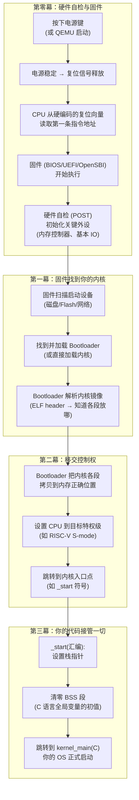
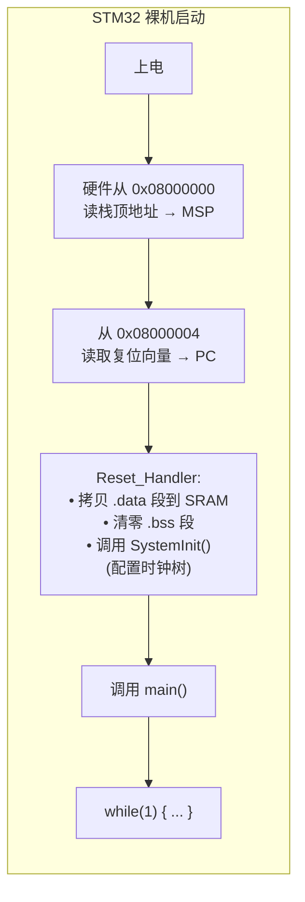
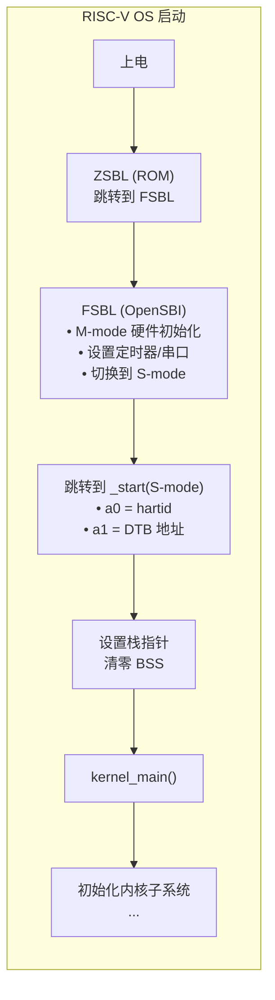

z

# 第 2 章：最小内核启动 — 从硬件复位到第一条指令

> **对应实验**：[Lab 2: 最小内核启动](../labs/lab2-boot.md)

## 2.1 本章要解决的问题

计算机上电后，硬件执行一系列自举过程，最终将控制权交给你的内核。你的任务是理解并控制这条路径：从固件到内核第一条指令，从裸机到 C 语言运行环境。

### 2.1.1 前置概念：上电后到底发生了什么（白话版）

如果你是零基础自学者，可能对"计算机上电后怎么就开始跑我的代码了"只有模糊的概念。在深入技术细节之前，先用一张全景图建立直觉。

按下电源按钮后发生的事情，和一个乐团演出前的准备有几分神似：



这张图里有两个关键信息，值得停下来想清楚：

**第一，在 `kernel_main` 执行之前，已经有大量代码在运行了。** 固件（几百 KB 到几 MB）和 bootloader（几十 KB）在你完全不知情的情况下做了硬件初始化、设备扫描、镜像加载、模式切换。理解它们做了什么、把什么状态留给了你——这是启动阶段最重要的认知任务。不知道固件给了你什么，你就不知道自己需要做什么。

**第二，"设置栈指针"这一步虽然只有一条指令，但它决定了你的内核能不能用 C 语言。** C 语言的函数调用、局部变量、参数传递——全部依赖栈。在栈指针被正确设置之前，你不能调用任何 C 函数。这就是为什么内核的入口必须是一小段汇编——汇编不需要栈，可以直接操作寄存器。汇编设置好栈，C 接管；没有栈，C 寸步难行。

> **零基础检查点**：在继续往下读之前，确认你能用自己的话回答这三个问题：
> 1. CPU 上电后执行的第一条指令在哪？（提示：不是你的 `_start`）
> 2. Bootloader 到底为你的内核做了什么？（至少说出 3 件事）
> 3. 为什么 `kernel_main` 不能是内核的真正入口点？

### 2.1.2 本章的核心任务清单

读完本章、做完 Lab 2 后，你应该能独立完成以下全部任务：

- [ ] 写出一个能通过 QEMU 启动的内核（即使它只会打印一行字然后停在那里）
- [ ] 画出你的内核从 `_start` 到 `kernel_main` 的每一步在做什么
- [ ] 解释链接脚本中每个段的含义（`.text` / `.data` / `.bss` / `.rodata`）
- [ ] 独立排查"内核不输出任何东西"的问题（这是 OS 开发最高频的 bug 类型）
- [ ] 说出固件直启、Multiboot2 启动、UEFI 直启三种路径的关键差异

## 2.2 固件与 Bootloader 简史——为什么启动链长这样

最初的计算机没有"启动"的概念。程序员通过前面板开关手动输入引导代码——一字节一字节地拨入内存，然后按下"运行"按钮。1975 年发布的 Altair 8800（被公认为第一台个人电脑）的前面板上有一排 LED 和一排拨动开关——程序员需要拨动 16 个开关（代表一个 16 位地址），再拨动 8 个开关（代表数据），按下"DEPOSIT"按钮，然后继续拨动下一个地址。一个最小引导程序（从纸带读入器加载操作系统）大约需要 20-30 个字节——这意味着程序员要拨动几百次开关。错了任何一位？从头再来。

这就是"固件"诞生的背景——不是为了让启动更方便，而是为了把程序员从拨开关的体力劳动中解放出来。

**ROM 和 BIOS 的出现。** 1981 年，IBM PC 5150 引入了一套后来统治了整个 PC 世界三十年的方案——BIOS（Basic Input/Output System）。IBM 把一个 8 KB 的 ROM 芯片焊在主板上，映射到物理地址 `0xFE000`~`0xFFFFF`（这就是今天 CPU 从 `0xFFFF0` 开始执行的由来——复位向量落在 ROM 的末尾，只有 16 字节的空间放一条 `JMP` 指令跳到真正的 BIOS 代码）。BIOS 的职责是清晰的：上电自检（POST——检查内存、键盘、显示器是否存在）→ 初始化基本 I/O 设备 → 扫描启动设备（软盘→硬盘）→ 读取第一个扇区（MBR，Master Boot Record）到内存 `0x7C00` → 跳转过去。

> **原始文献：** IBM, *IBM Personal Computer Technical Reference*, 1981. 这本手册完整定义了 BIOS 的中断向量表（`int 0x10` = 视频服务、`int 0x13` = 磁盘服务、`int 0x16` = 键盘服务）——这些中断号直到今天仍在 UEFI 模拟模式和虚拟化中被使用。

但 BIOS 有一个问题——它不是 IBM 发明的。或者说，BIOS 的"软件/硬件抽象层"这个想法，来自 Gary Kildall 在 1974 年创造的 CP/M 操作系统。

**CP/M 的 BIOS：在 IBM PC 之前就存在的思想。** 1974 年，Gary Kildall 在为 Intel 8008/8080 微处理器编写 PL/M 编译器时，发现了一个问题：每次他把软件移植到新的软盘驱动器或终端上，都要重写所有 I/O 代码。他的解决方案是 CP/M（Control Program for Microcomputers），把操作系统分成两层：

1. **BDOS（Basic Disk Operating System）**——CP/M 的核心，管理文件系统（`open`、`read`、`write`），与硬件无关
2. **BIOS（Basic I/O System）**——位于 BDOS 之下，包含与特定硬件相关的驱动代码（读一个扇区、写一个字符到控制台）

这意味着"把 CP/M 移植到新机器"只需要重写 BIOS 层——BDOS 层完全不变。这是操作系统历史上第一个明确的硬件抽象层设计。

> **原始文献：** Gary A. Kildall, "CP/M: A Family of 8-and 16-Bit Operating Systems," *BYTE Magazine*, vol. 6, no. 6, pp. 216-246, June 1981. Kildall 在这篇文章中详细解释了 CP/M 的分层设计哲学。这篇文章是在 IBM 选择了微软的 MS-DOS 而非 CP/M 之后发表的——一个改变了计算机行业格局的商业决策（BIOS 的名字留了下来，但 CP/M 的创始人被排除在了 PC 革命之外）。

IBM 的工程师直接采用了 CP/M 的"BDOS + BIOS"架构思路——MS-DOS（微软为 IBM PC 编写的操作系统）的 `IO.SYS` 就是 BIOS 层，`MSDOS.SYS` 就是 BDOS 层。而固化在 ROM 中的"系统 BIOS"是 IBM 的创新——把硬件初始化的最底层代码烧死在芯片上，让操作系统不必关心主板特定细节。

**BIOS 的局限催生了 UEFI。** BIOS 运行在 16 位实模式下（这是 1978 年 8086 的遗产），只能寻址 1 MB。到了 1990 年代末，BIOS 的三大约束已经不可忍受：16 位实模式启动慢、MBR 分区表最大只支持 2 TB 磁盘、BIOS 的中断服务（`int 0x13`）每次只能读一个扇区——这限制了启动速度。

但 UEFI 诞生的真正推动力不是 PC，而是 Intel 的 Itanium 处理器（1999）。Itanium 完全不支持 x86 的 16 位实模式——Intel 需要一个新的固件标准来取代 BIOS。这个标准最初叫 EFI（Extensible Firmware Interface），由一个包括 Intel、Microsoft、HP 等行业联盟推动。后来 EFI 改名 UEFI，并在 2005 年苹果从 PowerPC 迁移到 Intel 时成为第一个大规模商业采用者——每一台 Intel Mac 都是用 UEFI 启动的。PC 世界则在 2011 年（Windows 8 时代）才强制要求 UEFI。

> **原始文献：** Intel, "Extensible Firmware Interface Specification," Version 1.02, December 2000. 第 1 章解释了 EFI 的设计目标：替代 16 位 BIOS 和 MBR，支持 64 位启动、GPT 分区表、从大容量存储直接加载 OS。

**RISC-V 世界的固件。** RISC-V 没有 BIOS 或 UEFI 的历史包袱——它直接采用了 OpenSBI。OpenSBI 运行在 M-mode，负责最底层的硬件初始化，然后切换到 S-mode 并把控制权交给你的内核。你的内核通过 SBI 调用请求固件服务：串口输出、关机、设置定时器等。

### 不同 ISA 的启动链对比

| ISA    | 典型固件           |      内核入口特权级      | 固件提供什么                         | 你需要自己建立什么                     |
| ------ | ------------------ | :-----------------------: | ------------------------------------ | -------------------------------------- |
| RISC-V | OpenSBI            |          S-mode          | 串口、定时器、关机、HART 管理        | 页表、trap 向量、设备树解析            |
| ARM    | U-Boot / UEFI      |        EL1 或 EL2        | 串口、定时器、设备树、可能已启用 MMU | 页表重设、中断控制器、trap 向量        |
| x86-64 | UEFI / legacy BIOS | Ring 0 (64-bit long mode) | ACPI 表、帧缓冲、内存映射            | GDT/IDT 设置、页表、几乎所有设备初始化 |

理解你继承了什么、你需要自己建立什么，这是启动阶段最重要的洞察。

### 从裸机看启动：STM32 启动 vs OS 启动链

如果你有 STM32 裸机编程经验，你可能习惯了这样的启动流程：编写 `main()` → 编译器自动链接启动文件 → 烧录到 Flash → 上电即运行。整个过程中，你几乎不需要关心"谁把 CPU 设置到当前模式的"——因为根本就没有模式切换这一说。

但 OS 的启动流程比这复杂得多。理解差异的最好方式，是把两种启动流程放在一起看。

**STM32F103 的启动流程（裸机）：**



整个过程在一个特权级（Privileged / Thread mode with privileged access）内完成。没有固件和内核的边界——如果非要说的话，启动文件（`startup_stm32f103xx.s`）和 HAL 库就是你全部的"固件"。

**RISC-V OS 的启动流程（OpenSBI + 内核直启）：**



**关键差异：**

| 维度 | STM32 裸机 | RISC-V OS |
|------|-----------|-----------|
| **特权级变化** | 始终在 Privileged 级别，无模式切换 | M-mode(固件) → S-mode(内核) → 将来 U-mode(用户) |
| **谁初始化硬件** | 你的启动文件 + `SystemInit()` 手动配时钟树 | OpenSBI 已完成时钟、定时器、串口初始化 |
| **启动地址** | 硬编码：`0x08000000` (Flash 首地址) | 固件决定：由 OpenSBI 加载到 RAM 某处 |
| **入口状态** | SP 从向量表自动加载；PC 从复位向量加载 | `a0` = hartid, `a1` = DTB 地址（由 OpenSBI 传递） |
| **BSS 清零** | 启动文件里做（`startup_*.s` 中的 `Reset_Handler`） | 必须在内核 `_start` 中手动做 |
| **有没有"回去"的路** | 没有——裸机程序从不"返回" | 有——S-mode 可以通过 `ecall` 回 M-mode 请求 SBI 服务 |
| **启动失败的表现** | LED 不闪、程序不动、看门狗复位 | QEMU 无输出、panic、三重故障（x86） |

**为什么 OS 的启动比裸机复杂这么多？根本原因只有一条：**

裸机程序是整块硅片上的唯一居民——它不需要和任何人共享硬件，不需要考虑"我该不该碰这个寄存器"，因为所有寄存器都归它。而 OS 内核只是硬件上的第一层租客——它下面有固件（已经初始化了一些硬件、设置了一些寄存器），它上面将来还会有用户程序（不能随便访问硬件）。OS 内核的启动流程必须妥善处理这份"和上下邻居的交接"——从固件手里接过干净的状态，为用户程序准备好隔离的执行环境。

**对零基础自学者的启示：** 如果你觉得 OS 启动流程"步骤太多记不住"，不要硬记。回到上面那张差异表——每一步都是为了解决"裸机程序不需要面对、但 OS 必须面对"的问题。BSS 清零？因为裸机上你的数据段可能不需要初始化（你知道它从 Flash 来），但 OS 内核需要在 RAM 中运行，RAM 上电后的内容是随机的。设置栈？裸机也设——但启动文件替你做了，而 OS 得自己来，因为固件不知道你的内核打算把栈放在哪。

如果你只在 RISC-V 上写 OS，你可能会问："固件已经把内核加载好了，为什么还需要 bootloader？"

在 x86 的世界，这个问题有一个直白的答案：**因为手动从固件跳转到 64 位 long mode 内核实在太痛苦了。**

Legacy BIOS 把 CPU 留在 16 位实模式——这是 1978 年 8086 的遗产。你的内核是 64 位的，但你收到的第一条指令只能执行 16 位代码。在跳转到你的 C 入口之前，你必须亲手完成整套"模式切换体操"：禁用中断 → 设置 GDT（全局描述符表，段式内存管理的历史遗物，即使在纯分页模式下也必须有一个最小 GDT）→ 启用保护模式 → 设置最基本的页表（long mode 要求分页必须开启）→ 启用 long mode → 远跳转刷新指令流水线 → 终于进入 64 位模式。每一步都有严格的寄存器写入顺序，写错一步，CPU 三重故障（triple fault）直接重启，连调试信息都不留。

这就是 bootloader 存在的第一个理由：**它替你做了这些脏活。** 你只需要按照 bootloader 的协议（如 Multiboot2）写一个启动头，bootloader 找到你的内核、加载到内存、把 CPU 切换到你要的模式、跳转到你的入口点。你收到的第一条指令就已经在 64 位模式（或 32 位保护模式）下，可以直接写 C 代码。

这就是 GRUB 的价值。

但这引出了第二个问题：既然 UEFI 已经可以直接加载 64 位 PE/COFF 内核了，为什么还需要 bootloader？UEFI 的 DXE 阶段运行在 64 位模式下，`EFI_BOOT_SERVICES->LoadImage()` 可以直接加载 PE 格式的内核。答案是：**UEFI 启动服务的生命周期很短。** UEFI 规范在调用 `ExitBootServices()` 之后，固件的大多数服务（内存分配、文件系统访问、图形输出）全部不可用。你的内核必须在此之前——在 UEFI 的"临终关怀"窗口内——获取物理内存映射、帧缓冲地址、ACPI 表根指针等关键信息。如果你的内核是 PE/COFF 格式，UEFI 帮你加载它；如果你的内核是 ELF 格式，你需要在 PE 里嵌入一个 UEFI stub（Linux 的做法），或者用 bootloader 做格式翻译。

### 三大 Bootloader 速览

| Bootloader | 支持 ISA | 启动协议 | 镜像格式 | 给你什么 | 教学推荐 |
|-----------|---------|---------|---------|---------|:------:|
| **GRUB 2** | x86-64, ARM64 | Multiboot2 | ELF + Multiboot2 header | 64 位模式、内存映射、帧缓冲、ACPI 表、模块加载 | ★★★ 最通用，x86 教学首选 |
| **Limine** | x86-64, ARM64, RISC-V | Limine boot protocol (stivale 后继) | ELF + Limine 请求段 | 64 位模式、内存映射、帧缓冲、SMP 信息、设备树、内核重定位 | ★★★ 现代化，支持多 ISA |
| **U-Boot** | ARM, RISC-V, x86 (有限) | U-Boot image (uImage/FIT) | 传统 uImage 或 FIT image | 设备树、内存映射、网络启动、脚本化 | ★★☆ 嵌入式/RISC-V 首选 |

**GRUB 2 (Grand Unified Bootloader)** 是 hobby OS 社区最老牌的 bootloader。它通过 Multiboot2 协议将内核加载到内存，并传递内存映射、帧缓冲地址、ACPI 根指针等关键信息。GRUB 本身支持从 ext2/3/4、FAT、ISO9660 等多种文件系统读取内核镜像——这意味着你不需要在 OS 内部实现磁盘驱动和文件系统就能开始工作。对于 x86-64 教学 OS，GRUB 几乎是不二之选。

**Limine** 是 2020 年代兴起的现代 bootloader，被 SerenityOS 等项目采用。它的协议设计比 Multiboot2 更简洁规范，原生支持 RISC-V（而 GRUB 的 RISC-V 移植仍在早期阶段）。Limine 通过声明式请求段让内核声明"我需要帧缓冲、SMBIOS 表、EFI 内存映射"，bootloader 负责找到并提供这些资源。如果你的 OS 需要跨 ISA 支持（既跑 x86-64 也跑 RISC-V），Limine 是最值得投入的选项。

**U-Boot (Das U-Boot)** 是嵌入式 Linux 世界的霸主。它支持几乎所有你能想象到的 ARM 和 RISC-V 开发板。U-Boot 可以加载传统 uImage 格式（内核镜像 + 头部信息）或 FIT (Flattened Image Tree) 格式（多组件镜像，可包含内核、设备树、initramfs）。对于 RISC-V 教学 OS，如果你的目标是最终移植到真实硬件（如 SiFive HiFive 或 StarFive VisionFive 开发板），U-Boot 是必经之路。

### UEFI 直启——跳过 Bootloader

如果你不想引入外部 bootloader 依赖，可以让内核自身成为一个 UEFI 可执行文件。这叫做"UEFI 直启"：

1. 将你的内核编译为 PE/COFF 格式（或 ELF + UEFI stub），入口点接收 `EFI_SYSTEM_TABLE*`
2. 在内核的第一个阶段（`efi_main` 或等价入口），通过 UEFI Boot Services 获取物理内存映射（`GetMemoryMap()`）、帧缓冲（`GOP`）、ACPI 表（`GetConfigurationTable()`）
3. 调用 `ExitBootServices()` 后，固件退出，你的内核完全接管硬件
4. 之后的执行与任何其他启动方式相同——你已经有了 64 位模式、内存映射、帧缓冲

**优势**：零外部依赖——内核镜像本身就是一个完整的 UEFI 应用，可以直接放在 FAT32 分区上被固件加载。在真实 x86-64 机器上测试时尤其方便。

**代价**：你的内核必须"学会说 UEFI"——需要链接 UEFI 协议头、实现 PE/COFF 入口、在早期启动中调用 UEFI Boot Services。UEFI 的 C API 有上千个函数，但你在启动阶段只需要约 5 个。

**实际案例**：Linux 内核通过 `EFISTUB` 支持 UEFI 直启——同一个 `vmlinuz` 既可以作为 bzImage 被 GRUB 加载，也可以直接作为 UEFI 应用运行。Windows 内核从 Windows 8 开始完全依赖 UEFI 启动（`bootmgfw.efi`）。

**对你这门课的意义**：如果你选择 RISC-V + QEMU `virt`，OpenSBI 直启是最简单的路径——你不需要任何 bootloader。如果你选择 x86-64，强烈建议用 GRUB 或 Limine——手动写 16 位实模式到 64 位 long mode 的切换代码不是"学习 OS"，是"考古 8086"。如果你想让你的 OS 在真实 x86-64 电脑上启动，UEFI 直启是未来——2020 年后的主板几乎全部默认 UEFI 模式，Legacy BIOS 正在被淘汰。

这个阶段产出的不是复杂的功能，而是一个**可复现的、可验证的基础执行环境**。它验证了你的工具链、链接布局和硬件理解是正确的——后续所有阶段都建立在这个基础上。

## 2.3 设计维度

### 维度 1：固件与启动链

你的内核不是凭空开始执行的。它前面有一段"先行者"：

- **固件（Firmware）**：如 OpenSBI（RISC-V）、U-Boot、UEFI。固件负责基本的硬件初始化和特权级切换。
- **Bootloader**：可能与固件合一，也可能独立。负责加载内核镜像到内存并跳转。

你需要回答的问题：

- 固件把你的内核放在了内存的什么位置？它以什么格式（ELF？raw binary？）加载的？
- 固件将 CPU 留在什么状态？（什么特权级？什么寄存器已设置？栈在哪里？）
- 固件提供了什么服务？你的内核需要调用它们吗？（如 SBI console 输出、关机）

### 维度 2：启动方式选择——固件直启、Bootloader 与 UEFI

你的内核通过什么路径到达入口点？这不是一个"选完就不用再想"的技术细节——它决定了你的内核收到的第一份输入长什么样、CPU 在什么模式下、你能利用什么服务。

**三种路径的对比：**

| 路径 | 典型场景 | 内核入口点收到的状态 | 你需要做什么 | 教学难度 |
|------|---------|---------------------|------------|:------:|
| **固件直启**（Firmware-direct） | RISC-V + OpenSBI | S-mode, `a0=hartid`, `a1=dtb` 地址 | 设置栈，解析设备树，初始化页表 | ★★☆ 低 |
| **Bootloader 启动**（Multiboot2 / Limine） | x86-64 + GRUB/Limine | 64 位保护模式或 long mode, 内存映射/帧缓冲已由 bootloader 收集好 | 解析 bootloader 信息结构，跳转到 C 入口 | ★★☆ 低（因为 bootloader 替你干了模式切换的脏活） |
| **UEFI 直启**（PE/COFF 内核） | x86-64 UEFI 机器 | 64 位 long mode, `EFI_SYSTEM_TABLE*` 可用, Boot Services 未退出 | 通过 UEFI 获取内存映射/帧缓冲/ACPI，调用 `ExitBootServices()` | ★★★ 中（需要理解 UEFI 协议和 PE/COFF 格式） |

**RISC-V 学生建议**：固件直启。OpenSBI 已经把 CPU 留在 S-mode，你的内核入口点已经在一个干净的状态。不需要 bootloader。这是 RISC-V 教学的默认路径，也是最简单的路径。

**x86-64 学生建议**：绝对不要手动写 16 位实模式到 64 位 long mode 的切换代码。选择 GRUB（Multiboot2 协议）或 Limine。GRUB 安装命令 `grub-mkrescue` 可以一键生成可启动 ISO；Limine 的 `limine` 工具同样简洁。你花在阅读 Multiboot2 规范上的三十分钟，省掉的是在 GDT 表项出错时对着三重故障抓狂的三个下午。

**如果你想让你的 OS 在真实硬件上启动**：UEFI 直启。用 `clang -target x86_64-unknown-windows -fuse-ld=lld-link` 编译为 PE/COFF，放在 FAT32 分区上。或者更简单的：先通过 GRUB/Limine 启动来验证内核正确性，UEFI 直启作为后续移植任务。

你需要回答的问题：
- 你的 ISA 是什么？你选择的启动路径对应哪个选项？
- 如果你选择 bootloader 启动，你用的是 Multiboot2、Limine 还是 U-Boot？你的内核如何解析它传递的信息结构？
- 如果你选择 UEFI 直启，你的内核入口的函数签名是什么？你在调用 `ExitBootServices()` 之前必须获取哪些信息？

### 维度 3：入口与初始化序列

从固件跳转到你的内核入口点后，你需要建立最基本的执行环境：

- **汇编入口**：通常是一个 `_start` 符号。在这里你需要设置栈指针，然后跳转到 C 代码。
- **BSS 清零**：C 语言假设未初始化的全局变量为零。你需要手动清零 BSS 段。
- **栈设置**：每个 HART（硬件线程）需要自己的栈。栈的大小和位置需要仔细考虑。
- **设备初始化**：至少在某个时刻初始化串口（UART），以便能输出信息。

你需要回答的问题：

- 你的启动序列分几个阶段？每个阶段完成什么？
- 哪些初始化必须用汇编完成？哪些可以用 C 完成？
- 多核（多 HART）如何处理？所有 HART 都执行初始化代码吗？还是只有一个 HART 执行初始化，其他 HART 等待？

### 维度 4：多核并发初步

RISC-V 的 `virt` 机器默认有多个 HART。你需要决定：

- 所有 HART 同时启动还是只有 HART 0 启动？
- 非启动 HART 在等待什么信号？（自旋检查某个内存位置？通过 SBI 的 HSM 扩展？）
- 在阶段 2，你可能只需要 HART 0 运行而其他 HART 自旋。但这需要明确的设计——"其他 HART 碰巧没动"不是设计，是运气。

### 维度 5：HAL 边界

硬件抽象层（HAL）决定了硬件相关代码和操作系统核心代码之间的边界。

在阶段 2，你可以把 HAL 做得很薄——直接操作 MMIO 寄存器。但你需要意识到这在未来的影响：

- 如果你计划移植到多种硬件平台，你现在就应该考虑 HAL 的接口抽象
- 如果你只支持 QEMU `virt`，薄 HAL 在可维护性上是可控的

你需要回答的问题：

- 你的 HAL 边界在哪里？什么代码是平台无关的？什么代码是平台相关的？
- 如果将来要移植到另一个机器型号或 ISA，哪些代码需要重写？

### 维度 6：构建系统与工具链

你需要决定如何编译和链接你的内核：

- **编译器**：GCC 还是 LLVM/Clang？交叉编译目标是什么？（如 `riscv64-unknown-elf`）
- **链接脚本**：内核的代码段、数据段、BSS 段放在内存的什么位置？入口符号是什么？
- **镜像格式**：ELF？raw binary？QEMU 的 `-kernel` 参数期望什么格式？
- **构建系统**：Make？CMake？还是通过 `vos build generate` 自动生成？

### 维度 7：验证策略

如何验证你的内核成功启动了？在没有任何用户态程序、没有任何复杂子系统的情况下，最基本的验证方式是：

- 串口输出：内核能够向串口打印字符串
- 预期输出：QEMU 的串口输出包含你预期的 banner 字符串
- 超时与退出：内核在完成启动后能正常关机或进入空闲循环，而不是崩溃

## 2.4 典型设计路线（参考）

### 路线参考 A：最小化启动序列

```
固件 → _start(asm) → 设置 sp → bss_clear → kernel_main(C) → 初始化串口 → 打印 banner → 空闲循环
```

这是最常见的教学启动路径。简单、可理解、可验证。

### 路线参考 B：多阶段启动

```
固件 → entry(asm) → 最小化 C 环境 → 硬件探测 → 完整内核环境 → 跳转到主循环
```

在更复杂的系统中，启动可能分为多个阶段：第一阶段做最小初始化，第二阶段做完整初始化。在教学 OS 中通常不需要，但值得了解。

### 路线参考 C：Bootloader 启动（x86-64 + GRUB/Multiboot2）

```
UEFI/BIOS → GRUB → 解析 multiboot2 header → 加载内核 ELF 到内存
    → 切换到 64 位 long mode → 跳转到 _start(64-bit)
    → 设置 sp → bss_clear → kernel_main(C, multiboot_info*)
    → 解析内存映射/帧缓冲 → 初始化串口 → 打印 banner → 空闲循环
```

Multiboot2 启动的内核在 `kernel_main` 中收到的不是一个空白的 CPU——它收到一个 `multiboot_info` 结构，里面已经填好了物理内存映射、可选的帧缓冲基址、ACPI 根指针等。你的内核不需要解析设备树或扫描 PCI 总线就能知道内存布局。

### 路线参考 D：UEFI 直启（x86-64 PE/COFF 内核）

```
UEFI DXE → LoadImage(\EFI\BOOT\BOOTX64.EFI) → 跳转到 efi_main(EFI_SYSTEM_TABLE*)
    → GetMemoryMap() → 获取帧缓冲 (GOP) → 获取 ACPI 表
    → ExitBootServices() → 设置 GDT/IDT → 设置页表
    → 跳转到 kernel_main(C, memmap, framebuffer, acpi_root)
    → 初始化串口 → 打印 banner → 空闲循环
```

UEFI 直启的内核入口是 `efi_main`（或等价名称），在执行流程上分为两个明确阶段："UEFI 阶段"（Boot Services 可用，可以调用 UEFI 函数）和"内核阶段"（`ExitBootServices()` 之后，固件完全退出，你的内核就是 OS）。

## 2.5 ⚡ 挑战：多核启动的内存序与早期验证

### 挑战 A：多核启动的并发正确性

在阶段 2，"其他 HART 自旋等待"似乎很简单——写一个 `while (flag == 0) {}` 循环就行。但这里有一个容易被忽略的问题：**内存序**。

RISC-V 的存储模型是弱内存序（Weak Memory Order）。HART 0 写入 `flag = 1` 之后，HART 1 不一定立刻看到这个写入——如果没有正确的 `fence` 指令。在多核启动序列中，正确放置 `fence` 是并发正确性的基本保障：

```text
HART 0 (启动核):
  初始化共享数据结构
  fence w,w        ← 确保之前的写入对其它 HART 可见
  设置 flag = 1

HART 1 (等待核):
  while (flag == 0) { fence r,r }  ← 确保每次读取都看到最新值
  fence r,r        ← 确保读到 flag=1 后，之前 HART 0 的写入也可见
  // 现在可以安全使用共享数据结构
```

**验证挑战**：在 QEMU 中弱内存序的 bug 很难触发（QEMU 的默认模型比真实硬件强）。但你可以通过编写"fence 放置正确性"的不变量检查来保证正确性——记录每个核看到的 flag 值的顺序，断言没有核在 flag=1 之前使用了未初始化的共享数据。

### 挑战 B：在启动阶段就引入不变量检查

大多数 OS 把不变量检查推迟到阶段 3（内存管理）或更晚。但你可以更早：在阶段 2 的启动完成点，运行一个最小不变量检查器：

- **栈边界检查**：每个 HART 的栈指针是否在其分配的栈范围内？
- **BSS 清零验证**：遍历 BSS 段，确认所有字节为零
- **链接布局一致性**：验证 `_etext`、`_edata`、`_end` 等链接符号的相对顺序（text < data < bss）

这些检查器总共不到 50 行代码，但它们建立了一个重要的习惯：**从系统能跑的第一天起，就在验证它。**

## 2.6 规格要求

阶段 2 必须产出的 Spec 制品：

### ArchitectureSlice (boot)

`spec/architecture/slices/01-boot.yaml`：声明启动阶段引入了什么机制，依赖什么前序决策。

### ModuleSpec (boot)

`spec/modules/boot/module.yaml`：描述启动模块的状态（如 BSS 段、栈布局）、接口（如 `kinit` 或 `kernel_main`）和不变量（如"BSS 段在进入 C 代码前已归零"）。

### ToolchainSpec

`spec/toolchain/toolchain.yaml`：描述构建、链接、运行的基本参数。

## 2.7 质量门禁

无论你选择何种启动路径和工具链，必须满足：

### 构建门禁

- [ ] 内核可以成功编译并链接为 ELF 镜像
- [ ] 构建过程可复现（相同源码 + 相同工具链 = 相同镜像）

### 运行门禁

- [ ] QEMU 启动后内核在预期时间内输出内容到串口
- [ ] 输出包含可识别的标识字符串（你的 "kernel banner"）
- [ ] 内核不在启动过程中 panic 或无限循环（除非是预期的 idle 循环）

### 正确性门禁

- [ ] BSS 段在 C 代码执行前已完全清零（可通过在 `_start` 和 `kernel_main` 之间插入检查代码验证）
- [ ] 栈不会溢出到相邻区域（可通过栈保护或静态分析验证）
- [ ] 非启动 HART 的行为是确定性的（不能"碰巧不动"）

### 证据门禁

- [ ] QEMU 启动日志可复现
- [ ] 构建产物（`kernel.elf`）存在且可被 QEMU 加载

## 2.8 常见陷阱

1. **栈太小**：教学 OS 的栈通常设 4-8 KiB。递归或大的局部变量可能导致栈溢出。栈溢出在内核中特别危险——你会覆盖相邻的数据段。
2. **BSS 忘记清零**：这是最隐蔽的 bug 之一。全局变量在 C 中应该初始化为零，但如果你忘了清零 BSS，它们的初值是随机的。有时候碰巧是零（测试通过），有时候不是（随机崩溃）。
3. **链接脚本地址错误**：内核的链接地址必须与 QEMU 加载内核的地址一致。RISC-V `virt` 机器上 RAM 通常从 `0x80000000` 开始。
4. **所有 HART 同时进入初始化**：如果多个 HART 同时执行初始化代码（特别是内存分配），会导致竞态条件。确保只有 HART 0 执行初始化，其他 HART 在信号上等待。
5. **串口未正确初始化**：不确定 UART 的 MMIO 基地址？不确定是否需要配置波特率？不同平台和 QEMU 版本可能有不同的默认配置。最佳实践是从设备树获取信息，而非硬编码。
6. **Multiboot2 header 未对齐**：Multiboot2 header 必须在 ELF 文件的前 32768 字节内、8 字节对齐。GRUB 找不到这个 header 就静默跳过你的内核。验证方法：用 `grub-file --is-x86-multiboot2 kernel.elf` 检查。
7. **UEFI 下调用 ExitBootServices() 之后还用 UEFI 函数**：这是最常见的 UEFI 启动 bug。`ExitBootServices()` 之后，内存映射归你的内核管，UEFI 的 `AllocatePool`/`CopyMem`/`OutputString` 全部不可用。在调用 `ExitBootServices()` 之前，确保你已经不再需要任何 Boot Service。典型遗漏：串口输出——在 UEFI 阶段用 `ConOut->OutputString()` 打印，ExitBootServices 之后还想用它输出 banner——崩溃。
8. **Bootloader 给你的内存映射和你的内核链接地址冲突**：GRUB/Limine 提供的内存映射标记了哪些区域是可用的、哪些是保留的。如果内核的链接地址（如 `0x100000`）恰好落在 bootloader 自身使用的内存区域内，启动随机崩溃。确保链接地址在可用内存范围内。
9. **链接脚本中遗漏了 `.rodata` 段**：只放了 `.text`、`.data`、`.bss`，忘了放只读数据段。字符串常量（如你的 kernel banner `"Hello, OS!"`）默认放在 `.rodata`。如果没有在链接脚本中声明这个段，链接器可能把它塞到奇怪的地方——或者更糟，你的字符串根本不在内核镜像里，运行时输出随机内存内容。**症状：kernel banner 输出乱码或空字符串。**
10. **编译器优化导致"死代码消除"**：你写了一个 `printf("Hello\n")`，但编译器发现这个函数的返回值没有被使用，把它优化掉了。在裸机/内核环境中，串口输出的"副作用"编译器不知道。**解决方案：确保 UART 写入函数使用 `volatile` 指针，或者在关键位置加编译器屏障 `asm volatile("" ::: "memory")`。**
11. **RISC-V 的 `mret` vs `sret` 用混**：OpenSBI 通过 `mret` 从 M-mode 跳转到 S-mode 进入你的内核。如果你在 S-mode 中错误地使用了 `mret`（这是非法的），CPU 会产生非法指令异常。内核中从 trap 返回应该始终使用 `sret`。
12. **设备树（DTB）地址被栈覆盖**：OpenSBI 把 DTB 地址放在 `a1` 寄存器中传递给你的内核。如果你在设置栈之前就使用了 `a1` 的值，没问题。但如果你先设置了栈、栈向低地址增长、而 DTB 恰好在栈区域的上方——你的栈可能会覆盖 DTB 数据。**最佳实践：在 `_start` 中第一时间保存 `a0` 和 `a1` 到安全位置（如暂存到其他寄存器或预留的全局变量），然后再设置栈。**

## 2.8a 自学调试指南：内核不输出任何东西怎么办

这是你在 OS 开发中会遇到的最常见、最令人沮丧的场景：QEMU 启动了，但串口一片空白。你不知道内核是否被执行了、在哪一步崩溃了、还是根本没被加载。

按以下顺序排查——从最可能的原因开始，每一步都有具体的验证方法。

### 第一阶段：确认工具链本身是好的（5 分钟）

在你怀疑内核代码之前，先确认 QEMU 和交叉编译器能正常工作。

```sh
# 验证 1：QEMU 本身能启动
qemu-system-riscv64 -machine virt -bios default -nographic
# 期望：看到 OpenSBI 的 banner 输出，然后因为没找到内核而退出或报错
# 如果连 OpenSBI banner 都没有 → QEMU 安装有问题

# 验证 2：交叉编译器能编译一个最简单的 freestanding 程序
echo 'void _start() { while(1); }' > test.c
riscv64-unknown-elf-gcc -nostdlib -o test.elf test.c
# 期望：无错误输出，生成 test.elf
# 如果报 "riscv64-unknown-elf-gcc: command not found" → 交叉编译器路径没配好
```

### 第二阶段：确认内核被加载了（10 分钟）

```sh
# 验证 3：检查 ELF 的入口点
riscv64-unknown-elf-readelf -h build/kernel.elf | grep "Entry point"
# 期望：入口地址与你链接脚本中声明的起始地址一致（如 0x80000000）

# 验证 4：用 GDB 确认 CPU 是否到达了 _start
qemu-system-riscv64 -machine virt -kernel build/kernel.elf -nographic -S -s &
riscv64-unknown-elf-gdb build/kernel.elf \
    -ex "target remote :1234" \
    -ex "b _start" \
    -ex "c"
# 如果 GDB 在 _start 断点停下 → 内核被正确加载并执行了
# 如果 GDB 永远不停 → 内核没有被加载到正确的地址
```

### 第三阶段：如果内核被执行了但没有输出（15 分钟）

这意味着问题在 `_start` 到第一次 UART 写入之间。逐条排查：

```
排查清单（按执行顺序）：

□ 栈指针设置是否正确？
  → 在 GDB 中执行到 _start 第一条指令后，输入 info registers sp
  → SP 应该指向一个合理的地址（不能是 0，不能是代码段地址）
  → 如果 SP = 0x00000000：你没有在跳转 C 代码前设置 sp

□ BSS 清零操作是否在 UART 初始化之前完成？
  → BSS 清零本身不会阻止输出，但如果你先初始化 UART、后清零 BSS，
    而 UART 状态变量恰好在 BSS 段——你的 UART 配置会被清零覆盖
  → 确保顺序：BSS 清零 → UART 初始化 → 输出 banner

□ UART MMIO 基地址是否正确？
  → RISC-V virt 机器：UART0 在 0x10000000
  → 在 GDB 中：x/4bx 0x10000000 查看 UART 寄存器状态
  → 如果读回来全是 0 或全是 0xFF → 地址很可能不对

□ UART 是否已由固件初始化？
  → OpenSBI 默认初始化了 UART0（115200 8N1），你可以直接写数据寄存器
  → 但如果你在写之前"重新初始化"了 UART 且写错了配置寄存器，
    可能反而破坏了已有的正确配置
  → 最简单做法：先不要自己初始化 UART，直接向 0x10000000 写一个字节试试

□ 你的 UART 写入函数用了 volatile 吗？
  → 如果写的是 *(uint8_t*)0x10000000 = 'H' 而没有 volatile，
    编译器可能优化掉这个"无用的"写入
  → 正确写法：*(volatile uint8_t*)0x10000000 = 'H';

□ 确认 UART 发送缓冲区是空的再写
  → UART 状态寄存器（LSR, 偏移 +0x14 for 16550 兼容）
  → Bit 5 (THRE: Transmitter Holding Register Empty) 必须为 1 才能写
  → 如果忽略这个检查，在 UART 还没准备好时写入，数据会丢失
```

### 第四阶段：如果以上都检查了还是不行

启动阶段最难的 bug 往往不是代码逻辑错误，而是**假设错误**——你以为某个寄存器在某个地址、你以为 QEMU 的某种行为和真实硬件一致、你以为链接脚本的某个符号代表了你以为的含义。

最有效的排查方法：**从后往前验证每一条假设。**

1. **QEMU 真的加载了你的内核吗？** 在 GDB 中打断点在 `0x80000000`（RISC-V virt RAM 首地址），看是否到达。
2. **链接脚本的 `ENTRY` 符号真的是 `_start` 吗？** `riscv64-unknown-elf-readelf -h` 检查。
3. **`_start` 真的在 `.text` 段的最开头吗？** `riscv64-unknown-elf-objdump -d kernel.elf | head -20` 检查反汇编。
4. **你的第一条指令真的是设置栈指针吗？** 如果第一条指令是 `call`（函数调用），而栈还没设好——那就不用往下查了。

**终极技巧：二分法定位崩溃点。** 在 `_start` 和 `kernel_main` 之间插入一个极简单的标记——比如向某个固定内存地址写一个递增值（`0xDEAD0001`, `0xDEAD0002`, ...）。崩溃后用 GDB 检查这个地址的值——它告诉你最后执行成功的步骤是哪一个。比任何 print 调试都快，因为此时你连串口都还没输出。

## 2.9 与前后阶段的接口

- **依赖阶段 1**：你的 ArchitectureSeed 决定了目标平台、ISA 和约束
- **为阶段 3 提供**：你的启动阶段建立了物理内存的初始视图（至少知道哪里是可用 RAM），这将直接成为阶段 3 的输入。如果启动阶段没有正确识别内存布局，页分配器将无法工作。
