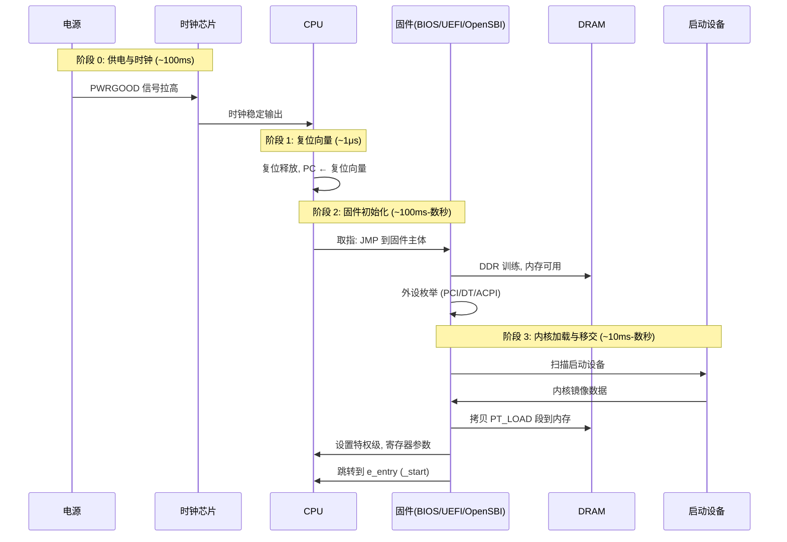
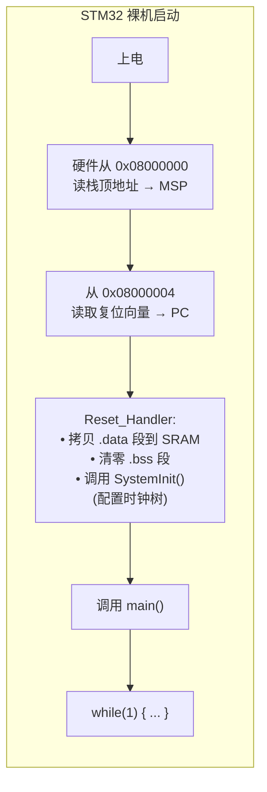
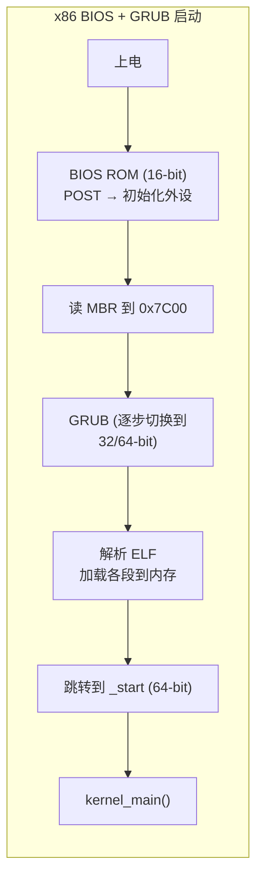
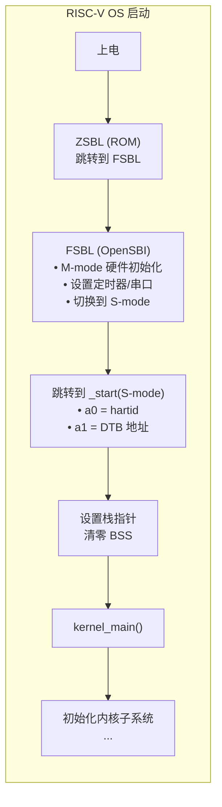

z

# 第 2 章：最小内核启动 — 从硬件复位到第一条指令

> **对应实验**：[Lab 2: 最小内核启动](../labs/lab2-boot.md)

## 2.1 本章要解决的问题

计算机上电后，硬件执行一系列自举过程，最终将控制权交给你的内核。你的任务是理解并控制这条路径：从固件到内核第一条指令，从裸机到 C 语言运行环境。

### 2.1.1 本章的核心任务清单

读完本章、做完 Lab 2 后，你应该能独立完成以下全部任务：

- [ ] 写出一个能通过 QEMU 启动的内核（即使它只会打印一行字然后停在那里）
- [ ] 解释 UART 如何把你的 `'H'` 变成屏幕上的字符（MMIO、LSR 轮询、THR 写入）
- [ ] 画出你的内核从 `_start` 到 `kernel_main` 的每一步在做什么
- [ ] 解释链接脚本中每个段的含义（`.text` / `.data` / `.bss` / `.rodata`）
- [ ] 实现正确的多核启动：自旋锁保护共享数据，fence 保证内存序
- [ ] 独立排查"内核不输出任何东西"的问题（这是 OS 开发最高频的 bug 类型）
- [ ] 说出固件直启、Multiboot2 启动、UEFI 直启三种路径的关键差异

## 2.2 从固件到内核：启动链全貌

本节将启动链拆解为七个层层递进的主题。先回答"固件为什么存在"，再讲"从按下电源到 `_start` 到底发生了什么"，然后回答"固件在运行时能为我做什么"，接着通过裸机/BIOS/UEFI 的三方对比说明固件的必要性，用 ELF 格式讲清楚内核镜像的结构，最后用启动路径选择和 UART 输出完成从原理到实践的闭环。

### 2.2.1 为什么会有启动链？——固件简史

最初的计算机没有"启动"的概念。程序员通过前面板开关手动输入引导代码——一字节一字节地拨入内存，然后按下"运行"按钮。1975 年发布的 Altair 8800（被公认为第一台个人电脑）的前面板上有一排 LED 和一排拨动开关——程序员需要拨动 16 个开关（代表一个 16 位地址），再拨动 8 个开关（代表数据），按下"DEPOSIT"按钮，然后继续拨动下一个地址。一个最小引导程序（从纸带读入器加载操作系统）大约需要 20-30 个字节，相当于要拨动几百次开关。错了任何一位？从头再来。

这就是"固件"诞生的背景——不是为了更方便，而是把程序员从拨开关的体力劳动中解放出来。

**CP/M 的 BIOS：在 IBM PC 之前就存在的思想。** 1974 年，Gary Kildall 在为 Intel 8008/8080 微处理器编写 PL/M 编译器时，发现了一个问题：每次他把软件移植到新的软盘驱动器或终端上，都要重写所有 I/O 代码。他的解决方案是 CP/M（Control Program for Microcomputers），把操作系统分成两层：

1. **BDOS（Basic Disk Operating System）**——CP/M 的核心，管理文件系统（`open`、`read`、`write`），与硬件无关
2. **BIOS（Basic I/O System）**——位于 BDOS 之下，包含与特定硬件相关的驱动代码（读一个扇区、写一个字符到控制台）

换句话说，"把 CP/M 移植到新机器"只需要重写 BIOS 层，BDOS 层完全不变。这是操作系统历史上第一个明确的硬件抽象层设计。

> **原始文献：** Gary A. Kildall, "CP/M: A Family of 8-and 16-Bit Operating Systems," *BYTE Magazine*, vol. 6, no. 6, pp. 216-246, June 1981. Kildall 在这篇文章中详细解释了 CP/M 的分层设计哲学。这篇文章是在 IBM 选择了微软的 MS-DOS 而非 CP/M 之后发表的——一个改变了计算机行业格局的商业决策（BIOS 的名字留了下来，但 CP/M 的创始人被排除在了 PC 革命之外）。

**ROM 和 IBM PC BIOS 的出现。** 1981 年，IBM PC 5150 引入了第一套大规模商用的固件方案。IBM 把一个 8 KB 的 ROM 芯片焊在主板上，映射到物理地址 `0xFE000`~`0xFFFFF`——这就是今天 x86 CPU 从 `0xFFFF0` 开始执行的由来：复位向量落在 ROM 的末尾，只有 16 字节的空间放一条 `JMP` 指令跳到真正的 BIOS 代码。IBM 的工程师直接采用了 CP/M 的"BDOS + BIOS"架构思路：MS-DOS 的 `IO.SYS` 就是 BIOS 层，`MSDOS.SYS` 就是 BDOS 层。而固化在 ROM 中的"系统 BIOS"是 IBM 的创新：把硬件初始化的最底层代码烧死在芯片上，让操作系统不必关心主板特定细节。

BIOS 的职责是清晰的：上电自检（POST——检查内存、键盘、显示器是否存在）→ 初始化基本 I/O 设备 → 扫描启动设备（软盘→硬盘）→ 读取第一个扇区（MBR，Master Boot Record）到内存 `0x7C00` → 跳转过去。

> **原始文献：** IBM, *IBM Personal Computer Technical Reference*, 1981. 这本手册完整定义了 BIOS 的中断向量表（`int 0x10` = 视频服务、`int 0x13` = 磁盘服务、`int 0x16` = 键盘服务）——这些中断号直到今天仍在 UEFI 模拟模式和虚拟化中被使用。

**岔路：PC-98 与 IBM PC——"兼容"不是理所当然的。** IBM PC 的成功引来了大量模仿者。Compaq 在 1982 年通过逆向工程造出了第一台 100% 兼容的 IBM PC 克隆机。但"兼容"在当时并非唯一的选择。

NEC 在 1982 年发布了 PC-9801，针对日本市场做了大量"本土化"设计：汉字字符集需要更高的分辨率，所以 PC-98 使用了自己的图形控制器（μPD7220，I/O 端口在 `0xA0`-`0xAF`，而非 IBM PC 的 `0x3D0`-`0x3DF`）；文本模式显存映射在 `0xA0000`-`0xAFFFF`（IBM PC 在 `0xB8000`）；BIOS ROM 定位在 `0xE8000` 而非 IBM 的 `0xFE000`。这些改动让 PC-98 能更好地显示日文，但也导致了一个后果：**为 IBM PC 编写的任何软件（包括操作系统）都无法直接在 PC-98 上运行**。

PC-98 在日本市场取得了超过 50% 的份额，并一直生产到 2003 年。但在全球市场上，IBM PC 兼容机的规模效应最终碾压了所有"更好但不同"的设计：硬件制造商发现只要遵循 IBM 的 I/O 端口映射和 BIOS 中断约定，就能获得整个生态的软件兼容性。PC-98 的兴衰证明了一条铁律：**硬件兼容性比硬件优越性更重要。** 这也正是后来 UEFI 试图一劳永逸解决的问题：用一套跨平台标准替代"祈祷制造商抄对了 IBM 的设计"。

**BIOS 的局限催生了 UEFI。** BIOS 运行在 16 位实模式下，这是 1978 年 8086 的遗产，只能寻址 1 MB。到了 1990 年代末，BIOS 的三大约束已经不可忍受：16 位实模式启动慢、MBR 分区表最大只支持 2 TB 磁盘、BIOS 的中断服务（`int 0x13`）每次只能读一个扇区。

但 UEFI 诞生的真正推动力不是 PC，而是 Intel 的 Itanium 处理器（1999）。Itanium 完全不支持 x86 的 16 位实模式，Intel 需要一个全新的固件标准来取代 BIOS。这个标准最初叫 EFI（Extensible Firmware Interface），由 Intel、Microsoft、HP 等行业联盟共同推动。后来 EFI 改名 UEFI，并在 2005 年苹果从 PowerPC 迁移到 Intel 时成为第一个大规模商业采用者：每一台 Intel Mac 都是用 UEFI 启动的。PC 世界则在 2011 年（Windows 8 时代）才强制要求 UEFI。

> **原始文献：** Intel, "Extensible Firmware Interface Specification," Version 1.02, December 2000. 第 1 章解释了 EFI 的设计目标：替代 16 位 BIOS 和 MBR，支持 64 位启动、GPT 分区表、从大容量存储直接加载 OS。

**RISC-V 世界的固件。** RISC-V 没有 BIOS 或 UEFI 的历史包袱——它直接采用了 OpenSBI。OpenSBI 运行在 M-mode，负责最底层的硬件初始化，然后切换到 S-mode 并把控制权交给你的内核。

> **历史教训小结**：固件的演进轨迹是一条从"无标准"到"硬件绑定标准"再到"跨平台统一标准"的曲线。Altair 时代无标准（每人拨自己的开关）→ IBM PC 时代硬件绑定标准（BIOS 只活在 IBM 兼容机上，PC-98 有自己的标准）→ UEFI 时代跨平台统一标准（同一套 UEFI 固件模型可以跑在 x86-64、ARM64 和有限的 RISC-V 上）。你的 OS 内核坐在这条曲线的终点：只要你遵循目标平台的固件接口（SBI 或 UEFI），内核的逻辑可以完全不关心主板型号。

### 2.2.2 上电到内核：硬件复位序列

**阶段 0：供电与时钟（~100 ms）**

按下电源键或 QEMU 启动后，首先发生的是纯物理过程：

1. ATX 电源收到 `PS_ON#` 信号（被拉低），开始输出各电压轨——3.3V、5V、12V
2. 电压爬升到额定值的 90% 后，`PWRGOOD` 信号被拉高
3. `PWRGOOD` 触发时钟芯片起振——晶振开始振荡，PLL（锁相环）锁定到目标频率
4. 时钟分发到 CPU 各核心、内存控制器、外设总线——此时"数字逻辑"才开始运转

在 QEMU 中，以上全部瞬间完成（QEMU 不建模供电和 PLL 锁定延迟）。但在真实硬件上，从按下电源键到 CPU 开始执行第一条指令，可能需要几百毫秒——大部分时间花在等待电源稳定和 PLL 锁相上。

**阶段 1：复位向量（~1 μs）**

复位信号释放后，CPU 内部各寄存器进入预先定义的复位默认值。最关键的是程序计数器（PC）——它被硬编码到一个特定地址，即**复位向量**：

| ISA | 复位向量地址 | CPU 初始状态 |
|-----|------------|------------|
| **x86-64** | `0xFFFFFFF0`（实模式 `CS:IP = F000:FFF0`） | 16 位实模式，分页关闭，中断关闭 |
| **RISC-V** | 实现定义，通常 `0x1000`（M-mode）或 `0x80000000` | M-mode，分页关闭，中断关闭 |
| **ARM Cortex-A** | `0x00000000` 或 `0xFFFF0000`（由配置引脚/寄存器选择） | EL3（最高特权级），MMU 关闭 |

此时 CPU 处于**最原始的状态**：无栈指针（SP 未定义）、无页表（`satp` / `CR3` / `TTBR0` 为零）、无异常向量（`mtvec` / `IDTR` 未初始化）。CPU 只知道一件事：去复位向量地址取第一条指令。

**阶段 2：固件初始化（~100 ms ~ 数秒）**

固件的第一条指令通常是一条 `JMP`——因为复位向量处通常只预留了 16 字节（x86）或类似的小空间，放不下完整的固件入口逻辑。这条 `JMP` 跳到固件的真正入口。

固件的初始化遵循一条严格顺序：

1. **CPU 自身配置**：设置本特权级的控制寄存器（如 RISC-V 的 `mstatus`、`mie`；x86 的 `CR0`、`CR4`）。此时固件运行在最高特权级
2. **内存控制器初始化**：这是整个启动过程中最慢的步骤。DDR4/DDR5 需要在时钟、电压、时序参数上做精细的"训练"（校准 DQS 信号与数据线的相位关系）。在服务器主板上，这一步可能需要数秒
3. **基本 I/O 初始化**：至少初始化一个串口或调试控制台——这是"第一条可能被外界看到的调试输出"出现的地方
4. **外设枚举**：扫描 PCI/PCIe 总线（x86）、或从设备树/ACPI 获取平台信息（ARM/RISC-V）

> **为什么固件需要几百 KB 甚至几 MB？** 不是因为"启动逻辑"很复杂——启动逻辑本身可能只有几十 KB。体积膨胀来自硬件驱动：每个主板可能使用不同厂商的内存控制器、不同的 Super I/O 芯片、不同的 PCIe 根端口配置。UEFI 固件（如 TianoCore/EDK II）本质上是一个为启动优化的迷你操作系统：它有完整的驱动程序模型、文件系统支持（FAT32），甚至网络栈（PXE 启动）。

**阶段 3：内核加载与移交（~10 ms ~ 数秒）**

固件初始化完成后，进入"引导策略"阶段：

1. **扫描启动设备**：按固件配置的启动顺序依次尝试——UEFI 从 EFI System Partition（FAT32）查找 `\EFI\BOOT\BOOT{ARCH}.EFI`；传统 BIOS 读取磁盘的第一个扇区（MBR）；OpenSBI 直接加载 `-kernel` 参数指定的 ELF 文件
2. **读取并解析内核镜像头**：识别格式——ELF header（`e_ident` 魔数 `\x7fELF`）、PE/COFF header（`MZ` 魔数）、或 raw binary（无头部，需要额外指定加载地址）
3. **加载各段到内存**：对于 ELF 格式，固件遍历 program headers，对每个 `PT_LOAD` 段，从文件偏移 `p_offset` 处读取 `p_filesz` 字节，拷贝到物理地址 `p_vaddr`。如果 `p_memsz > p_filesz`（这正是 `.bss` 段的情况），差值部分理应填零。但**不是所有固件都严格执行这一步**（详见 §2.2.5）
4. **设置 CPU 状态并移交**：将 CPU 切换到目标特权级（M→S、EL3→EL1/EL2、实模式→保护模式→long mode）、设置约定的寄存器参数（如 RISC-V 的 `a0=hartid, a1=DTB`）、跳转到 ELF 头中记录的 `e_entry` 地址

此时，你的 `_start`（或 `_entry`）开始执行。



### 2.2.3 固件平台服务：你的内核继承了什么

§2.2.2 讲了固件**怎么把你带到 `_start`**。但固件的工作不止于此——它在运行时还提供一组**服务**，你的内核可以在早期启动中调用它们。这些服务的存在，让你在还没有自己的磁盘驱动、定时器驱动、甚至还没有页表的时候，就能做一些基本的事情。

**SBI（RISC-V）——ecall 即服务**

OpenSBI 实现运行在 M-mode，你的内核运行在 S-mode。内核通过 `ecall` 指令请求 M-mode 服务——这与"用户态通过系统调用请求内核服务"是同一种机制，只是角色换成了"内核请求固件"。

SBI 调用约定：`a7` 存功能 ID（EID），`a6` 存扩展 ID（EID 的高位），`a0`-`a5` 传参数，返回值在 `a0`。

| SBI 服务 | 功能 | 为什么早期内核需要它 |
|---------|------|-------------------|
| `console_putchar`（EID=1） | 向调试串口写一个字符 | 在内核自己的 UART 驱动就绪之前，这是唯一的输出手段 |
| `console_getchar`（EID=2） | 从调试串口读一个字符 | 早期调试输入 |
| `set_timer`（EID=0，TIME 扩展） | 设置定时器中断 | 时钟中断是调度器的心脏——内核需要定时器才能实现抢占 |
| `system_reset`（EID=0x53525354，SRST 扩展） | 关机或重启 | 在没有 ACPI 或 PMU 驱动的平台上，这是唯一能"优雅关机"的方式 |
| `hart_start` / `hart_stop`（HSM 扩展） | 启动或停止其他 HART | 多核 OS 需要动态管理从核的启动和挂起 |
| `send_ipi`（IPI 扩展） | 向其他 HART 发送核间中断 | TLB shootdown、调度器跨核唤醒 |


**UEFI Boot Services（x86-64/ARM64）——临终关怀**

UEFI 固件比 SBI 厚重得多。它通过 `EFI_SYSTEM_TABLE` 向内核暴露一组完整的运行时数据结构和服务表：

| UEFI 服务 | 功能 | 生命周期 |
|----------|------|---------|
| `SystemTable->ConOut->OutputString()` | 向控制台输出字符串 | 直到 `ExitBootServices` |
| `BootServices->GetMemoryMap()` | 获取物理内存布局 | **必须在 `ExitBootServices` 之前调用** |
| `BootServices->LocateProtocol(&gEfiGraphicsOutputProtocolGuid, ...)` | 获取帧缓冲基址和分辨率 | 同上 |
| `BootServices->GetConfigurationTable(&gEfiAcpiTableGuid, ...)` | 获取 ACPI 表根指针 | 同上 |
| `RuntimeServices->ResetSystem()` | 关机或重启 | `ExitBootServices` 后仍然可用 |
| `RuntimeServices->GetVariable()` | 读写 UEFI 变量（如 BootOrder） | 同上 |

**关键约束**：`ExitBootServices()` 是把剪刀——调用之后，Boot Services 全部失效。但 Runtime Services 仍然可用。你的内核必须在调用 `ExitBootServices()` 之前，把物理内存映射、帧缓冲地址等关键信息保存到自己的数据结构中。这条边界是 UEFI 启动阶段最重要的设计约束。

**传统 BIOS 中断服务（x86 历史参考）**

传统 BIOS 通过中断向量表提供服务——这是 16 位实模式下的简陋方案：

| BIOS 中断 | 功能 | 限制 |
|----------|------|------|
| `int 0x10` | 视频服务（设置模式、写字符、滚动） | 仅实模式可用 |
| `int 0x13` | 磁盘服务（读/写扇区） | 每次只能读一个扇区，无法处理 2 TB+ 磁盘 |
| `int 0x15` | 系统服务（内存映射检测 `E820`） | 获取的内存映射是内核后续一切的基础 |
| `int 0x16` | 键盘服务 | 仅实模式可用，保护模式下需重写键盘驱动 |

一旦内核切换到 32 位保护模式或 64 位 long mode，所有这些中断服务全部不可用。这也是为什么 x86 内核在切换到保护模式之前必须调用 `int 0x15 E820` 获取内存映射——切换之后就再也没有机会了。

**服务层次对比**：

| | 传统 BIOS | UEFI | SBI (RISC-V) | 裸机 (无固件) |
|------|:--:|:--:|:--:|:--:|
| 串口输出 | `int 0x10` | ConOut | `ecall` (EID=1) | 手动写 UART MMIO 寄存器 |
| 磁盘读取 | `int 0x13` | Block I/O Protocol | 无（RISC-V 不定义磁盘服务） | 手动写 AHCI/NVMe 寄存器 |
| 内存映射 | `int 0x15 E820` | `GetMemoryMap()` | 无（需解析设备树） | 硬编码或手动探测 |
| 定时器 | 无标准接口 | `SetTimer()` (EFI Timer) | `ecall` (TIME) | 手动编程平台定时器 |
| 关机 | `int 0x15` (APM) | `ResetSystem()` | `ecall` (SRST) | 无——只能死循环 |
| 信任边界 | 无（实模式无保护） | Boot/Runtime 分离 | M/S-mode 分离 | 无边界 |

**对你这门课的意义**：如果你选择 RISC-V + OpenSBI，你在阶段 2 就可以用 `ecall` 输出字符和关机，不需要先写 UART 驱动（虽然写一个也不难）。如果你选择 x86-64 UEFI 直启，你必须在 `ExitBootServices()` 的"临终关怀窗口"内完成内存映射的获取。错过这一步，你连自己的内核占了多少内存都不知道。

### 2.2.4 固件 vs UEFI vs 裸机：为什么固件是必要的

如果你有 STM32 裸机编程经验，你可能习惯了这样的启动流程：编写 `main()` → 编译器自动链接启动文件 → 烧录到 Flash → 上电即运行。整个过程中，你几乎不需要关心"谁把 CPU 设置到当前模式的"。因为根本就没有模式切换这一说。

但 OS 的启动流程比这复杂得多。理解差异的最好方式，是把三种场景放在一起看。

**STM32F103 裸机启动：**



整个过程在一个特权级（Privileged / Thread mode with privileged access）内完成。没有固件和内核的边界。如果非要说的话，启动文件（`startup_stm32f103xx.s`）和 HAL 库就是你全部的"固件"。

**传统 BIOS + Bootloader 启动（x86）：**



**现代 UEFI/OpenSBI 固件直启（RISC-V）：**



**三方关键差异：**

| 维度 | 裸机 (STM32) | 传统固件 (BIOS) | 现代固件 (UEFI/OpenSBI) |
|------|-----------|---------------|----------------------|
| **特权级变化** | 始终一个级别 | 16-bit 实模式 → 32/64-bit（手工切换） | M-mode→S-mode 或 DXE→内核（固件替你切换） |
| **谁初始化硬件** | 你的启动文件 + `SystemInit()` | BIOS 初始化基本 I/O，内核初始化其余一切 | 固件全面初始化 + 提供运行时服务 |
| **启动地址** | 硬编码 Flash 首地址 | 固件决定，传统在 `0x7C00`（MBR） | 固件决定，由 ELF entry 或 PE entry point 确定 |
| **运行时服务** | 无。所有硬件自己驱动 | 16 位中断服务，切换模式后全部失效 | SBI ecall 或 UEFI Runtime Services（ExitBootServices 后部分可用） |
| **BSS 清零** | 启动文件里做 | Bootloader 替你做了，或者自己确认 | **自己负责**——固件可能填零，也可能不填 |
| **硬件多样性处理** | 烧写针对特定芯片的 HAL | 主板厂商定制 BIOS → 兼容性问题 | 统一标准接口（SBI/UEFI），固件屏蔽硬件差异 |
| **启动失败的表现** | LED 不闪、看门狗复位 | 黑屏、蜂鸣器报错码、三重故障 | QEMU 无输出、panic、SBI 错误码 |

**为什么 OS 需要固件？三个不可调和的矛盾：**

1. **硬件多样性与内核通用性的矛盾**。DDR4 的时序训练参数因主板而异——你不能期望内核携带所有主板的内存初始化代码。固件封装了这一层差异，内核只需要知道"内存从哪开始、到哪结束"。UEFI/OpenSBI 的使命就是把"如何初始化硬件"变成固件的事，把"硬件有哪些资源"用统一接口告诉内核。

2. **特权级鸿沟**。从最高特权级（M-mode/EL3）到内核特权级（S-mode/EL1）的切换，必须由当前更高特权级的代码完成。你不可能在 S-mode 中把自己"提升"到 M-mode——这是硬件安全模型的基础。固件运行在最高特权级，负责设置好低特权级的入口环境，然后主动降级。

3. **启动资源的临时性**。UEFI Boot Services 的 `GetMemoryMap()` 是内核在有自己的物理内存分配器之前，了解物理内存布局的唯一途径。如果你不在 `ExitBootServices()` 之前调用它，你将永远失去获取精确内存映射的能力——之后你只能靠"手动探测哪些地址有 DRAM"这种不可靠的方法。固件服务是一扇有时间限制的窗口，关上就不会再打开。

> **对零基础自学者的启示**：如果你觉得 OS 启动流程"步骤太多记不住"，不要硬记。回到上面那张三方差异表——每一步都是为了解决"裸机程序不需要面对、但 OS 必须面对"的问题。BSS 清零？因为裸机的数据段在 Flash 中已知初值，但 OS 内核在 RAM 中运行，RAM 上电后内容是随机的。设置栈？裸机也设——但启动文件替你做了，而 OS 得自己来，因为固件不知道你的内核打算把栈放在哪。请求固件服务？裸机不需要——因为整块芯片都是你的；OS 需要——因为固件已经占用了最高特权级，你要通过规定的接口请它代劳。

### 2.2.5 可执行文件格式：ELF 与链接脚本

到此为止，我们反复提到了 ELF、段（section/segment）、BSS 清零——但没有系统性地解释过它们到底是什么。现在补上这一课。

**ELF 的双重身份**

ELF（Executable and Linkable Format）被设计为同时服务于两个截然不同的目的——链接和执行。它用两套平行的"目录"来实现这一点：

```
┌─────────────────────────────────────────────┐
│                 ELF Header                    │
│  e_entry = 入口地址                           │
│  e_phoff = Program Header 表偏移               │
│  e_shoff = Section Header 表偏移               │
├─────────────────────────────────────────────┤
│          Program Header Table                 │  ← 执行视图（固件/加载器看这里）
│  [PT_LOAD] p_vaddr=0x80000000                 │
│            p_offset=0x1000                    │
│            p_filesz=0x4000  ← 文件中有多少     │
│            p_memsz=0x5000   ← 内存中需要多少   │
│            p_flags=PF_R|PF_X                  │
│  [PT_LOAD] p_vaddr=0x80005000                 │
│            p_filesz=0x1000                    │
│            p_memsz=0x3000   ← .bss 多出的部分  │
│            p_flags=PF_R|PF_W                  │
├─────────────────────────────────────────────┤
│              Section Headers                  │  ← 链接视图（链接器/调试器看这里）
│  .text    addr=0x80000000  size=0x3F00       │
│  .rodata  addr=0x80003F00  size=0x0100       │
│  .data    addr=0x80005000  size=0x1000       │
│  .bss     addr=0x80006000  size=0x2000       │
│  .symtab  (不加载到内存)                       │
│  .strtab  (不加载到内存)                       │
└─────────────────────────────────────────────┘
```

**执行视图**（Program Headers）是固件或加载器唯一关心的部分。它告诉加载器："把文件中的哪些连续块（segment）拷贝到内存的哪些位置，每个块的权限是什么。" `.bss` 段没有自己的 `PT_LOAD`——它被合并到包含可写数据的 segment 中，用 `p_memsz > p_filesz` 的方式表示"多出来的那部分需要填零"。

**链接视图**（Section Headers）是链接器和调试器使用的。它把 ELF 内部按用途分成不同的 section（`.text` 代码、`.rodata` 只读数据、`.data` 已初始化数据、`.bss` 未初始化数据……），精度比 segment 高得多。**但是固件不读 section headers**：它只按 program headers 加载。也就是说，即使你的 `.bss` section header 正确地描述了 BSS 的大小和位置，固件仍然可能不替你填零。

**链接脚本：段符号从哪里来**

链接脚本（linker script）是你和链接器之间的合同。它告诉链接器：各段按什么顺序摆放、放在什么地址、以及在哪定义边界符号。

以 一个典型的链接脚本为例：

```ld
SECTIONS
{
  . = 0x80200000;              /* 当前位置计数器从 0x80200000 开始 */

  .text : {
    kernel/entry.o(_entry)     /* 确保 _entry 在 .text 的最开头 */
    *(.text .text.*)
    PROVIDE(etext = .);        /* 定义符号 etext = 当前地址 */
  }

  .rodata : {
    *(.rodata .rodata.*)
  }

  .data : {
    *(.data .data.*)
  }

  .bss : {
    *(.bss .bss.*)
  }

  PROVIDE(end = .);            /* 定义符号 end = 内核镜像末尾 */
}
```

`PROVIDE(etext = .)` 的意思是：在当前地址（`.` 是位置计数器）处定义一个符号 `etext`，它的值是当前地址。你在汇编中可以这样引用它：

```asm
la   t0, _bss_start       # t0 = BSS 段的起始地址
la   t1, _bss_end         # t1 = BSS 段的结束地址
```

这些符号**不是变量**——它们没有存储空间，它们只是地址标签。在 C 中引用它们时，这是一个非常容易出错的点：

```c
// ❌ 错误：把 _bss_start 当成 int 用
extern int _bss_start, _bss_end;
size_t bss_size = &_bss_end - &_bss_start;   // 这才是对的——取地址

// ✅ 正确：声明为 char[]，语义更清晰
extern char _bss_start[], _bss_end[];
size_t bss_size = _bss_end - _bss_start;      // 数组名自动退化为地址
```

> **最常见的 BSS 清零 bug**：声明 `extern int _bss_start` 然后写 `memset(&_bss_start, 0, ...)`——这里的 `&_bss_start` 取的确实是符号地址，看似正确。但如果有人写成 `memset(_bss_start, 0, ...)`（忘写 `&`），它会把 `_bss_start` 符号地址的**前 4 个字节**解释为一个 `int` 值，然后把这个值当作 memset 的目标地址——几乎是随机的，必崩溃。

**为什么必须清零 BSS？**

这个问题有三层答案：

1. **C 语言标准要求**。C11 §6.7.9 ¶10：静态存储期的未初始化对象（包括全局变量和 `static` 局部变量）初始值为零。编译器有权依赖这个假设——它可能把 `static int count;` 优化为"从 BSS 段读，假定是零"。

2. **在 freestanding 环境中没有 CRT**。在宿主环境（Linux/Windows 用户程序）中，C 运行时（`crt0.o`）会在 `main()` 之前调用 `memset(__bss_start, 0, __bss_size)`。在你的内核中——没有 CRT。你必须自己做。

3. **RAM 上电后的内容是不确定的**。DRAM 单元在上电后、第一次被写入之前，电荷状态是不确定的——可能是 0，可能是 1，可能随温度变化、随芯片个体变化。你不清零，`static int count;` 的初始值就是一个随机数。有时候碰巧是零（测试通过），有时候不是（随机崩溃）——这是最隐蔽的 bug 类型。

**最小语言运行时：BSS 之外还需要什么。**

BSS 清零是 C 语言对你的核心要求。但一个能实际工作的 freestanding C 程序，还需要几个最基本的函数。这些函数通常由 `libc` 提供，但你的内核是 freestanding 的——没有 `libc`，你得自己实现。

**`memset` 和 `memcpy`。** 编译器在编译某些结构体赋值、数组初始化时，会隐式生成对 `memset` 或 `memcpy` 的调用。例如 `struct { char buf[64]; } a = {0};` 在某些优化级别下会被编译为 `memset(&a, 0, 64)`。如果你的内核没有提供 `memset`，链接器会报 `undefined reference to 'memset'`——即使你从来没在源码里写过这个函数名。

最小实现只需要几行：

```c
// memset: 用字节 value 填充内存区域
void *memset(void *dst, int c, size_t n) {
    unsigned char *p = dst;
    while (n--) *p++ = (unsigned char)c;
    return dst;
}

// memcpy: 逐字节拷贝（不处理重叠，生产环境应用 memmove）
void *memcpy(void *dst, const void *src, size_t n) {
    unsigned char *d = dst;
    const unsigned char *s = src;
    while (n--) *d++ = *s++;
    return dst;
}
```

有了 `memset`，BSS 清零在 C 代码中就变成一行：

```c
extern char _bss_start[], _bss_end[];
memset(_bss_start, 0, _bss_end - _bss_start);
```

> **一个容易忽略的陷阱**：`memset` 本身不能依赖 BSS 中的未初始化变量。如果你的 `memset` 实现用了 `static` 局部变量或全局变量，而这些变量恰好落在 BSS 段中，那么在执行 BSS 清零之前调用 `memset` 会导致 `memset` 自己的状态是随机的。最简单的解法：在汇编入口中完成 BSS 清零（汇编不依赖任何 C 变量），或者确保 `memset` 只使用栈上局部变量和寄存器。

**Rust 视角：`panic_handler`。** 如果你的内核用 Rust 编写，最小的语言运行时需求略有不同。Rust 没有 BSS 的概念——编译器负责生成正确的段布局——但它有一个硬性要求：你必须提供一个 `#[panic_handler]` 函数，处理所有不可恢复的错误（数组越界、`unwrap()` 失败、`panic!()` 宏等）。在裸机环境中，最小的 `panic_handler` 通常就是向串口输出一条错误信息然后停机：

```rust
use core::panic::PanicInfo;

#[panic_handler]
fn panic(info: &PanicInfo) -> ! {
    // 向 UART 输出 panic 信息（假设 uart_puts 已实现）
    // 在 panic 时，正常的格式化基础设施可能不可用，
    // 所以常用最简单的方式：输出固定字符串 + 停机
    uart_puts("KERNEL PANIC\n");
    loop {}  // 或调用 sbi::system_reset() 重启
}
```

> **C 与 Rust 的对比**：C 语言通过"缺失的东西"来定义最小运行时——编译器不会主动告诉你需要什么，直到链接器报 `undefined reference`。Rust 通过"必须提供的东西"来定义——`panic_handler` 是编译时强制要求的符号，缺少它连编译都过不了。两种方式殊途同归：都要求你在语言运行时和裸机之间，自己搭一座最小的桥。

无论你用 C 还是 Rust，核心道理是一样的：**BSS 清零 + `memset`/`memcpy`（C）或 `panic_handler`（Rust）构成你的最小语言运行时。** 除此之外的一切——`printf`、`malloc`、文件操作——都可以等到后面阶段再实现。但这几个函数必须在阶段 2 就位，否则你的内核要么链接不过，要么行为随机。


### 2.2.6 启动路径选择

* **三种路径的对比：**

| 路径 | 典型场景 | 内核入口点收到的状态 | 你需要做什么 | 教学难度 |
|------|---------|---------------------|------------|:------:|
| **固件直启**（Firmware-direct） | RISC-V + OpenSBI | S-mode, `a0=hartid`, `a1=dtb` 地址 | 设置栈，解析设备树，初始化页表 | ★★☆ 低 |
| **Bootloader 启动**（Multiboot2 / Limine） | x86-64 + GRUB/Limine | 64 位保护模式或 long mode, 内存映射/帧缓冲已由 bootloader 收集好 | 解析 bootloader 信息结构，跳转到 C 入口 | ★★☆ 低（因为 bootloader 替你干了模式切换的脏活） |
| **UEFI 直启**（PE/COFF 内核） | x86-64 UEFI 机器 | 64 位 long mode, `EFI_SYSTEM_TABLE*` 可用, Boot Services 未退出 | 通过 UEFI 获取内存映射/帧缓冲/ACPI，调用 `ExitBootServices()` | ★★★ 中（需要理解 UEFI 协议和 PE/COFF 格式） |

**RISC-V 学生建议**：固件直启。OpenSBI 已经把 CPU 留在 S-mode，你的内核入口点已经在一个干净的状态。不需要 bootloader。这是 RISC-V 教学的默认路径，也是最简单的路径。

**x86-64 学生建议**：绝对不要手动写 16 位实模式到 64 位 long mode 的切换代码。选择 GRUB（Multiboot2 协议）或 Limine。GRUB 安装命令 `grub-mkrescue` 可以一键生成可启动 ISO；Limine 的 `limine` 工具同样简洁。你花在阅读 Multiboot2 规范上的三十分钟，省掉的是在 GDT 表项出错时对着三重故障抓狂的三个下午。

**如果你想让你的 OS 在真实硬件上启动**：UEFI 直启。用 `clang -target x86_64-unknown-windows -fuse-ld=lld-link` 编译为 PE/COFF，放在 FAT32 分区上。或者更简单的：先通过 GRUB/Limine 启动来验证内核正确性，UEFI 直启作为后续移植任务。

* **为什么不是所有人都用固件直启？——bootloader 的不可替代性。**

在 x86 的世界，这个问题有一个直白的答案：**手动从固件跳转到 64 位 long mode 内核实在太痛苦了。**

Legacy BIOS 把 CPU 留在 16 位实模式，这是 1978 年 8086 的遗产。你的内核是 64 位的，但你收到的第一条指令只能执行 16 位代码。在跳转到你的 C 入口之前，你必须亲手完成整套"模式切换体操"：禁用中断 → 设置 GDT（全局描述符表，段式内存管理的历史遗物，即使在纯分页模式下也必须有一个最小 GDT）→ 启用保护模式 → 设置最基本的页表（long mode 要求分页必须开启）→ 启用 long mode → 远跳转刷新指令流水线 → 终于进入 64 位模式。每一步都有严格的寄存器写入顺序，写错一步，CPU 三重故障（triple fault）直接重启，连调试信息都不留。

这就是 bootloader 存在的第一个理由：**它替你做了这些脏活。** 你只需要按照 bootloader 的协议（如 Multiboot2）写一个启动头，bootloader 找到你的内核、加载到内存、把 CPU 切换到你要的模式、跳转到你的入口点。你收到的第一条指令就已经在 64 位模式（或 32 位保护模式）下，可以直接写 C 代码。

但这引出了第二个问题：既然 UEFI 已经可以直接加载 64 位 PE/COFF 内核了，为什么还需要 bootloader？UEFI 的 DXE 阶段运行在 64 位模式下，`EFI_BOOT_SERVICES->LoadImage()` 可以直接加载 PE 格式的内核。答案是：**UEFI 启动服务的生命周期很短。** UEFI 规范在调用 `ExitBootServices()` 之后，固件的大多数服务（内存分配、文件系统访问、图形输出）全部不可用。你的内核必须在此之前——在 UEFI 的"临终关怀"窗口内——获取物理内存映射、帧缓冲地址、ACPI 表根指针等关键信息。如果你的内核是 PE/COFF 格式，UEFI 帮你加载它；如果你的内核是 ELF 格式，你需要在 PE 里嵌入一个 UEFI stub（Linux 的做法），或者用 bootloader 做格式翻译。

* **三大 Bootloader 速览：**

| Bootloader | 支持 ISA | 启动协议 | 镜像格式 | 给你什么 | 教学推荐 |
|-----------|---------|---------|---------|---------|:------:|
| **GRUB 2** | x86-64, ARM64 | Multiboot2 | ELF + Multiboot2 header | 64 位模式、内存映射、帧缓冲、ACPI 表、模块加载 | ★★★ 最通用，x86 教学首选 |
| **Limine** | x86-64, ARM64, RISC-V | Limine boot protocol (stivale 后继) | ELF + Limine 请求段 | 64 位模式、内存映射、帧缓冲、SMP 信息、设备树、内核重定位 | ★★★ 现代化，支持多 ISA |
| **U-Boot** | ARM, RISC-V, x86 (有限) | U-Boot image (uImage/FIT) | 传统 uImage 或 FIT image | 设备树、内存映射、网络启动、脚本化 | ★★☆ 嵌入式/RISC-V 首选 |

**GRUB 2 (Grand Unified Bootloader)** 是 hobby OS 社区最老牌的 bootloader。它通过 Multiboot2 协议将内核加载到内存，并传递内存映射、帧缓冲地址、ACPI 根指针等关键信息。GRUB 本身支持从 ext2/3/4、FAT、ISO9660 等多种文件系统读取内核镜像。也就是说，你不需要在 OS 内部实现磁盘驱动和文件系统就能开始工作。对于 x86-64 教学 OS，GRUB 几乎是不二之选。

**Limine** 是 2020 年代兴起的现代 bootloader，被 SerenityOS 等项目采用。它的协议设计比 Multiboot2 更简洁规范，原生支持 RISC-V（而 GRUB 的 RISC-V 移植仍在早期阶段）。Limine 通过声明式请求段让内核声明"我需要帧缓冲、SMBIOS 表、EFI 内存映射"，bootloader 负责找到并提供这些资源。如果你的 OS 需要跨 ISA 支持（既跑 x86-64 也跑 RISC-V），Limine 是最值得投入的选项。

**U-Boot (Das U-Boot)** 是嵌入式 Linux 世界的霸主。它支持几乎所有你能想象到的 ARM 和 RISC-V 开发板。U-Boot 可以加载传统 uImage 格式（内核镜像 + 头部信息）或 FIT (Flattened Image Tree) 格式（多组件镜像，可包含内核、设备树、initramfs）。对于 RISC-V 教学 OS，如果你的目标是最终移植到真实硬件（如 SiFive HiFive 或 StarFive VisionFive 开发板），U-Boot 是必经之路。

**UEFI 直启——跳过 Bootloader。** 如果你不想引入外部 bootloader 依赖，可以让内核自身成为一个 UEFI 可执行文件：

1. 将你的内核编译为 PE/COFF 格式（或 ELF + UEFI stub），入口点接收 `EFI_SYSTEM_TABLE*`
2. 在内核的第一个阶段（`efi_main` 或等价入口），通过 UEFI Boot Services 获取物理内存映射（`GetMemoryMap()`）、帧缓冲（`GOP`）、ACPI 表（`GetConfigurationTable()`）
3. 调用 `ExitBootServices()` 后，固件退出，你的内核完全接管硬件
4. 之后的执行与任何其他启动方式相同——你已经有了 64 位模式、内存映射、帧缓冲

**优势**：零外部依赖——内核镜像本身就是一个完整的 UEFI 应用，可以直接放在 FAT32 分区上被固件加载。在真实 x86-64 机器上测试时尤其方便。

**代价**：你的内核必须"学会说 UEFI"——需要链接 UEFI 协议头、实现 PE/COFF 入口、在早期启动中调用 UEFI Boot Services。UEFI 的 C API 有上千个函数，但你在启动阶段只需要约 5 个。

**实际案例**：Linux 内核通过 `EFISTUB` 支持 UEFI 直启——同一个 `vmlinuz` 既可以作为 bzImage 被 GRUB 加载，也可以直接作为 UEFI 应用运行。Windows 内核从 Windows 8 开始完全依赖 UEFI 启动（`bootmgfw.efi`）。

**对你这门课的意义**：如果你选择 RISC-V + QEMU `virt`，OpenSBI 直启是最简单的路径，你不需要任何 bootloader。如果你选择 x86-64，强烈建议用 GRUB 或 Limine。手动写 16 位实模式到 64 位 long mode 的切换代码不是"学习 OS"，是"考古 8086"。如果你想让你的 OS 在真实 x86-64 电脑上启动，UEFI 直启是未来。2020 年后的主板几乎全部默认 UEFI 模式，Legacy BIOS 正在被淘汰。

这个阶段产出的不是复杂的功能，而是一个**可复现的、可验证的基础执行环境**。它验证了你的工具链、链接布局和硬件理解是正确的——后续所有阶段都建立在这个基础上。

### 2.2.7 第一条输出：UART 如何把字符送到屏幕

启动链讲完了。但还有一个"最后一公里"的问题没回答：你的内核写了一个 `'H'`，它到底是怎么变成屏幕上那个亮晶晶的字符的？

**UART 是什么。** UART（Universal Asynchronous Receiver/Transmitter）是最古老、最简单的串行通信接口之一。它不需要时钟线——收发双方事先约定好波特率（每秒传输的符号数），各自用独立的时钟采样数据线。一根 TX 线发送，一根 RX 线接收，再加一根 GND 共地，三根线就能通信。

在 QEMU `virt` 机器和大多数 RISC-V 开发板上，UART 是内核能接触到的第一个输出设备。你的 kernel banner 就是从 UART 的 TX 引脚出去的。

**16550 UART 的寄存器模型。** QEMU `virt` 机器模拟的 UART 兼容 16550 标准，MMIO 基地址在 `0x10000000`：

| 偏移 | 寄存器 | 方向 | 作用 |
|------|--------|------|------|
| `0x00` | THR (Transmitter Holding Register) | 写 | 把要发送的字节写进这里 |
| `0x00` | RBR (Receiver Buffer Register) | 读 | 读出收到的字节（同一偏移，读/写不同寄存器） |
| `0x14` | LSR (Line Status Register) | 读 | Bit 5 = THRE：发送器空闲，可以写下一个字节；Bit 0 = DR：有数据可读 |

**发送一个字符的完整路径。** 假设你的内核调用了 `uart_putc('H')`：

```
kernel_main()
  → uart_putc('H')
    → 循环读 LSR (0x10000014) 直到 bit 5 为 1 (发送器空闲)
    → 把 'H' (0x48) 写入 THR (0x10000000)
      → UART 硬件自动添加起始位和停止位，按约定的波特率逐位驱动 TX 线
        → QEMU 将串口数据转发到宿主终端 (或 `-nographic` 下的 stdio)
          → 你的终端模拟器将收到的字节渲染为字符 'H'
```

关键细节：在向 THR 写数据之前，必须先读 LSR 确认 THRE 为 1。UART 的发送速度远远慢于 CPU，在 115200 波特率下，每个字节大约需要 87 微秒。如果你不检查 THRE 就连续写入，后面的字节会覆盖还没发完的前一个字节，导致输出丢字符。

**两条路径：SBI ecall vs 直接 MMIO。** 你的内核有两种方式向 UART 写字符：

| 方式 | 路径 | 优点 | 缺点 |
|------|------|------|------|
| **SBI ecall** | `ecall` → OpenSBI(M-mode) → 写 UART 寄存器 → 返回 S-mode | 简单，一行 `ecall` 搞定；固件已初始化好波特率 | 每次输出都触发 M-mode 陷入，开销大；功能受限（只有 putchar/getchar） |
| **直接 MMIO** | 内核直接读写 `0x10000000`/`0x10000014` | 无陷入开销；完全控制 UART 所有功能（中断、FIFO、流控） | 需要自己处理 LSR 轮询；如果固件未初始化 UART 则需要先配置 |

在教学场景中，两种方式都可以。SBI ecall 的优势在于"立即可用"——OpenSBI 在启动时已经初始化了 UART0（115200 8N1），你不需要写任何配置代码。直接 MMIO 的优势在于"你完全理解硬件在做什么"。但"直接 MMIO"这四个字到底是什么意思？`*(volatile uint8_t*)0x10000000 = 'H'` 这一行 C 代码，在硬件层面到底触发了什么？

**MMIO 如何驱动设备。** 在大多数 CPU 架构上，I/O 设备通过两种方式与 CPU 通信：x86 有独立的 I/O 地址空间（用 `IN`/`OUT` 指令访问），而 RISC-V、ARM 和绝大多数现代架构使用 MMIO——Memory-Mapped I/O，把设备寄存器映射到物理地址空间的特定区域。

CPU 不区分"这是一块 DRAM"还是"这是一个 UART 寄存器"。它只做一件事：发出 load 或 store 请求，带上一个物理地址。芯片上的互联网络（总线矩阵或 crossbar）根据地址范围将请求路由到正确的目的地：

```
CPU 执行:  sb  a0, 0(t0)          # t0 = 0x10000000, a0 = 'H'
    │
    ▼
MMU (此时分页未开启, 物理地址直通)
    │
    ▼
总线矩阵: 地址 0x10000000 落在哪个范围内?
    │
    ├── 0x80000000 ~ 0x88000000  →  DRAM 控制器
    ├── 0x10000000 ~ 0x10000100  →  UART0 控制器  ◀── 命中!
    ├── 0x0C000000 ~ ...         →  PCIe 根端口
    └── ...
    │
    ▼
UART0 控制器收到写请求: 地址偏移 0x00, 数据 0x48
    → 识别为 THR 写入
    → 将 0x48 装入发送移位寄存器
    → 硬件状态机开始逐位驱动 TX 线 (起始位 → 8 个数据位 → 停止位)
```

几个关键点：

1. **地址是硬件布死的。** 物理地址 `0x10000000` 对应 UART0 不是操作系统的选择，而是 SoC 设计时在地址映射表中写死的。QEMU 的 `virt` 机器遵循 SiFive 的地址映射规范，你在 QEMU 源码 `hw/riscv/virt.c` 中能找到 `VIRT_UART0 = 0x10000000` 这个常量。如果你写了一个错误地址——比如 `0x20000000`——总线矩阵找不到匹配的目标设备，要么返回全 0 或全 1 的垃圾数据，要么触发访问异常。

2. **MMIO 访问不能缓存。** CPU 访问 DRAM 时，数据可能在 L1/L2 cache 中就被截获了。但设备寄存器的值会"自己变化"——LSR 的 THRE 位随时可能从 0 变成 1。如果把设备寄存器的值缓存在 CPU cache 里，你读到的永远是过时数据。这就是为什么设备地址范围必须被标记为不可缓存（在 RISC-V 上通过 PMA——Physical Memory Attributes——配置），以及为什么 C 代码中必须用 `volatile` 指针。

3. **读写可能有副作用。** 对普通内存的读操作不会改变内存内容。但读 UART 的 RBR 寄存器会从接收 FIFO 中弹出一个字节——读完数据就没了。写 UART 的 THR 寄存器会触发硬件开始发送——写操作本身就是一个命令。这意味着编译器的很多优化假设（"两次读同一个地址，结果相同"、"没用的写可以删掉"）在 MMIO 上全部失效。

> **直接 MMIO 的代码示例**（完整实现）：
> ```c
> #define UART0_BASE 0x10000000L
> #define UART_THR   0x00   // 发送保持寄存器（写）
> #define UART_LSR   0x14   // 线路状态寄存器（读）
> #define LSR_THRE   (1 << 5)  // 发送器空闲位
>
> void uart_putc(char c) {
>     volatile uint8_t *lsr = (volatile uint8_t *)(UART0_BASE + UART_LSR);
>     volatile uint8_t *thr = (volatile uint8_t *)(UART0_BASE + UART_THR);
>     while (!(*lsr & LSR_THRE));  // 等待发送器空闲
>     *thr = c;                      // 写入字符
> }
>
> void uart_puts(const char *s) {
>     while (*s) uart_putc(*s++);
> }
>
> void kernel_main(void) {
>     uart_puts("Hello, OS!\n");
>     while (1);
> }
> ```
>
> 这里 `volatile` 是必须的——编译器不知道 `0x10000014` 是一个硬件寄存器，它的值会"自己变化"。没有 `volatile`，编译器可能把 `while (!(*lsr & LSR_THRE))` 优化成"读一次、死循环"，因为从编译器的视角看，`*lsr` 的返回值不会变。加上 `volatile` 告诉编译器：每次都要真的去读这个地址。

**为什么这条路径在启动阶段特别重要。** 在整个 OS 开发过程中，UART 输出是你唯一的调试手段。没有屏幕、没有日志文件、没有调试器 GUI。你看到的第一行 `Hello, OS!`，是"电源键按下"到"UART 数据寄存器被写入"这条漫长路径的终点。理解这条路径的每一个环节——供电、时钟、复位向量、固件初始化、ELF 加载、BSS 清零、栈设置、UART 寄存器写入——是排查"内核不输出任何东西"问题的前提。出了问题，你不会对着空白的终端发呆；你会从 `_start` 开始，顺着这条路径，逐个环节验证。

## 2.3 设计维度

### 维度 1：固件与启动链

你的内核不是凭空开始执行的。它前面有一段"先行者"：

- **固件（Firmware）**：如 OpenSBI（RISC-V）、U-Boot、UEFI。固件负责基本的硬件初始化和特权级切换。
- **Bootloader**：可能与固件合一，也可能独立。负责加载内核镜像到内存并跳转。

你需要回答的问题：

- 固件把你的内核放在了内存的什么位置？它以什么格式（ELF？raw binary？）加载的？
- 固件将 CPU 留在什么状态？（什么特权级？什么寄存器已设置？栈在哪里？）
- 固件提供了什么服务？你的内核需要调用它们吗？（如 SBI console 输出、关机）

### 维度 2：启动方式选择——固件直启、Bootloader 与 UEFI

你的内核通过什么路径到达入口点？这不是一个"选完就不用再想"的技术细节——它决定了你的内核收到的第一份输入长什么样、CPU 在什么模式下、你能利用什么服务。

**选择指南**：

- 如果你的 ArchitectureSeed 选了 **RISC-V + QEMU virt**：固件直启是最简路径，OpenSBI 已把 CPU 留在 S-mode
- 如果你选了 **x86-64**：用 GRUB（Multiboot2）或 Limine——不要手写 16 位实模式到 long mode 的切换
- 如果你想在**真实 x86-64 硬件**上启动：UEFI 直启是未来，但教学阶段建议先通过 GRUB/Limine 验证内核正确性

你需要回答的问题：
- 你的 ISA 是什么？你选择的启动路径对应哪个选项？
- 如果你选择 bootloader 启动，你用的是 Multiboot2、Limine 还是 U-Boot？你的内核如何解析它传递的信息结构？
- 如果你选择 UEFI 直启，你的内核入口的函数签名是什么？你在调用 `ExitBootServices()` 之前必须获取哪些信息？

### 维度 3：入口与初始化序列

从固件跳转到你的内核入口点后，你需要建立最基本的执行环境：

- **汇编入口**：通常是一个 `_start` 符号。在这里你需要设置栈指针，然后跳转到 C 代码。
- **BSS 清零**：C 语言假设未初始化的全局变量为零。你需要手动清零 BSS 段。
- **栈设置**：每个 HART（硬件线程）需要自己的栈。栈的大小和位置需要仔细考虑。
- **设备初始化**：至少在某个时刻初始化串口（UART），以便能输出信息。

你需要回答的问题：

- 你的启动序列分几个阶段？每个阶段完成什么？
- 哪些初始化必须用汇编完成？哪些可以用 C 完成？
- 多核（多 HART）如何处理？所有 HART 都执行初始化代码吗？还是只有一个 HART 执行初始化，其他 HART 等待？

### 维度 4：多核并发控制（强制要求）

RISC-V 的 `virt` 机器默认有多个 HART。你需要决定：

- 所有 HART 同时启动还是只有 HART 0 启动？
- 非启动 HART 在等待什么信号？（自旋检查某个内存位置？通过 SBI 的 HSM 扩展？）
- 在阶段 2，你可能只需要 HART 0 运行而其他 HART 自旋。但这需要明确的设计——"其他 HART 碰巧没动"不是设计，是运气。

**并发控制是强制要求，不是可选的挑战。** 一旦多个 HART 同时运行，它们就在共享同一块物理内存。启动 HART 初始化内核数据结构时，从 HART 可能同时读取这些结构。没有任何同步机制的并发访问，即使只发生在启动阶段的一瞬间，也能导致难以复现的数据损坏。

**最小同步原语：自旋锁。** 在阶段 2，你不需要实现完整的锁层次结构——一个最简自旋锁就足以保护启动阶段的共享数据。RISC-V 提供了原子指令 `amoswap`，这是实现自旋锁的基础：

```c
// 自旋锁结构：一个整数，0 = 未锁定，1 = 已锁定
typedef struct { volatile int locked; } spinlock_t;

// 获取锁
void spin_lock(spinlock_t *lk) {
    while (__sync_lock_test_and_set(&lk->locked, 1) != 0)
        ;  // 自旋等待
    __sync_synchronize();  // 获取屏障：确保后续读写不会重排到锁获取之前
}

// 释放锁
void spin_unlock(spinlock_t *lk) {
    __sync_synchronize();  // 释放屏障：确保之前的读写全部完成
    __sync_lock_release(&lk->locked, 0);
}
```

这里有两层正确性保障：

1. **原子性**：`__sync_lock_test_and_set`（底层编译为 RISC-V 的 `amoswap.w` 指令）保证"读旧值 + 写新值"是一个不可分割的操作。两个 HART 同时试图获取同一把锁时，硬件保证只有一个能看到旧值 0、并成功写入 1。

2. **内存序**：RISC-V 是弱内存序模型。`__sync_synchronize()` 生成 `fence rw,rw` 指令——获取锁之后，确保被保护的数据读取发生在 `amoswap` 之后；释放锁之前，确保被保护的数据写入发生在 `amoswap` 之前。没有这两道 `fence`，编译器或 CPU 可能把临界区内的内存访问重排到锁操作之外——锁就白加了。

**为什么 `while (flag == 0) {}` 不够？** 在 §2.5 中我们会详细讨论内存序问题，但这里给出核心答案：一个普通的 `while` 循环不提供任何内存排序保证。HART 0 写入共享数据结构 → 设置 `flag = 1`，HART 1 看到 `flag == 1` → 读取共享数据结构——在没有 `fence` 的情况下，HART 1 看到的"共享数据结构"可能还是旧值。自旋锁通过 `fence` 消除了这个不确定性。

**启动阶段的典型用法：**

```c
spinlock_t boot_lock = {0};  // 全局自旋锁，保护启动阶段的共享状态

void kernel_main(int hartid) {
    if (hartid == 0) {
        // 只有 HART 0 执行初始化
        uart_puts("Hello, OS!\n");
        // ... 初始化内核数据结构 ...

        spin_lock(&boot_lock);
        boot_phase = 1;   // 标记初始化完成
        spin_unlock(&boot_lock);
    } else {
        // 从 HART 等待初始化完成
        int ready = 0;
        while (!ready) {
            spin_lock(&boot_lock);
            ready = (boot_phase == 1);
            spin_unlock(&boot_lock);
        }
        // 从 HART 现在可以安全访问内核数据结构
    }
}
```

注意从 HART 的等待循环中也使用了自旋锁——而不是裸 `while (boot_phase == 0) {}`。这确保从 HART 每次读取 `boot_phase` 都能看到最新值。

**设计自检**：
- 你的 `_start` 或 `kernel_main` 中，启动 HART 和从 HART 的执行路径是否明确分离？
- 是否有共享数据被多个 HART 并发访问？如果有，保护它的锁在哪里？
- 如果你的从 HART 实现为裸 `while (flag == 0) {}`——在你的 ISA 上，这个循环是否包含必要的 `fence` 指令？

### 维度 5：HAL 边界

硬件抽象层（HAL）决定了硬件相关代码和操作系统核心代码之间的边界。

在阶段 2，你可以把 HAL 做得很薄——直接操作 MMIO 寄存器。但你需要意识到这在未来的影响：

- 如果你计划移植到多种硬件平台，你现在就应该考虑 HAL 的接口抽象
- 如果你只支持 QEMU `virt`，薄 HAL 在可维护性上是可控的

你需要回答的问题：

- 你的 HAL 边界在哪里？什么代码是平台无关的？什么代码是平台相关的？
- 如果将来要移植到另一个机器型号或 ISA，哪些代码需要重写？

### 维度 6：构建系统与工具链

你需要决定如何编译和链接你的内核：

- **编译器**：GCC 还是 LLVM/Clang？交叉编译目标是什么？（如 `riscv64-unknown-elf`）
- **链接脚本**：内核的代码段、数据段、BSS 段放在内存的什么位置？入口符号是什么？
- **镜像格式**：ELF？raw binary？QEMU 的 `-kernel` 参数期望什么格式？
- **构建系统**：Make？CMake？还是通过 `vos build generate` 自动生成？

### 维度 7：验证策略

如何验证你的内核成功启动了？在没有任何用户态程序、没有任何复杂子系统的情况下，最基本的验证方式是：

- 串口输出：内核能够向串口打印字符串
- 预期输出：QEMU 的串口输出包含你预期的 banner 字符串
- 超时与退出：内核在完成启动后能正常关机或进入空闲循环，而不是崩溃

## 2.4 典型设计路线（参考）

### 路线参考 A：最小化启动序列

```
固件 → _start(asm) → 设置 sp → bss_clear → kernel_main(C) → 初始化串口 → 打印 banner → 空闲循环
```

这是最常见的教学启动路径。简单、可理解、可验证。

### 路线参考 B：多阶段启动

```
固件 → entry(asm) → 最小化 C 环境 → 硬件探测 → 完整内核环境 → 跳转到主循环
```

在更复杂的系统中，启动可能分为多个阶段：第一阶段做最小初始化，第二阶段做完整初始化。在教学 OS 中通常不需要，但值得了解。

### 路线参考 C：Bootloader 启动（x86-64 + GRUB/Multiboot2）

```
UEFI/BIOS → GRUB → 解析 multiboot2 header → 加载内核 ELF 到内存
    → 切换到 64 位 long mode → 跳转到 _start(64-bit)
    → 设置 sp → bss_clear → kernel_main(C, multiboot_info*)
    → 解析内存映射/帧缓冲 → 初始化串口 → 打印 banner → 空闲循环
```

Multiboot2 启动的内核在 `kernel_main` 中收到的不是一个空白的 CPU——它收到一个 `multiboot_info` 结构，里面已经填好了物理内存映射、可选的帧缓冲基址、ACPI 根指针等。你的内核不需要解析设备树或扫描 PCI 总线就能知道内存布局。

### 路线参考 D：UEFI 直启（x86-64 PE/COFF 内核）

```
UEFI DXE → LoadImage(\EFI\BOOT\BOOTX64.EFI) → 跳转到 efi_main(EFI_SYSTEM_TABLE*)
    → GetMemoryMap() → 获取帧缓冲 (GOP) → 获取 ACPI 表
    → ExitBootServices() → 设置 GDT/IDT → 设置页表
    → 跳转到 kernel_main(C, memmap, framebuffer, acpi_root)
    → 初始化串口 → 打印 banner → 空闲循环
```

UEFI 直启的内核入口是 `efi_main`（或等价名称），在执行流程上分为两个明确阶段："UEFI 阶段"（Boot Services 可用，可以调用 UEFI 函数）和"内核阶段"（`ExitBootServices()` 之后，固件完全退出，你的内核就是 OS）。

## 2.5 ⚡ 挑战：内存序验证与早期不变量检查

基础并发控制（自旋锁 + fence）已经是强制要求（见 §2.3 维度 4）。以下挑战在此基础上，进一步提升启动阶段的可靠性。

### 挑战 A：验证内存序正确性

在阶段 2，"其他 HART 自旋等待"的基本方案已在 §2.3 维度 4 中作为强制要求给出（自旋锁 + fence）。本节讨论更深层的问题：你如何验证自己的 fence 放置是正确的？

RISC-V 的存储模型是弱内存序（Weak Memory Order）。HART 0 写入 `flag = 1` 之后，HART 1 不一定立刻看到这个写入——如果没有正确的 `fence` 指令。在多核启动序列中，正确放置 `fence` 是并发正确性的基本保障：

```text
HART 0 (启动核):
  初始化共享数据结构
  fence w,w        ← 确保之前的写入对其它 HART 可见
  设置 flag = 1

HART 1 (等待核):
  while (flag == 0) { fence r,r }  ← 确保每次读取都看到最新值
  fence r,r        ← 确保读到 flag=1 后，之前 HART 0 的写入也可见
  // 现在可以安全使用共享数据结构
```

**验证挑战**：在 QEMU 中弱内存序的 bug 很难触发（QEMU 的默认模型比真实硬件强）。但你可以通过编写"fence 放置正确性"的不变量检查来保证正确性——记录每个核看到的 flag 值的顺序，断言没有核在 flag=1 之前使用了未初始化的共享数据。

### 挑战 B：在启动阶段就引入不变量检查

大多数 OS 把不变量检查推迟到阶段 3（内存管理）或更晚。但你可以更早：在阶段 2 的启动完成点，运行一个最小不变量检查器。

**首先，你需要一个断言宏。** 在 freestanding 环境中，标准库的 `assert()` 不可用——它依赖 `fprintf` 和 `abort`，而这些都不存在。你需要自己写：

```c
// 最小断言宏：条件为假时输出信息并停机
#define ASSERT(cond, msg)                                       \
    do {                                                        \
        if (!(cond)) {                                          \
            uart_puts("ASSERT FAILED: " msg "\n");              \
            uart_puts("  at " __FILE__ ":" STR(__LINE__) "\n"); \
            while (1);  /* 停机，等待调试器检查 */               \
        }                                                       \
    } while (0)

#define STR_(x) #x
#define STR(x)  STR_(x)
```

一个断言失败的内核比一个静默损坏的内核有用一百倍。断言告诉你"哪里出了问题"和"在哪个文件的哪一行"——有了这两条信息，你通常不需要调试器就能定位 bug。

**然后，用断言表达不变量。** 三条不变量检查的完整实现：

```c
void boot_invariant_check(void) {
    // 1. 栈边界检查：当前栈指针是否在分配的栈范围内？
    extern char _stack_bottom[], _stack_top[];
    register uintptr_t sp asm("sp");
    ASSERT(sp >= (uintptr_t)_stack_bottom && sp <= (uintptr_t)_stack_top,
           "stack pointer outside stack bounds");

    // 2. BSS 清零验证：遍历 BSS 段，确认所有字节为零
    extern char _bss_start[], _bss_end[];
    for (char *p = _bss_start; p < _bss_end; p++) {
        if (*p != 0) {
            uart_puts("BSS NOT ZERO at offset: ");
            // 此处可以输出偏移量（需要实现简单的十六进制输出）
            ASSERT(0, "BSS segment not fully zeroed");
        }
    }

    // 3. 链接布局一致性：各段的相对顺序是否正确？
    extern char _etext[], _edata[];
    ASSERT((uintptr_t)_etext <= (uintptr_t)_edata,
           "linker layout: etext should be <= edata");
    ASSERT((uintptr_t)_edata <= (uintptr_t)_bss_start,
           "linker layout: edata should be <= bss_start");
    ASSERT((uintptr_t)_bss_start <= (uintptr_t)_bss_end,
           "linker layout: bss_start should be <= bss_end");

    uart_puts("Boot invariants: PASS\n");
}
```

在 `kernel_main` 末尾调用 `boot_invariant_check()`：

```c
void kernel_main(void) {
    uart_puts("Hello, OS!\n");
    boot_invariant_check();  // 启动阶段的不变量全部通过
    // ... 进入后续初始化 ...
}
```

这些检查器总共不到 60 行代码，但它们建立了一个重要的习惯：**从系统能跑的第一天起，就在验证它。** 断言不是调试工具——调试工具是你发现问题之后才用的。断言是你放在代码里的哨兵，它在问题发生的第一时间就喊停，告诉你精确的位置和原因。在内核开发中，这种"fail fast, fail loud"的策略比任何事后调试都高效。

## 2.6 规格要求

阶段 2 必须产出的 Spec 制品：

### ArchitectureSlice (boot)

`spec/architecture/slices/01-boot.yaml`：声明启动阶段引入了什么机制，依赖什么前序决策。

### ModuleSpec (boot)

`spec/modules/boot/module.yaml`：描述启动模块的状态（如 BSS 段、栈布局）、接口（如 `kinit` 或 `kernel_main`）和不变量（如"BSS 段在进入 C 代码前已归零"）。

### ToolchainSpec

`spec/toolchain/toolchain.yaml`：描述构建、链接、运行的基本参数。

## 2.7 质量门禁

无论你选择何种启动路径和工具链，必须满足：

### 构建门禁

- [ ] 内核可以成功编译并链接为 ELF 镜像
- [ ] 构建过程可复现（相同源码 + 相同工具链 = 相同镜像）

### 运行门禁

- [ ] QEMU 启动后内核在预期时间内输出内容到串口
- [ ] 输出包含可识别的标识字符串（你的 "kernel banner"）
- [ ] 内核不在启动过程中 panic 或无限循环（除非是预期的 idle 循环）

### 正确性门禁

- [ ] BSS 段在 C 代码执行前已完全清零（可通过在 `_start` 和 `kernel_main` 之间插入检查代码验证）
- [ ] 栈不会溢出到相邻区域（可通过栈保护或静态分析验证）
- [ ] 非启动 HART 的行为是确定性的（不能"碰巧不动"）
- [ ] 多核启动使用自旋锁保护共享数据，锁实现包含正确的 `fence` 指令（见 §2.3 维度 4）

### 证据门禁

- [ ] QEMU 启动日志可复现
- [ ] 构建产物（`kernel.elf`）存在且可被 QEMU 加载

## 2.8 常见陷阱

1. **栈太小**：教学 OS 的栈通常设 4-8 KiB。递归或大的局部变量可能导致栈溢出。栈溢出在内核中特别危险——你会覆盖相邻的数据段。
2. **BSS 忘记清零**：这是最隐蔽的 bug 之一。全局变量在 C 中应该初始化为零，但如果你忘了清零 BSS，它们的初值是随机的。有时候碰巧是零（测试通过），有时候不是（随机崩溃）。
3. **链接脚本地址错误**：内核的链接地址必须与 QEMU 加载内核的地址一致。RISC-V `virt` 机器上 RAM 通常从 `0x80000000` 开始。
4. **所有 HART 同时进入初始化**：如果多个 HART 同时执行初始化代码（特别是内存分配），会导致竞态条件。确保只有 HART 0 执行初始化，其他 HART 在信号上等待。使用自旋锁保护共享标志位，不要裸写 `while(flag==0){}`——没有 fence 的等待循环在弱内存序 CPU 上可能永远看不到 flag 被更新。
5. **串口未正确初始化**：不确定 UART 的 MMIO 基地址？不确定是否需要配置波特率？不同平台和 QEMU 版本可能有不同的默认配置。最佳实践是从设备树获取信息，而非硬编码。
6. **Multiboot2 header 未对齐**：Multiboot2 header 必须在 ELF 文件的前 32768 字节内、8 字节对齐。GRUB 找不到这个 header 就静默跳过你的内核。验证方法：用 `grub-file --is-x86-multiboot2 kernel.elf` 检查。
7. **UEFI 下调用 ExitBootServices() 之后还用 UEFI 函数**：这是最常见的 UEFI 启动 bug。`ExitBootServices()` 之后，内存映射归你的内核管，UEFI 的 `AllocatePool`/`CopyMem`/`OutputString` 全部不可用。在调用 `ExitBootServices()` 之前，确保你已经不再需要任何 Boot Service。典型遗漏：串口输出——在 UEFI 阶段用 `ConOut->OutputString()` 打印，ExitBootServices 之后还想用它输出 banner——崩溃。
8. **Bootloader 给你的内存映射和你的内核链接地址冲突**：GRUB/Limine 提供的内存映射标记了哪些区域是可用的、哪些是保留的。如果内核的链接地址（如 `0x100000`）恰好落在 bootloader 自身使用的内存区域内，启动随机崩溃。确保链接地址在可用内存范围内。
9. **链接脚本中遗漏了 `.rodata` 段**：只放了 `.text`、`.data`、`.bss`，忘了放只读数据段。字符串常量（如你的 kernel banner `"Hello, OS!"`）默认放在 `.rodata`。如果没有在链接脚本中声明这个段，链接器可能把它塞到奇怪的地方——或者更糟，你的字符串根本不在内核镜像里，运行时输出随机内存内容。**症状：kernel banner 输出乱码或空字符串。**
10. **编译器优化导致"死代码消除"**：你写了一个 `printf("Hello\n")`，但编译器发现这个函数的返回值没有被使用，把它优化掉了。在裸机/内核环境中，串口输出的"副作用"编译器不知道。**解决方案：确保 UART 写入函数使用 `volatile` 指针，或者在关键位置加编译器屏障 `asm volatile("" ::: "memory")`。**
11. **RISC-V 的 `mret` vs `sret` 用混**：OpenSBI 通过 `mret` 从 M-mode 跳转到 S-mode 进入你的内核。如果你在 S-mode 中错误地使用了 `mret`（这是非法的），CPU 会产生非法指令异常。内核中从 trap 返回应该始终使用 `sret`。
12. **设备树（DTB）地址被栈覆盖**：OpenSBI 把 DTB 地址放在 `a1` 寄存器中传递给你的内核。如果你在设置栈之前就使用了 `a1` 的值，没问题。但如果你先设置了栈、栈向低地址增长、而 DTB 恰好在栈区域的上方——你的栈可能会覆盖 DTB 数据。**最佳实践：在 `_start` 中第一时间保存 `a0` 和 `a1` 到安全位置（如暂存到其他寄存器或预留的全局变量），然后再设置栈。**

## 2.8a 自学调试指南：内核不输出任何东西怎么办

这是你在 OS 开发中会遇到的最常见、最令人沮丧的场景：QEMU 启动了，但串口一片空白。你不知道内核是否被执行了、在哪一步崩溃了、还是根本没被加载。

按以下顺序排查——从最可能的原因开始，每一步都有具体的验证方法。

### 第一阶段：确认工具链本身是好的（5 分钟）

在你怀疑内核代码之前，先确认 QEMU 和交叉编译器能正常工作。

```sh
# 验证 1：QEMU 本身能启动
qemu-system-riscv64 -machine virt -bios default -nographic
# 期望：看到 OpenSBI 的 banner 输出，然后因为没找到内核而退出或报错
# 如果连 OpenSBI banner 都没有 → QEMU 安装有问题

# 验证 2：交叉编译器能编译一个最简单的 freestanding 程序
echo 'void _start() { while(1); }' > test.c
riscv64-unknown-elf-gcc -nostdlib -o test.elf test.c
# 期望：无错误输出，生成 test.elf
# 如果报 "riscv64-unknown-elf-gcc: command not found" → 交叉编译器路径没配好
```

### 第二阶段：确认内核被加载了（10 分钟）

```sh
# 验证 3：检查 ELF 的入口点
riscv64-unknown-elf-readelf -h build/kernel.elf | grep "Entry point"
# 期望：入口地址与你链接脚本中声明的起始地址一致（如 0x80000000）

# 验证 4：用 GDB 确认 CPU 是否到达了 _start
qemu-system-riscv64 -machine virt -kernel build/kernel.elf -nographic -S -s &
riscv64-unknown-elf-gdb build/kernel.elf \
    -ex "target remote :1234" \
    -ex "b _start" \
    -ex "c"
# 如果 GDB 在 _start 断点停下 → 内核被正确加载并执行了
# 如果 GDB 永远不停 → 内核没有被加载到正确的地址
```

### 第三阶段：如果内核被执行了但没有输出（15 分钟）

问题出在 `_start` 到第一次 UART 写入之间。逐条排查：

```
排查清单（按执行顺序）：

□ 栈指针设置是否正确？
  → 在 GDB 中执行到 _start 第一条指令后，输入 info registers sp
  → SP 应该指向一个合理的地址（不能是 0，不能是代码段地址）
  → 如果 SP = 0x00000000：你没有在跳转 C 代码前设置 sp

□ BSS 清零操作是否在 UART 初始化之前完成？
  → BSS 清零本身不会阻止输出，但如果你先初始化 UART、后清零 BSS，
    而 UART 状态变量恰好在 BSS 段——你的 UART 配置会被清零覆盖
  → 确保顺序：BSS 清零 → UART 初始化 → 输出 banner

□ UART MMIO 基地址是否正确？
  → RISC-V virt 机器：UART0 在 0x10000000
  → 在 GDB 中：x/4bx 0x10000000 查看 UART 寄存器状态
  → 如果读回来全是 0 或全是 0xFF → 地址很可能不对

□ UART 是否已由固件初始化？
  → OpenSBI 默认初始化了 UART0（115200 8N1），你可以直接写数据寄存器
  → 但如果你在写之前"重新初始化"了 UART 且写错了配置寄存器，
    可能反而破坏了已有的正确配置
  → 最简单做法：先不要自己初始化 UART，直接向 0x10000000 写一个字节试试

□ 你的 UART 写入函数用了 volatile 吗？
  → 如果写的是 *(uint8_t*)0x10000000 = 'H' 而没有 volatile，
    编译器可能优化掉这个"无用的"写入
  → 正确写法：*(volatile uint8_t*)0x10000000 = 'H';

□ 确认 UART 发送缓冲区是空的再写
  → UART 状态寄存器（LSR, 偏移 +0x14 for 16550 兼容）
  → Bit 5 (THRE: Transmitter Holding Register Empty) 必须为 1 才能写
  → 如果忽略这个检查，在 UART 还没准备好时写入，数据会丢失
```

### 第四阶段：如果以上都检查了还是不行

启动阶段最难的 bug 往往不是代码逻辑错误，而是**假设错误**——你以为某个寄存器在某个地址、你以为 QEMU 的某种行为和真实硬件一致、你以为链接脚本的某个符号代表了你以为的含义。

最有效的排查方法：**从后往前验证每一条假设。**

1. **QEMU 真的加载了你的内核吗？** 在 GDB 中打断点在 `0x80000000`（RISC-V virt RAM 首地址），看是否到达。
2. **链接脚本的 `ENTRY` 符号真的是 `_start` 吗？** `riscv64-unknown-elf-readelf -h` 检查。
3. **`_start` 真的在 `.text` 段的最开头吗？** `riscv64-unknown-elf-objdump -d kernel.elf | head -20` 检查反汇编。
4. **你的第一条指令真的是设置栈指针吗？** 如果第一条指令是 `call`（函数调用），而栈还没设好——那就不用往下查了。

**终极技巧：二分法定位崩溃点。** 在 `_start` 和 `kernel_main` 之间插入一个极简单的标记——比如向某个固定内存地址写一个递增值（`0xDEAD0001`, `0xDEAD0002`, ...）。崩溃后用 GDB 检查这个地址的值——它告诉你最后执行成功的步骤是哪一个。比任何 print 调试都快，因为此时你连串口都还没输出。

## 2.9 与前后阶段的接口

- **依赖阶段 1**：你的 ArchitectureSeed 决定了目标平台、ISA 和约束
- **为阶段 3 提供**：你的启动阶段建立了物理内存的初始视图（至少知道哪里是可用 RAM），这将直接成为阶段 3 的输入。如果启动阶段没有正确识别内存布局，页分配器将无法工作。
