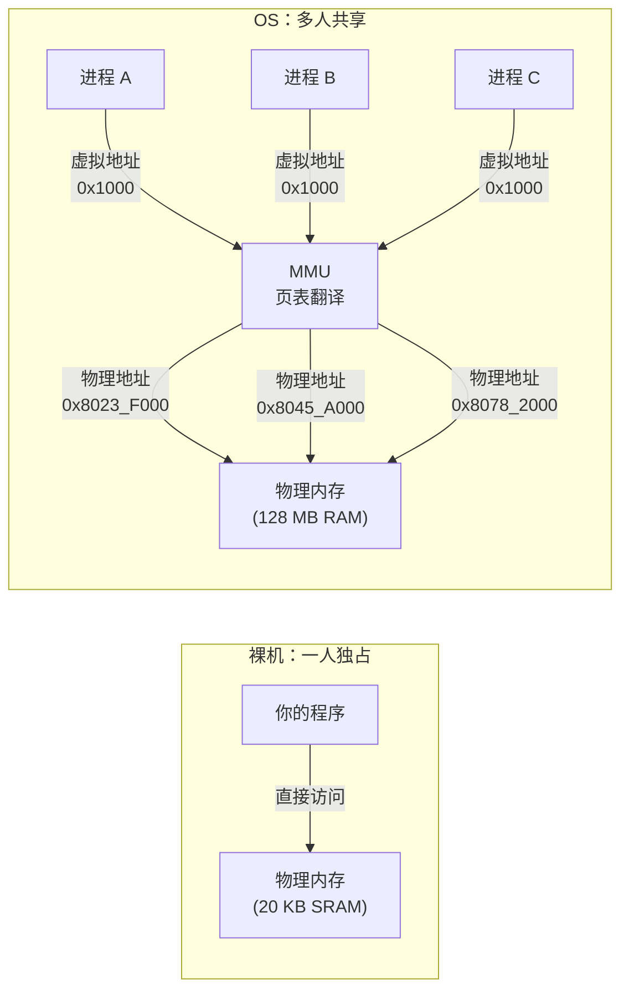

# 第 3 章：内存管理 — 物理与虚拟

## 3.1 虚拟内存的发明——操作系统史上最伟大的抽象

### 前 Atlas 时代：程序员和物理地址的战争

1961 年之前的程序员，脑子里必须同时装着两套地址——自己程序的地址，和物理内存的地址。这不仅仅是"不方便"——它在根本上限制了软件能做什么。

**手动覆盖（Manual Overlay）。** 如果一个程序比物理内存大，程序员需要亲手把程序切成若干块（overlay），在运行时按需加载和卸载。哪块代码调用哪块代码、它们能不能同时驻留在内存中——这些原本属于"操作系统"的职责，全部落在程序员肩上。IBM 在 1950 年代的 FORTRAN 编译器中实现了自动 overlay 管理器，但这只是一个编译器的权宜之计，不是系统级的解决方案。

**地址约定（Gentlemen's Agreement）。** 在多道程序出现之前的批处理时代，"我的数据放在 0x2000 到 0x3000，你的程序别碰那里"可以靠口头约定维持。但当多个程序同时驻留在内存中时——这是 IBM OS/360（1964 年）和多道程序时代的要求——这种约定完全不可控。程序 A 的一个越界写入，可能静默破坏程序 B 的数据，而程序 B 崩溃时的症状和程序 A 毫无关联。

根本矛盾是：**程序需要一个连续的、从零开始的地址空间来简化自己的逻辑；但物理内存只有一块，被所有程序共享，且不一定是连续的。** 解决这个矛盾的，是一台叫 Atlas 的英国计算机。

### Atlas（1961）：一个被硬件限制逼出来的发明

曼彻斯特大学的 Tom Kilburn 带领的团队在 1956 年到 1962 年间开发了 Atlas 计算机。Atlas 的很多创新——包括虚拟内存——的动机非常朴素：**Atlas 的物理内存只有 32 页磁芯存储器（core store），每页 512 字。但程序需要的空间远超于此。** 当时的二级存储是磁鼓（drum）——一种圆柱形的磁存储设备，容量远大于磁芯，但访问速度慢数百倍。

Atlas 团队的核心洞见是一个"地址翻译器"——后来的 MMU 的祖先。这个翻译器做了两件在当时堪称革命的事情：

**第一，把程序地址和物理地址彻底分离。** 程序用"虚拟地址"（Atlas 术语中叫 "program address"）访问内存。硬件在每条内存访问指令执行时，实时地把虚拟地址翻译成物理地址——或者，如果数据不在磁芯中而在磁鼓上，触发一个"page fault"，由操作系统从磁鼓加载。

**第二，用硬件自动管理内存层级。** Atlas 的页面置换算法——后来被称为"学习算法"（learning algorithm）——跟踪每一页在过去一段时间被访问的频率，选择"最不活跃"的页换出。这是所有现代页面置换算法（LRU、Clock、Working Set）的祖先。一页一页地，Atlas 把磁鼓上的数据搬进磁芯——程序完全不知道这件事。它以为自己的全部代码和数据一直在"内存"里。

> **原始文献：** T. Kilburn, D. B. G. Edwards, M. J. Lanigan, and F. H. Sumner, "One-Level Storage System," *IRE Transactions on Electronic Computers*, vol. EC-11, no. 2, pp. 223-235, April 1962. 这篇论文首次系统描述了虚拟内存的设计和实现。它的标题 "One-Level Storage"（单级存储）本身就是对虚拟内存哲学的最佳概括——程序只看到一个存储层级，底层是磁芯还是磁鼓，由硬件和 OS 共同管理。

Atlas 的"一页"是 512 字。你的 RISC-V Sv39 的"一页"是 4096 字节。大小变了，原理没变。Atlas 的页面置换是用一种启发式学习算法（跟踪最近使用模式），你的 OS 可能用的是简单的 Clock 算法——但"自动决定该把哪页换出去"这个思想，始于 Atlas。

### MULTICS（1965）：当分段遇到分页——一次"过于超前"的实验

Atlas 证明了虚拟内存是可行的。下一个问题是：**虚拟地址空间应该是什么形状的？**

Atlas 的方案是扁平的——虚拟地址就是 0, 1, 2, ... 线性排列，和物理地址一样。但 MIT 的 MULTICS 团队（包括后来创建 Unix 的 Ken Thompson 和 Dennis Ritchie）认为这是一种浪费。程序的虚拟地址空间应该反映程序本身的结构——代码段、数据段、栈应该是独立可管理的实体，每个段有自己的大小、独立的地址空间、自己的访问权限。

这就是**分段（Segmentation）**——MULTICS 的核心创新之一。一个 MULTICS 程序看到的不再是一个扁平的地址空间，而是一个"段表"（Descriptor Segment），每个段有名字、基址、长度、访问权限。访问一个段内的地址需要两步：先通过段号查段表，再在段内偏移。

分段的思想非常优雅——它把"这个程序由哪些部分组成"这个语义信息编码到地址空间中。但分段有一个致命弱点：**段的大小不固定。** 一个段可以随时增长（如栈），也可以萎缩。物理内存被不同大小的段切割，产生外部碎片——总空闲空间足够，但没有一块连续的区域能容纳一个新的大段。

MULTICS 的解决方案是**分段加分页（Segmented Paging）**——把每个段再切成固定大小的页，用页表管理。段提供逻辑结构和权限，页消除外部碎片。这个方案在理论上近乎完美——但它需要硬件支持两级地址翻译（段号→段描述符→页号→物理页），在 1965 年的硬件条件下，性能代价巨大。

> **原始文献：** F. J. Corbató and V. A. Vyssotsky, "Introduction and Overview of the Multics System," *Proceedings of the AFIPS Fall Joint Computer Conference*, pp. 185-196, 1965. 以及 E. I. Organick, *The Multics System: An Examination of Its Structure*, MIT Press, 1972——第一本系统描述一个完整 OS 设计的书。

MULTICS 在商业上失败了——太庞大、太复杂、运行太慢。但它的技术遗产深远：段页式内存管理被 Intel 在 80286/80386 中继承（尽管实现得极其笨拙）；基于段的保护模型直接启发了后来的 capability 系统；MULTICS 的失败经验直接塑造了 Unix 的"小而美"哲学——Ken Thompson 和 Dennis Ritchie 是在 MULTICS 项目上工作过后才去写的 Unix，他们确切地知道什么东西不该做。

### Intel 80386（1985）：当虚拟内存进入每台 PC

Atlas 是研究项目。MULTICS 是大型机的奢侈实验。虚拟内存真正进入"每台电脑都有一台"的时代，始于 Intel 80386。

1985 年之前，Intel 的 x86 系列只有分段（没有分页）。8086/8088（1978）——IBM PC 的芯——只能在 1 MB 的物理地址空间中做 16 位寻址。80286（1982）引入了保护模式，但仍然只有分段。这意味着 x86 程序不能从"大于物理内存的地址空间"中受益——虚拟内存的"虚拟化"能力完全不存在。

80386 改变了这一切。它引入了**两级页表**（Page Directory + Page Table），4 KiB 标准页大小，以及 TLB（Translation Lookaside Buffer）——一个缓存最近地址翻译结果的小型硬件缓存，大幅减少了"每次内存访问都要查两次页表"的性能开销。

80386 的页表格式设计影响深远：它选择了"硬件遍历页表"而非"软件管理 TLB"（如 MIPS 的做法）。这意味着当 TLB miss 时，CPU 自动按照页表结构在内存中查表——不需要 OS 干预。这简化了 OS 的实现，但也把页表格式冻在了硬件中——后来的 x86-64 为了兼容，不得不把 80386 的页表层数从 2 级扩展到 4 级，再扩展到 5 级（57 位虚拟地址），同时保留了最初的两级作为子集。

> **原始文献：** Intel, *Intel 80386 Programmer's Reference Manual*, 1986. 第 5 章和第 6 章定义了分页单元的完整行为。这本手册的 PDF 至今仍在 osdev.org 上被广泛引用——它的第 5 章是无数 hobby OS 开发者第一次理解"页表"的地方。

**RISC-V 站在了这些巨人的肩膀上。** RISC-V 的 Sv39 分页——三级页表、4 KiB 页、硬件页表遍历——直接继承了 Atlas 的"单级存储"理念、MULTICS 的"页消除外部碎片"方案和 80386 的"硬件遍历页表"设计。它不是重新发明轮子——它是把过去 50 年虚拟内存设计的精华收敛到一个干净的现代 ISA 中。

### 对你这门课的意义

你在阶段 3 实现的 Sv39 分页，每一行页表遍历代码、每一次 `sfence.vma` 调用，背后都站着几个时代的人的思考和实验。Atlas（1961）告诉你为什么要分离虚拟地址和物理地址。MULTICS（1965）告诉你为什么用页而不是段来管理物理内存。80386（1985）告诉你硬件自动遍历页表的便利和代价。

理解这段历史，不是为了在考试里默写年份。是为了让你在写 `walk()` 函数时知道——**你正在写的这个遍历三级页表的循环，是计算机科学花了 25 年（从 Atlas 到 80386）才收敛到的"标准答案"。**

## 3.2 为什么内存管理是 OS 中最危险的代码

如果你问一个有十年经验的内核开发者"你花最多时间调试的 bug 是哪类"，答案大概率是内存管理。

原因很微妙。内存管理的 bug 不会立刻炸。一个 double-free——同一个物理页被释放两次——可能在几分钟后、在另一个完全不相关的模块里才表现为随机数据损坏。一个未清零的页，今天碰巧内容是零（测试通过），明天内容是上次分配的残留数据（随机崩溃）。

这就是为什么本章的焦点不是"实现一个能跑的分配器"——那半天就够了。焦点是**证明你的分配器是正确的**。通过不变量检查器、测试矩阵、显式的前置后置条件。在 OS 开发中，"看起来能跑"不代表"正确"——内存管理的"看起来能跑"和"正确"之间的距离，可能隔着几十个还没遇到的竞态条件。

## 3.3 本章要解决的问题

启动阶段让你的内核活了过来。现在它需要管理自己最基础的资源：物理内存。

本章涉及两个紧密相关但概念不同的任务：
- **物理内存管理**：哪些物理页是可用的？如何分配和回收？
- **虚拟内存管理**：如何建立页表使得虚拟地址映射到正确的物理地址？用户空间和内核空间如何隔离？

### 3.3.1 从裸机看内存：STM32 的固定内存映射 vs OS 的虚拟内存

如果你有 STM32 裸机编程经验，你对"内存管理"的理解可能是这样的：

```c
// STM32 裸机：直接访问已知的物理地址
int *my_data = (int *)0x20000000;  // SRAM 起始地址（从数据手册查的）
*my_data = 42;                      // 直接写入物理地址

// 外设也是固定的地址
volatile uint32_t *gpioa_odr = (volatile uint32_t *)0x4001080C;
*gpioa_odr |= (1 << 5);            // 直接操作 GPIO 寄存器
```

在裸机世界，"内存管理"只有三件事：
1. **知道地址**：从芯片数据手册的 Memory Map 章节查出每个外设和 SRAM 的起始地址
2. **不越界**：确保你的栈不溢出到 `.data` 段、你的数组不覆盖相邻变量
3. **手动分配**（如果要做动态分配的话）：在 SRAM 里划一块区域当"堆"，自己写 `malloc`

裸机不需要"内存管理器"——因为**只有你一个程序在跑，所有物理地址都是你的**。没有竞争，没有隔离的需要，没有"这个地址已经被别人用了"的概念。

OS 的内存管理比裸机复杂一个数量级，根源就在于此：**OS 要支持多个程序同时运行，而物理内存只有一块。**



**关键差异：**

| 维度 | STM32 裸机 | OS |
|------|-----------|-----|
| **地址类型** | 只有物理地址——你写的地址就是总线上的地址 | 虚拟地址和物理地址分离——通过 MMU 翻译 |
| **内存视图** | 单一、固定——从数据手册查到的 Memory Map 是唯一的真相 | 每个进程有自己的"虚拟内存视图"——进程 A 的 0x1000 和进程 B 的 0x1000 是不同的物理位置 |
| **"分配内存"的含义** | 在已知的 SRAM 范围内划一块出来用——本质上是约定 | 从页分配器获取一个物理页，在页表中建立虚拟地址到该物理页的映射——有硬件强制 |
| **"越界访问"的后果** | 静默覆盖相邻数据——没有 MMU 报警 | Page Fault——MMU 检测到访问了未映射的地址，CPU 产生异常 |
| **内存保护** | 没有——任何代码可以读写任何地址 | 有——通过页表项的 R/W/X/U 位控制每个页的访问权限 |
| **内存布局** | 芯片设计时固定好了（Flash 在 0x08000000，SRAM 在 0x20000000） | 由 OS 设计者决定——内核可以自由安排虚拟地址空间的布局 |

**这个差异对你的 OS 设计的影响：**

裸机上，"在哪里放什么"是芯片制造商替你决定好的。OS 上，**"虚拟地址空间怎么布局"是你必须做的设计决策**——这是你在阶段 1 的 ArchitectureSeed 中不需要回答、但在阶段 3 必须回答的核心问题。你的内核代码放哪？你的内核栈放哪？用户程序的代码、堆、栈各自放哪？这些地址不能冲突，且必须和你的页表设计一致。

**对零基础自学者的启示：** 如果你觉得"虚拟内存"这个概念很抽象，回到裸机的痛点上想——你在 STM32 上最怕什么？数组越界静默覆盖全局变量？malloc 和栈互相挤压？换一块芯片所有地址全变了？虚拟内存和 MMU 就是为解决这些问题而发明的硬件机制。页表不是"又多了一个要学的东西"——它是"让以上所有问题从根源上消失的东西"。

## 3.4 设计维度

### 维度 1：物理内存布局

在分配任何内存之前，你需要知道物理内存的"地图"：

- **总内存大小**：从固件、设备树或硬编码获取
- **保留区域**：哪些物理地址范围不能用于通用分配？（内核代码段、数据段、MMIO 区域、固件保留区域）
- **可用区域**：哪些范围是空闲可分配的？

你需要回答的问题：
- 你的分配器如何获知物理内存布局？硬编码？设备树解析？从阶段 2 传入？
- 保留区域如何标记？分配器如何保证不返回保留区域的页？

### 维度 2：物理页分配器

分配器的设计涉及三个核心问题：

- **数据结构**：用什么来表示"空闲页"和"已分配页"？常见做法包括：freelist（空闲页链表）、buddy system（伙伴系统）、bitmap（位图）、slab（对象缓存）。
- **分配粒度**：通常是页大小（4 KiB）。是否需要支持更小粒度的分配？
- **并发安全**：分配器会被多个 CPU 或中断上下文同时调用吗？需要什么锁？

你需要回答的问题（在你的 ADR 中记录）：
- 你选择的分配算法在大规模分配/释放下的行为特征是什么？
- 分配和释放的最坏情况时间复杂度是多少？这在你的使用场景中可接受吗？
- 分配器在多核场景下的正确性如何保证？

### 维度 3：分页与虚拟内存

如果你的目标平台支持分页（RISC-V 的 Sv39、Sv48 等），你需要决定：

- **页表结构**：Sv39（3 级）还是 Sv48（4 级）？教学场景中 Sv39 足够。
- **内核地址空间**：内核使用直接映射（虚拟地址 = 物理地址 ± 偏移）还是固定映射？
- **用户地址空间**：用户的虚拟地址空间如何布局？栈、堆、代码段、mmap 区域各自放在哪里？
- **页表操作**：walk（遍历）、map（映射）、unmap（取消映射）、free（释放页表）这些操作的契约是什么？

你需要回答的问题：
- 内核访问物理内存通过什么地址？（直接映射可以让内核用虚拟地址直接访问物理内存）
- 启用分页的瞬间发生了什么？`satp` 写入后，下一条指令的 PC 还能正确取指吗？
- TLB 一致性如何保证？什么时候需要 `sfence.vma`？

### 维度 4：用户/内核隔离

分页机制的核心目的之一是实现地址空间的隔离：

- **内核内存不可被用户访问**：用户页表中的所有条目应标记为 U=0（内核）或 U=1 但不包含内核地址
- **用户内存不可被其他用户访问**：除非显式共享
- **用户不能修改页表**：页表物理页不应映射到用户地址空间

你需要回答的问题：
- 你的隔离边界精确在哪里？是"用户不能访问内核物理页"还是"用户不能访问任何 U=0 的映射"？
- 内核何时需要访问用户内存？（如 syscall `write` 的 buf 参数）如何安全地进行这种访问？

### 维度 5：内核编程中的内存管理

除了物理页分配器，内核可能还需要：
- **小对象分配器**（kmalloc）：分配小于一页的内存块
- **引用计数**：跟踪共享资源的生命周期

在阶段 3，你可以用最简单的方式处理——每个需要内存的内核数据结构直接分配一整个物理页。这有浪费，但简化了实现。后续阶段可以优化。

## 3.5 物理分配器的设计光谱

物理页分配器在简单性、性能和碎片之间做不同的权衡。不存在"最好的"分配器——只有最适合你的 OS 目标和约束的分配器。

### Freelist：极简主义

空闲页通过单向链表连接。分配取链表头，释放插入链表头。O(1)。xv6 只用约 50 行 C 实现了完整的页分配器。

**优势**：实现极简，代码容易审计和验证。调试直观——遍历链表就能看到所有空闲页。

**代价**：不合并相邻空闲页，碎片风险。需要连续多页时可能分配失败——即使总空闲页数足够。

**适合**：小内存系统、代码量受限的场景、碎片在你的内存规模下通常不成问题。

### Buddy System：空间换时间

空闲页按 2 的幂次分组。分配时找满足需求的最小块，必要时分裂。释放时伙伴都空闲则合并。O(log n)。Linux 使用 buddy system。

**优势**：自动合并相邻空闲页，大幅减少外部碎片。天然支持分配连续多页。

**代价**：实现复杂度显著高于 freelist。伙伴关系维护容易写出隐蔽 bug。内部碎片——需要 3 页实际分配 4 页。

**适合**：通用 OS、需要频繁分配连续多页、碎片敏感的场景。

### Bitmap：极致内存效率

每页用一个 bit 标记是否空闲。128 MB 内存的位图仅 4096 字节。

**优势**：内存开销极低。数据结构简单。天然适合检查连续页可用性。

**代价**：分配时需扫描找空闲页——最坏 O(n)。频繁分配释放时扫描开销不可接受。

**适合**：极低内存系统、嵌入式、分配不频繁的批处理场景。

### Slab Allocator：对象缓存

专门分配固定大小的内核对象（进程结构、文件结构、inode）。从页分配器获取大块内存，切割成统一大小的槽位。Linux 使用 slab。

**优势**：避免反复分配释放页。减少内部碎片。可追踪对象用于泄漏检测。

**代价**：增加一层间接。每种对象大小需独立 slab cache。

**适合**：任何需要频繁分配固定大小内核对象的 OS。可与以上三种底层分配器组合。

## 3.6 地址空间布局的三种哲学

内核的虚拟地址和物理地址之间的映射关系，有三种主流方案。

**直接映射（Identity Mapping 或 Fixed Offset）。** 内核的虚拟地址 = 物理地址 + 一个固定偏移。例如 xv6 中内核虚拟地址直接等于物理地址（偏移为 0），Linux 中内核使用 `PAGE_OFFSET` 偏移。好处：内核访问物理内存极其简单——`pa = va - offset`。调试也很直观。代价：内核的虚拟地址空间布局被物理内存布局"绑死"了。

**固定映射（Fixed Mapping）。** 内核使用独立的虚拟地址空间，与物理地址没有固定的数学关系。例如 Windows 的做法。好处：内核地址空间布局完全自由——你可以把内核代码、数据、堆、MMIO 放在任何你认为合理的位置。代价：物理地址和虚拟地址之间的转换需要查表（或至少是显式管理），增加了复杂度。

**全分离（Full Separation）。** 内核有完全独立的虚拟地址空间，和用户程序一样使用自己的页表。这在微内核中常见——内核自己是一个"进程"，有独立的地址空间。好处：内核和用户程序的隔离最彻底。代价：每次进入内核都需要切换页表（写入 `satp`），开销大。

教学 OS 通常选择直接映射——简单，省去了物理-虚拟转换的额外复杂度。但你应该知道你放弃了什么：未来如果你想让内核支持 KASLR（内核地址空间随机化），直接映射的假设会被打破。

### 3.6.1 HHDM（Higher Half Direct Mapping）——64 位时代的标准答案

如果你在 64 位地址空间上写 OS，你几乎一定会遇到 HHDM。它的核心思想简单但影响深远：

**内核映射到虚拟地址空间的“上半部分”（higher half），用户空间占据“下半部分”。** 例如在 RISC-V Sv39 下（39 位虚拟地址，256 GB 地址空间）：
- 用户空间：`0x0000_0000_0000_0000` ~ `0x0000_003F_FFFF_FFFF`（低 128 GB）
- 内核空间：`0xFFFF_FFC0_0000_0000` ~ `0xFFFF_FFFF_FFFF_FFFF`（高 128 GB）

为什么叫“直接映射”？内核虽然映射到了高位地址，但映射关系仍然是线性的：`内核 VA = 物理 PA + HHDM_OFFSET`。例如 `HHDM_OFFSET = 0xFFFF_FFC0_0000_0000`，物理地址 0x8000_0000 的 RAM 在内核中通过虚拟地址 `0xFFFF_FFC0_8000_0000` 访问。这是“两步的优点各取一半”的设计：
- **保留了直接映射的简单性**：`pa = va - HHDM_OFFSET` 仍然是 O(1) 的减法
- **把整个低半地址空间完整地留给用户程序**：用户程序的堆、栈、mmap 区域有充足的增长空间，永远不会和内核地址冲突

HHDM 并非本课程必须实现的内容——你可以选择 xv6 风格的 identity mapping（内核 VA = PA），这在教学场景中完全够用。但理解 HHDM 让你知道**为什么真实 OS 不这么做**。xv6 把内核放在低地址，用户程序的地址空间被内核地址“挖掉”了一块——用户程序不能用 `0x8000_0000` 附近的地址。在 32 位或 39 位地址空间下这勉强可以接受；但在 48 位（x86-64）或 57 位地址空间下，没有任何理由让内核占用宝贵的低地址空间。

### 3.6.2 同一页表 vs 独立页表——熔断漏洞之前的平静岁月

在 HHDM 的框架下，有一个更深层的设计选择：**内核和用户是否共用同一套页表？**

**方案 A：同一页表（Shared Page Table）。** 每个进程的页表中既包含用户映射（低半地址，U=1），也包含内核映射（高半地址，U=0）。进入内核时只切换特权级（U→S），不切换页表。这是 Linux 在 Meltdown 之前的默认做法，也是大多数教学 OS 的做法。

**优势**：syscall 极快。从用户态 `ecall` 进入内核态，页表不变，TLB 不变，只有特权级变了。内核可以直接通过 `copyin`/`copyout` 访问用户内存——因为用户映射还在当前页表中。

**方案 B：独立页表（Separate Page Tables）。** 内核有自己独立的页表，用户进程有自己独立的页表。进入内核时切换页表——从用户页表切换到内核页表。这是微内核的标准做法，也是 Meltdown 之后 Linux（KPTI）、Windows 和 macOS 的做法。

**优势**：内核内存对用户态完全不可见——不是“U=0 所以不能访问”，而是“页表中根本没有内核映射”。即使 CPU 推测执行越过了权限检查，也没有内核数据可以泄漏。

**代价**：每次 syscall 都需要切换页表（写 `satp`/`CR3`），并伴随 TLB 刷新。性能开销在 Meltdown 缓解之前的粗略测量中约为 5-30%，取决于工作负载的 syscall 密集度。

在 2018 年 1 月之前，几乎所有人都认为方案 A 是理所当然的正确选择——权限位（U=0）已经阻止了用户态访问内核内存，为什么还要额外切换页表？熔断漏洞给出了残酷的答案。你可以在第 5 章读到 Meltdown 的完整故事以及它如何改变了内核设计。

## 3.7 规格要求

### ArchitectureSlice(memory)

`spec/architecture/slices/02-memory.yaml`

### ModuleSpec

- `spec/modules/memory/module.yaml`：物理内存模块
- `spec/modules/vm/module.yaml`：虚拟内存模块
- `spec/modules/memory/concurrency.yaml`：分配器的并发规则

### ADR（至少 1 个）

建议的 ADR 主题：
- 分页模型选择（Sv39 vs Sv48 vs BARE）
- 物理分配器算法选择
- 内核地址空间布局策略

### OperationContract（关键操作）

- 物理页分配操作
- 物理页释放操作
- 分配器不变量检查操作
- 内核页表建立操作
- 页表映射/取消映射操作
- 页表遍历操作

## 3.8 ⚡ 挑战路线：Buddy+Slab 分配器 & DMA 预留

如果你有 OS 开发经验或追求更高难度，可以选择跳过简单的 freelist 分配器，直接实现 buddy system + slab 的组合——这是 Linux 的物理内存管理栈。

### 挑战 A：Buddy System 的正确实现

Buddy system 的核心不变量：**伙伴块的地址有固定的数学关系**。一个 2^k 大小的块，其伙伴的起始地址 = 块的起始地址 XOR 2^k × PAGE_SIZE。合并时检查伙伴是否空闲且大小相同——但更微妙的是检查伙伴是否**真的**是你的伙伴（而不是碰巧空闲的相邻块）。

**易错点**：
- 释放时只检查相邻块是否空闲就合并——漏了大小相同的条件。一个 8 页块和一个相邻的 4 页块不是伙伴
- 位运算错误：伙伴地址 XOR 2^k 的计算中，k 的单位是"阶数"（order），不是字节数

**验证**：实现 O(n) 不变量检查器（n = 总页数）。遍历所有空闲链表：
1. 每个空闲块的大小必须是 2 的幂次
2. 每个空闲块的伙伴不能同时在空闲链表中（否则应该已合并）
3. 所有空闲块的页数之和 + 已分配页数 = 总可用页数
4. 空闲链表中没有重复的物理地址范围

### 挑战 B：Slab 分配器的设计

从 buddy system 获取 1 页（或 2^k 页）作为 slab，将其切割成固定大小的槽位（如 64 字节的进程结构槽位、128 字节的文件结构槽位）。

**关键设计决策**：
- 每种对象大小一个 slab cache，还是统一大小？
- slab 满时是分配新 slab 还是返回错误？（内核中通常不允许 kmalloc 失败——但教学 OS 可以返回 NULL 然后 panic）
- 释放对象时是否立即释放空 slab 回到 buddy system？还是保留一段时间以应对快速再分配？

### 挑战 C：为阶段 8 的 USB/PCI 预留 DMA 内存

USB 和 PCI 设备需要通过 DMA 直接访问物理内存。DMA 缓冲区的要求：
1. 物理连续（不能用分散的页拼凑）
2. 在设备驱动的生命周期内不能被换出或移动
3. 某些设备有 DMA 地址对齐要求（如 4 KB 或 64 KB 边界）

在阶段 3 就为 DMA 设计一个最小接口——即使你现在不实现 DMA：
```text
dma_alloc(size, align) → {vaddr, paddr}   // 分配物理连续的 DMA 缓冲区
dma_free(vaddr)                            // 释放
```
这个接口预留让你在阶段 8 不需要重构整个分配器。

## 3.9 动手：先写一个"会崩的"分配器

在写正确的分配器之前，写一个故意包含 bug 的版本。目的不是写 bug，是让你亲眼看到分配器失败时系统怎么死的。

**Bug 1：double-free 不检查。** 释放同一个页两次，第一版不报错。跑一百次分配-释放循环，用检查器扫描 freelist——你会看到同一个物理地址出现两次。这个页稍后被"分配"给两个不同用途——文件系统 buffer 和进程页表——然后它们互相覆盖对方的数据。症状：文件内容随机变化，进程随机崩溃。检查方式：在 freelist 中检测重复节点。

**Bug 2：忘记清零。** `kalloc()` 不把返回的页清零，页里带着上次的残留数据。你今天分配它当进程栈——栈初始值偶然全零，程序正常。明天分配它当文件系统 buffer——里面残留着上次的进程数据——`read()` 读到了进程的隐私信息。检查方式：断言 kalloc 返回的每一页都是零填充的。

**Bug 3：不保护保留区域。** 分配器忘了标记内核代码段所在物理页为"保留"。某次分配返回了内核代码所在的物理页——然后你把用户数据写进去了。内核代码被静默覆盖——下次执行到那里时，行为不可预测。检查方式：遍历所有"已分配"的页，确认没有落在保留地址范围内。

这三个 bug 修完后，你写的不变量检查器应该能抓到它们。这才是阶段 3 真正的训练——不是"写一个分配器"，是"写一个你确信正确的分配器，并证明它"。

## 3.10 质量门禁

### 分配器正确性

- [ ] 可分配所有可用页，直到返回空指针
- [ ] 释放后页可被重新分配
- [ ] 同一页不会被同时分配给两个调用者
- [ ] 保留区域的页从未被分配器返回
- [ ] 释放空指针是安全操作

### 分页正确性

- [ ] 启用分页后内核继续正常运行
- [ ] 内核可以访问自己的代码段、数据段和 MMIO 区域
- [ ] 访问未映射的地址触发页错误（而非静默返回错误数据）

### 不变量

- [ ] 分配器不变量检查器可运行且通过
- [ ] 页表不变量：所有映射的页都指向有效的物理页

## 3.11 常见陷阱

1. **分配器忘记加锁**：在阶段 3 你可能只有一个 HART 在运行，锁看起来多余。但阶段 5 引入多进程后，分配器会被并发调用。现在加上正确的锁可以避免未来的竞态条件。
2. **页表项权限过于宽松**：用户页表中的 PTE 可能不小心设置了 W 位而没设 U 位，导致内核写入正常但用户无法访问。权限位的组合需要仔细验证。
3. **忘记刷新 TLB**：修改页表后（特别是 unmap 或修改权限），必须用 `sfence.vma` 刷新 TLB。忘记这一步会导致"幽灵映射"——旧的映射在 TLB 中仍然有效。
4. **内核 page fault**：内核访问了一个未映射的地址，触发了 page fault，但 page fault handler 又访问了同一个地址。这是无限递归，会耗尽内核栈。
5. **不变量定义得不够精确**："freelist 没有重复"是不够的——你还需要定义什么算"在 freelist 中"。是链表中所有节点的集合？还是所有以特定标记标记的页？
6. **页表页本身的内存来源**：创建页表需要物理页来存放页表条目。这个物理页从哪里来？从你的分配器——但如果分配器还没初始化好呢？这是一个鸡生蛋的问题。**解决方案：在分配器初始化之前，用静态分配的页表页（如 `static char early_pgtable[4096] __attribute__((aligned(4096)))`）。**
7. **Sv39 的 PTE 地址格式错误**：每个 PTE 的 10-53 位存的是物理页号（PPN），0-9 位是标志位。如果你直接把物理地址写进 PTE 而忘了右移 12 位（因为物理地址的低 12 位是页内偏移），PTE 指向的地址完全错误。**检查方式：`pte = (pa >> 12) << 10`——先对齐到 4 KiB，再左移到 PTE 的 PPN 位置。**
8. **巨型页（Megapage）的混淆**：Sv39 的中间级页表项可以指向 2 MiB 巨型页（如果设置了 R/W/X 位）。如果本意是建立下一级页表，却不小心设了 R/W/X 位——硬件会把这条 PTE 解释为巨型页映射，而不是页表指针。**症状：遍历页表时发现某个中间级 PTE 是"叶子"（有 R/W/X 位），但你期望它是"分支"（指向下一级）。检查 PTE 的 R/W/X 位是否全为零——全零且 V=1 才是指向下一级页表。**
9. **分配器初始化顺序错误**：分配器需要知道哪些物理页可用。但这个信息通常从阶段 2 的启动过程获取——物理内存布局（设备树或硬编码）。如果分配器初始化和物理内存布局获取的顺序搞反了，分配器可能认为"所有物理页都可用"——包括内核代码段所在的页。**验证：在分配器初始化后，立即调用不变量检查器确认保留区域被正确标记。**

## 3.12 与前后阶段的接口

- **依赖阶段 2**：启动阶段建立的物理内存初始视图是分配器的输入
- **为阶段 4 提供**：MMIO 区域需要通过页表映射才能访问；DMA 分配器依赖物理页分配器
- **为阶段 5 提供**：用户进程的地址空间（页表）由本阶段的 VM 模块管理
