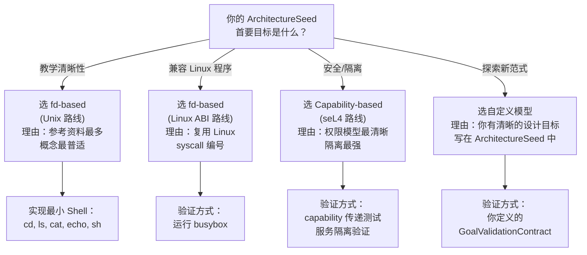

# 第 7 章：资源模型与 ABI — 暴露给用户

## 7.1 "一切皆文件"的起源与局限

1964 年，MIT 的 Multics——Unix 的前身——首次尝试把"文件"作为访问所有资源的统一接口。这个思想在 Multics 中叫**"单级存储"（Single-Level Store）**——程序不需要区分"内存"和"磁盘"，所有数据的持久化和访问都通过统一的"段"概念完成。一个段可以是文件、可以是共享内存区域、可以是设备——对程序来说，它们都是同一个命名空间中的对象。Multics 失败了（部分原因是它太庞大太复杂——单级存储需要硬件和 OS 的深度配合，在 1960 年代的硬件上根本跑不快）。但它的核心思想——**统一接口**——活了下来。

Unix 继承了这个思路并把它精简到了极致。Multics 需要专门的硬件和复杂的段描述符——Unix 用一个整数（文件描述符，file descriptor）取代了这一切。fd 0 = 标准输入，fd 1 = 标准输出，fd 2 = 标准错误。所有资源——文件、管道、设备、套接字——通过同一组操作访问：`open/read/write/close`。

Unix 一切皆文件的核心不是"所有东西真的是文件"——当然磁盘文件和串口在物理上完全不同。核心是**接口的统一**：不管底层是什么，上层用 `open/read/write/close` 这同一套操作。这个统一的威力在于组合——一个不知道什么是"串口"的程序，可以通过 `read(fd, ...)` 从一个串口读到数据；一个不知道什么是"管道"的程序，可以通过 `write(fd, ...)` 写到一个管道。Shell 的 `ls | grep foo` 之所以能工作，是因为 `ls` 和 `grep` 都不知道它们被通过管道连接——它们只知道自己在读 fd 0、写 fd 1。

### Plan 9（1992）——当 Unix 的创造者觉得"一切皆文件"还不够彻底

1990 年代初，Unix 的原创团队（Ken Thompson、Rob Pike、Dennis Ritchie）在 Bell Labs 启动了一个叫 Plan 9 的项目。他们的核心判断是：**Unix 把"一切皆文件"只做了一半。** Unix 把本地文件和本地设备统一了——但网络资源（如远程文件、远程打印机、远程窗口系统）需要一套完全不同的 API（socket、rlogin、X11）。

Plan 9 的答案是：**"一切皆文件服务器。"** 在 Plan 9 中，所有资源——无论本地还是远程——都通过 9P 协议暴露为一个文件树。一个进程打开 `/net/tcp` 目录，在其中创建一个 `ctl` 文件来拨号，然后读写 `data` 文件来通信。没有 socket API。打印机是 `/mnt/print` 下的一个文件。你甚至可以通过读写 `/dev/mouse` 来获取鼠标事件。

Plan 9 在商业上失败了——太激进、太不兼容、出现得太晚。但它提供了一个极端重要的设计参照点：**如果你真的把"一切皆文件"做到 100%，操作系统会长什么样？** 答案是 Plan 9。它的存在让 Unix 的"一切皆文件"看起来像是做了一半——一个在 1970 年代极其超前的思想，在 1992 年被自己的创造者超越了。

> **原始文献：** R. Pike, D. Presotto, S. Dorward, B. Flandrena, K. Thompson, H. Trickey, and P. Winterbottom, "Plan 9 from Bell Labs," *Computing Systems*, vol. 8, no. 3, pp. 221-254, Summer 1995. 这篇论文的 2.1 节有一句经典的话："In Plan 9, all objects look like file systems."（在 Plan 9 中，所有对象看起来都像文件系统。）注意——不是"文件"，是"文件系统"——因为每个资源暴露为一个可浏览的目录树，而不仅仅是一个字节流。

### "一切皆文件"的边界

但"一切皆文件"是有边界的——即使 Plan 9 也有它的边界。当一种资源的行为模式和"文件"的比喻严重不符时，这个抽象开始泄漏。

**网络套接字**是最著名的例子。套接字的操作——`connect`、`bind`、`listen`、`accept`——和"打开一个文件然后读写它"是完全不同的交互模式。BSD 花了好几年才设计出一个勉强能融入 fd 框架的套接字 API。

**进程控制**也尴尬。`kill(pid, SIGKILL)` 没有用到 fd。`ptrace` 完全在 fd 框架之外。Linux 的 `/proc` 文件系统试图把进程信息重新塞回"文件"的框架——你可以 `cat /proc/1234/status` 读到进程信息。但这是把复杂性藏到了文本解析里，而不是真正统一了抽象。

**异步 I/O** 是另一道裂纹。`read/write` 是同步操作——调用者阻塞到数据可用。高性能程序需要异步 I/O：发起一个读请求，继续做别的事，数据到了再处理。POSIX AIO、Linux 的 io_uring、Windows 的 IOCP——这些都是"一切皆文件"之外另加的机制，因为"阻塞读写"这个文件比喻在最需要性能的场景中不成立。

### 对你这门课的意义

阶段 7 是你设计中最大的分叉路口。继承 fd-based 模型，你获得了最简单的实现路径和最多的参考资料——但你也在继承 Unix 在套接字、异步 I/O 和进程控制上的设计张力。选择 capability-based 模型，你获得更清晰的安全语义和资源管理——但你要自己定义一整套 syscall ABI，没有现成程序能跑。

你的 ArchitectureSeed 中的 goals 会告诉你选哪条路。如果教学清晰性是首要目标，fd-based 更安全。如果你想要探索"文件和进程统一在一种访问控制模型下"的可能性，capability 值得认真对待。

## 7.2 六种资源范式的深度对比

阶段 7 是你设计中最核心的分叉点。以下六种范式不是"选 A 还是 B"的菜单——而是"你选择回答资源管理问题的哪一种方式"。其中前四种是经典的资源范式，后两种是同一思想谱系上的重要变体——Plan 9 把"一切皆文件"推到逻辑终点，Android Binder 为特定场景另起炉灶，io_uring 则在 fd 框架内部进化。

### fd-based：Unix 的"一切皆文件"

fd 是进程私有的整数索引，指向内核维护的打开文件表。`open()` 返回最小可用 fd，`read/write` 通过 fd 操作，`close` 释放。fork 时子进程继承父进程的 fd 表。

**优势**：接口极简，组合性强。`ls | grep foo` 能工作，因为 `ls` 和 `grep` 不知道它们被管道连接——它们只知道读 fd 0、写 fd 1。

**代价**："一切皆文件"在遇到不像文件的资源时开始泄漏。网络套接字（需要 `connect/bind/listen/accept`）、进程控制（`kill/ptrace`）、异步 I/O——都游离在 fd 的核心比喻之外。Linux 花了三十年给 fd 模型打补丁。

**教学建议**：最简单、资料最多、组合性最有教学价值。如果你第一次写 OS，选这个。

#### fd 模型的安全裂缝——CopyFail (CVE-2026-31431) 与权限泄漏

fd 模型的极简接口有一个隐蔽的代价：**权限检查只在 `open()` 时做一次，之后 fd 就成了"免检通行证"。** 如果这个 fd 被传递到不该拥有它的进程手中，或者 fd 背后引用的内核资源被跨信任边界操纵，你就制造了一个权限漏洞。

这不仅是理论上的可能——真实世界的 Linux 反复被这类漏洞击中。2026 年 4 月披露的 CVE-2026-31431（绰号 "CopyFail"，域名为 copy.fail）是最近也最严重的一次。

**CVE-2026-31431（CopyFail）——Linux 内核 crypto 子系统的跨信任边界资源传递。** 当你通过 `socket(AF_ALG, SOCK_SEQPACKET, "aead")` 创建一个加密套接字（一个 fd），然后用它做 AEAD 加密时，内核的 `algif_aead` 模块会在用户空间的 buffer 和内核的 page cache 之间传递数据。漏洞的核心是：内核在"原地加密"（in-place operation）路径中，源和目标 buffer 来自不同的内存映射（mapping）——但代码错误地将它们当作同一块内存处理。攻击者可以通过精心构造的 AIO 操作操纵 page cache，将数据写入权限更高的进程（如 root）的内存页中，实现本地提权。

这不是一个"开发者忘了设置 `O_CLOEXEC`"的错误。这是内核内部在**两个安全域之间错误传递资源**——用户态数据被写入到了内核管理的 page cache 中属于其他进程的页。CWE 分类为 "CWE-669: Incorrect Resource Transfer Between Spheres"，CVSS 评分 7.8（HIGH），已被列入 CISA 已知被利用漏洞目录（KEV）。影响范围涵盖 Linux 内核 4.14 到 7.0-rc6 的所有主要版本，及 Ubuntu、Debian、RHEL、SUSE、NixOS 等主流发行版。

CopyFail 是 fd 模型安全裂缝的一个具体实例：一个 fd（加密套接字）成了跨越用户态和内核态"安全球体"的桥梁。内核本应保证通过这个 fd 传递的数据不污染其他进程的内存——但这个保证在特定的代码路径中被违反了。

**更广义的 fd 权限泄漏——fork 继承、SCM_RIGHTS 与 /proc/self/fd。** 除了 CopyFail 这类内核 bug，fd 模型本身还有一些内建的设计属性，在特定场景下同样可以导致权限泄漏：

- **fork 继承**：当 root 守护进程打开一个特权文件（如 `/etc/shadow`）后 `fork()`，子进程通过 fork 继承完整的 fd 表。如果子进程随后 `exec()` 为非特权程序而 fd 未被关闭，非特权程序就可以通过继承的 fd 读取特权文件。这是因为 Unix 的权限模型是**打开时检查**（`open()` 验证 UID），而非**访问时检查**（`read(fd)` 不再次验证 UID）。Linux 的防御是 `O_CLOEXEC` flag——但 POSIX 历史兼容性要求它默认关闭，意味着防御依赖于开发者手动设置。

- **SCM_RIGHTS**：Linux 允许通过 Unix domain socket 跨进程传递 fd（`sendmsg` + `SCM_RIGHTS`）。接收方获得的 fd 指向与发送方相同的内核文件对象——即使接收方没有权限 `open()` 那个文件。systemd 的 socket activation 依赖这个特性，但它也意味着一个被攻破的进程可以通过持有的 fd 间接访问它本无权限打开的资源。

- **`/proc/self/fd`**：`/proc/<pid>/fd/<n>` 是符号链接，指向 fd 对应的文件。进程 B 无法直接 `open("/etc/shadow")`（权限不够），但可以 `open("/proc/<pid_A>/fd/3", O_RDONLY)` 来获取一个新 fd——这个 `open` 的权限检查发生在 `/proc` 层（检查 B 是否有权访问 A 的 `/proc` 目录），而非被打开文件本身的权限层。

**对你 OS 的启示。** 如果你选择实现 fd-based 模型，CopyFail 和上述模式给出了两层教训：
- **内核层面**：任何直接操作用户态内存的内核子系统（如 crypto、io_uring、fuse、VFS）——本质上都是"跨球体"的资源传递。CopyFail 提醒你，每当数据跨越用户/内核边界时，源和目标的映射关系必须被严格验证。在一个教学 OS 中你不会实现 `algif_aead`，但你的 `copyin`/`copyout` 路径面临着完全相同的安全约束。
- **设计层面**：默认让所有 fd 在 `exec()` 时关闭（close-on-exec by default），不要暴露其他进程的 fd 信息。这些不是"修复 bug"——它们是 fd 模型可以事先做出的更安全的设计选择。

### Capability-based：seL4 的"不可伪造令牌"

capability 是内核管理的不透明引用。进程不能"猜"一个 capability——只能从创建（如 `alloc_page` 返回一个内存页 capability）、接收（通过 IPC）、或派生（从已有 capability 创建权限更窄的子 capability）中获得。

**优势**：安全语义极其清晰。"进程 A 可以读文件 X"意味着进程 A 的 capability 空间中存在一个指向文件 X 的读 capability。没有这个 capability，读操作在 capability 查找阶段就失败了——不需要额外的权限检查层。

**代价**：和已有软件生态完全不兼容。没有 `open()`——你需要通过某种名字服务查找 capability。没有 `read(fd)`——你需要调用 capability 对应的操作。用户程序的编程模型完全变了。

**教学建议**：如果你选择微内核架构，capability 是微内核的自然伴侣。即使你选择宏内核，理解 capability 也会让你对 Unix 权限模型的局限有更深的认识。

**Capability 的安全边界——天生免疫但并非无懈可击。** 与 fd 模型不同，capability 模型从根源上消除了 CopyFail 类漏洞：capability 本身编码了权限，没有"先检查、后使用"的时间窗口。一个进程不能"碰巧"持有它不该有的 capability——capability 只能通过创建、IPC 接收、或派生获得。CopyFail（CVE-2026-31431）的本质是"资源在两个安全球体之间被错误传递"——在 capability 模型中，每个 cap 的传递都经过内核的严格验证，不存在"一个 fd 意外连接了两个不同映射"的可能性。

但这不意味着 capability 模型没有自己的安全挑战：
- **派生权限放大**：`cap_derive` 操作理论上只能缩小权限。如果派生逻辑有 bug——例如子 capability 意外获得了父 capability 没有的权限位——就制造了一条权限提升路径。
- **撤销竞态**：`cap_revoke` 与并发 cap 使用之间存在竞态窗口。防御手段：撤销操作需要 RCU 风格的宽限期，等待所有正在使用该 cap 的操作完成。
- **IPC 传递目标错误**：cap 通过 IPC 传递时，如果目标进程 PID 被复用，cap 可能被发送到错误的进程。seL4 使用全局唯一的线程标识符来防御这个问题。

#### Capability 模型的真实安全记录——seL4 的"零 CVE"与验证边界的幽灵

截至 2026 年 6 月，seL4 微内核在 GitHub Security Advisories 页面上**没有任何已发布的安全公告**（已验证：https://github.com/seL4/seL4/security/advisories）。对于一个有近 20 年历史、被部署在国防和自动驾驶等高风险场景中的内核来说，这是一个引人注目的数据点。

但这不意味着 capability 模型在安全上是无懈可击的。seL4 的形式化验证覆盖了 C 代码的正确性，但**不覆盖以下组件**：启动汇编代码（boot code）、MMU/页表操作、缓存管理、DMA 控制器交互、以及硬件指令的语义正确性。这些"验证边界之外"的组件代表了 capability 模型在实际部署中的残余攻击面。

**CVE-2024-21338——Windows Kernel 不可信指针解引用（作为 handle 模型的参照）。** 虽然这不是一个 capability 模型的 CVE，但它提供了有趣的对照。Windows 内核在处理来自用户态的指针时，未充分验证其有效性（CWE-822: Untrusted Pointer Dereference），导致本地攻击者可以通过精心构造的输入实现提权（CVSS 7.8, HIGH）。漏洞影响 Windows 10/11 和 Windows Server 2019/2022 的所有受支持版本。在 capability 模型中，对应的问题是：**内核必须验证用户态传入的 cap 确实引用了一个有效内核对象，而非伪造的指针**——因为 cap 在用户态表现为不透明句柄，但内核在解析 cap 时仍然走指针解引用路径。

> 验证链接：https://www.cve.org/CVERecord?id=CVE-2024-21338

**Capability 模型的"幽灵"——形式化验证覆盖不到的攻击面。** seL4 社区在 2020 年代识别出以下具体验证缺口，每个都可能成为未来的漏洞入口：
- **缓存侧信道**：seL4 的验证假设缓存是"透明的"（不影响功能正确性）。但 Spectre/Meltdown 类攻击表明，缓存状态可以被跨安全域观测和利用。seL4 的 capability 模型可以保证"进程 A 不能直接访问进程 B 的内存"——但不能保证"进程 A 不能通过缓存时序推断进程 B 正在访问哪个地址"。
- **DMA 攻击**：capability 模型只管理 CPU 侧的内存访问。如果硬件 DMA 引擎可以绕过 IOMMU 直接读写物理内存，capability 的安全保证在 DMA 路径上形同虚设。
- **启动链信任根**：seL4 的形式化验证从内核入口点开始，但内核本身是由 bootloader 加载的。如果 bootloader 被攻破，攻击者可以替换内核镜像——capability 模型的"不可伪造令牌"在启动链的信任传递中帮不上忙。

**对你 OS 的启示。** 如果你选择 capability 模型，seL4 的安全记录和验证缺口给出了两条互补的教训：
- **好消息**：形式化验证确实有效——seL4 的零 CVE 记录不是偶然。即使你的教学 OS 不做形式化验证，capability 模型本身的结构（权限编码在 cap 中、无"先检查后使用"窗口）也比 fd 模型更容易写出正确的代码。
- **坏消息**：没有安全模型是完整的——缓存、DMA、启动链、硬件 bug——每一个都在你的 capability 安全边界上撕开潜在的裂缝。这不是 capability 的问题，而是"做 OS 安全"必须面对的现实：**安全模型的安全边界总是小于物理系统的攻击面。**

### Handle-based：Windows NT 的"对象管理器"

handle 是进程私有的不透明值，指向对象管理器中的对象。和 fd 类似（都是整数索引），但 handle 指向的是类型化对象——每个对象知道自己是什么类型、支持什么操作、关联了什么安全描述符。`CreateFile` 实际上是 `NtCreateFile`——它可以创建文件、管道、邮槽、甚至是设备对象。

**优势**：统一的命名空间——文件、事件、互斥量、注册表键都在 `\??\` 命名空间中。统一的安全模型——每个对象有 ACL，而不是 Unix 的 owner/group/other。统一的 I/O 模型——IRP 在驱动栈中传递。

**代价**：复杂度远超 fd 模型。句柄表、对象类型系统、安全引用监视器、IRP 驱动模型——这些加在一起，代码量是指数级的。

**教学建议**：不推荐完整实现。但理解 handle-based 模型会让你看到 "fd 不是唯一答案"。借鉴对象管理器的"类型化资源"思路——你的资源可以比"文件"更丰富。

**Handle 模型的安全裂缝。** Windows NT 的 handle 模型在理论上比 fd 更安全——每个对象有关联的安全描述符（ACL），在每次操作时检查。但实践中仍有漏洞模式：
- **DuplicateHandle 权限放大**：复制句柄时如果指定了比源句柄更宽的 access mask，目标进程收到的是升级后的句柄。Windows 对此要求调用者在被复制对象上有相应的权限，但这依赖于安全引用监视器（SRM）的正确性。
- **命名空间竞态（Named Pipe Squatting）**：命名对象可以被任何知道该名称的进程抢先创建。如果服务端尚未启动，攻击者可以先创建命名管道并冒充服务端。
- **句柄表泄漏**：进程退出时句柄表未正确清理会导致内核对象永不释放。

#### Handle 模型的真实漏洞——CVE-2024-21338（Windows Kernel 不可信指针解引用）与 ALPC 句柄传递攻击

**CVE-2024-21338——Windows Kernel Elevation of Privilege（"Lazarus FudModule" 相关零日漏洞）。** 2024 年 2 月修补的 Windows 内核提权漏洞（CWE-822: Untrusted Pointer Dereference，CVSS 7.8, HIGH）。该漏洞被朝鲜 APT 组织 Lazarus 的 FudModule rootkit 在野利用——攻击者在获得管理员权限后，通过此漏洞进一步突破 admin-to-kernel 边界，以内核态权限执行任意代码。漏洞的本质是：Windows 内核在通过 handle 解析用户态传入的对象引用时，未充分验证指针的有效性——攻击者可以构造一个指向内核内存的"恶意 handle"，当内核信任这个 handle 并解引用时，就触发了对内核内存的非法访问。

在 handle 模型的语境中，这个漏洞暴露了一个关键设计张力：**handle 是用户态和内核态之间的信任桥梁。** 用户态持有的 handle 是一个不透明整数，内核在收到 handle 后必须将其转换为内核对象的指针。这个转换过程——从"不透明整数"到"可操作的内核指针"——是 handle 模型安全性的关键路径。如果这个转换逻辑有缺陷（如此 CVE 中的不可信指针解引用），handle 就从一个安全特性变成了攻击向量。

> 验证链接：https://www.cve.org/CVERecord?id=CVE-2024-21338  
> 在野利用分析：https://decoded.avast.io/janvojtesek/lazarus-and-the-fudmodule-rootkit-beyond-byovd-with-an-admin-to-kernel-zero-day/  
> Exploit-DB：https://www.exploit-db.com/exploits/52275

**CVE-2023-36803——Windows Kernel Information Disclosure（句柄解析路径的信息泄漏）。** 2023 年 9 月修补的 Windows 内核信息泄漏漏洞（CWE-126: Buffer Over-read，CVSS 5.5, MEDIUM）。该漏洞存在于内核在解析用户态传入的句柄时执行的越界读取——攻击者可以通过精心构造的句柄参数触发内核读取超出缓冲区的内存，从而泄漏内核地址空间中的敏感信息（如内核基址、token 地址等）。这类信息泄漏通常被用作更复杂的内核提权攻击链的第一步。

> 验证链接：https://www.cve.org/CVERecord?id=CVE-2023-36803  
> PoC：http://packetstormsecurity.com/files/175109/Microsoft-Windows-Kernel-Out-Of-Bounds-Reads-Memory-Disclosure.html

**Handle 模型的安全悖论——对象类型的"万能抽屉"。** 两个 CVE 共同揭示了一个深层问题：Windows NT 的 handle 模型将所有内核对象（文件、进程、线程、事件、互斥量、ALPC 端口、注册表键……）统一在"对象管理器"之下。这种统一性的代价是：**一个 handle 解析 bug 的影响面不再局限于某一类资源**——它可能同时影响文件、进程、和 ALPC 端口上的安全操作。fd 模型也有类似的统一性问题，但 Windows handle 模型的"类型化对象"体系意味着每种对象类型都有自己的解析逻辑——每个解析逻辑都可能引入独特的验证缺陷。

**对你 OS 的启示。** 如果你选择 handle 模型，CVE-2024-21338 给你的核心教训是：**handle → object 的转换路径上的每一个指针解引用，都必须假设 handle 是恶意的。** 用户态传入的 handle 值可能是一个精心构造的攻击载荷——它可能指向已被释放的对象（use-after-free）、指向不属于调用者的对象（权限绕过）、或指向完全无效的内存地址（crash/DoS）。你的 handle 验证逻辑必须同时检查：handle 是否属于当前进程→对象是否存在→对象类型是否匹配→调用者是否有足够的访问权限。这四个检查的顺序很重要——错误的检查顺序可能导致 TOCTOU 竞态。

### Plan 9 的 per-process namespace + 9P："一切皆文件"的激进延伸

如果说 Unix 把"一切皆文件"当作指导原则，那 Plan 9 把它当作了唯一的宗教。在 Plan 9 中，**每个进程拥有自己独立的命名空间**——私有的挂载表，可以独立地将任何资源（本地文件、远程文件、网络连接、设备、甚至 UI 窗口）挂载到任意路径。

**核心机制**：
- **per-process namespace**：每个进程通过 `rfork(RFNAMEG)` 可以创建独立的命名空间。父进程的挂载操作不影响子进程的命名空间（除非显式共享）。这与 Unix 的全局文件系统树形成鲜明对比。
- **9P 协议**：所有资源——无论本地还是远程——通过统一的 9P 文件协议访问。9P 是一个轻量级的文件协议（约 14 个操作），支持 open/read/write/stat 以及 auth/attach/walk 等命名空间操作。
- **一切都是文件**：网络连接是 `/net/tcp/` 下的文件——`/net/tcp/0/ctl` 控制连接，`/net/tcp/0/data` 传输数据。窗口系统（rio）通过 `/dev/cons`、`/dev/mouse`、`/dev/draw` 等文件暴露。

**优势**：
- **极致的组合性**：因为一切资源都是文件，任何能操作文件的程序——`cat`、`grep`、`rc`（Plan 9 shell）——都可以操作网络连接、窗口系统、远程服务器。组合不需要"中间件"。
- **自然的分布式**：9P 协议本身就是网络透明的。`import machine /net /net` 把远程机器的网络栈挂载到本地——本地程序无需修改就能使用远程网络资源。
- **极简内核**：内核只需要实现命名空间、进程调度、内存管理和 9P 消息路由。文件系统、网络协议栈、图形系统都在用户态。

**代价**：
- **性能开销**：每层抽象都通过 9P 消息传递。本地文件操作要经过用户态文件服务器 → 内核 → 磁盘驱动，比 Unix 的直接 syscall → VFS → 磁盘路径多了用户态往返。
- **生态断裂**：与 Unix 的兼容性几乎为零。没有 `socket()`、没有 `ioctl()`、没有 `/proc`（替代为文本文件接口）。移植已有软件需要大量适配层。
- **文件抽象的极限**：某些操作——如异步 I/O 完成通知——在纯文件模型中表达困难。Plan 9 用"文件中的数据变化"来表示事件，但等待数据变化的 `read` 是阻塞的。

**教学建议**：Plan 9 对"你的资源抽象应该有多纯粹"这个问题给出了极端的回答。即使你不实现 per-process namespace，理解"为什么 Unix 没有走到这一步"会让你对 fd 模型的设计取舍有更清醒的认识。如果你在阶段 8 选择了微内核(X4)或兼容(C1)方向，Plan 9 的 9P 协议是实现用户态服务的天然 IPC 通道。

**Plan 9 命名空间的安全悖论。** per-process namespace 提供了比 Unix 更强的隔离，但也引入了新的攻击面：
- **挂载点劫持**：进程在自己的命名空间中将关键路径 bind 到恶意文件服务器——之后所有对该路径的读写都被截获。因为没有"全局真相"可供验证。
- **9P 认证旁路**：Plan 9 的 `auth` 操作是可选的——文件服务器可以简单地接受所有客户端。如果用户态文件服务器被攻破，攻击者可以提供无认证的 9P 服务来伪装成合法资源。
- **`rfork(RFNAMEG)` 的意外后果**：子进程创建独立命名空间后，父进程无法审计子进程的文件访问。

#### 9P 模型的真实漏洞——CVE-2023-2861（QEMU 9pfs 特殊文件穿越逃逸）

**CVE-2023-2861——QEMU 9pfs 直通文件系统逃逸。** 2023 年 6 月披露的 QEMU 9P 直通文件系统（9pfs）漏洞（CWE-284: Improper Access Control，CVSS 6.0, MEDIUM）。9pfs 的 `passthrough` 安全模型允许宿主机上的共享文件夹通过 9P 协议暴露给虚拟机。漏洞的核心是：**9pfs 服务端未禁止客户机在共享文件夹内创建特殊文件（如设备节点）**。恶意客户机可以在共享目录中 `mknod` 一个设备文件，然后通过该设备文件访问宿主机的硬件资源——从而**逃逸出共享文件夹的隔离边界**。

这个漏洞精确对应了本章 7.2 节中描述的 9P 安全悖论：**"文件"这个抽象太通用了——它无法区分"普通文件"和"设备文件"。** 9P 协议本身不携带"文件类型是否安全"的语义——它忠实地把客户机的 `create` 请求翻译成宿主机的文件系统操作。当客户机说"我要创建一个文件"时，9P 服务端无法判断这个"文件"是一个无害的文本文件还是一个危险的块设备节点。

> 验证链接：https://www.cve.org/CVERecord?id=CVE-2023-2861  
> Red Hat Bugzilla：https://bugzilla.redhat.com/show_bug.cgi?id=2219266

**9P 协议栈在其他产品中的攻击面——WSL2 与 Hyper-V。** 9P 协议不只存在于 QEMU。微软的 WSL2（Windows Subsystem for Linux 2）和 Hyper-V 也使用 9P 协议在宿主机和虚拟机之间传递文件：
- **WSL2 的 9P 通道**：WSL2 通过 9P 协议将 Windows 文件系统暴露给 Linux 虚拟机（`/mnt/c/` 路径）。这个 9P 服务器的实现由微软维护，与 QEMU 的 9pfs 是不同的代码库——但共享相同的协议层攻击面。如果 WSL2 的 9P 服务器存在类似的特殊文件处理缺陷，Linux 虚拟机中的恶意程序可能通过 9P 通道访问 Windows 宿主机的资源。
- **Hyper-V 的 9P 通道**：Hyper-V 使用 9P 实现宿主机与虚拟机之间的文件共享（`hv_sock` 传输）。同样的协议层攻击面在这里也存在。

**对你 OS 的启示。** 如果你在 OS 中实现了 9P 或类 9P 的"一切皆文件"协议，CVE-2023-2861 给你一个具体的教训：**"文件"这个抽象是危险的——因为它抹平了不同类型资源之间的安全差异。** 当你的用户态文件服务器收到一个"创建文件"的请求时，它必须检查：这个"文件"是一个普通文件、一个目录、一个设备节点、还是一个符号链接？9P 的设计哲学是"文件服务器自行决定"——这意味着**安全策略被推给了每个文件服务器的实现者**。如果你的文件服务器实现者（可能是你自己）忘记检查某一种特殊文件类型，你就制造了一个隔离逃逸漏洞。

### Android Binder：为应用框架定制的 IPC 与资源模型

Android 没有继承 Unix 的"一切皆文件"，也没有照搬微内核的消息传递。Binder 是一个**为移动应用框架场景深度定制的 IPC 和资源管理模型**——它的设计目标不是"通用"，而是"让应用的 Java/Kotlin 代码能安全、高效地调用系统服务"。

**核心机制**：
- **内核驱动实现**：Binder 不是用户态库——它实现在 Linux 内核中（`/dev/binder` 字符设备）。内核维护跨进程的对象引用计数、线程池管理、和死亡通知。
- **对象引用传递**：Binder 的核心抽象不是"文件"也不是"消息"——是**可跨进程传递的对象引用**。进程 A 向进程 B 发送一个 Binder 对象后，进程 B 可以像调用本地对象一样调用它（RPC 语义），内核负责数据编组和线程调度。
- **引用计数与生命周期**：Binder 对象由内核维护引用计数。当所有跨进程引用都释放后，内核通知对象所有者（死亡通知）。这解决了分布式系统中"谁负责释放共享对象"的经典问题。
- **身份与权限**：Binder 携带发送者的 UID/PID，接收方可以精确识别调用者身份——不需要额外的认证机制。这是 Android 权限模型的基础。

**优势**：
- **零拷贝传输**：Binder 的 `transaction` 支持 parcel（序列化数据包）的内核空间零拷贝——数据在发送方和接收方的用户空间之间只在内核空间复制一次（甚至完全零拷贝通过 binder buffer 映射）。
- **线程池管理**：Binder 自动管理接收方的线程池——当多个客户端并发调用同一个服务时，Binder 驱动在服务进程中创建/复用线程处理。服务开发者不需要手写多线程代码。
- **安全性内建**：UID/PID 传递 + SELinux 检查 + 对象引用不可伪造——三层安全保证内建在 IPC 机制中。

**代价**：
- **非通用**：Binder 专为"应用调用系统服务"的场景设计——不适合通用 IPC（如两个对等应用通信），也不适合高性能数据流（socket 或共享内存更优）。
- **内核依赖重**：Binder 驱动约 5000+ 行代码在内核中——调试困难、升级需要内核变更。Android 8 之后引入了 Binderized HAL（硬件抽象层也通过 Binder 通信），但这也使系统更依赖这个单一 IPC 通道。
- **Linux 上游接受度低**：Binder 驱动长期在 Android kernel tree 中维护，直到 2020 年代才逐步被 upstream Linux 接受——设计哲学与 Unix 的"简单内核、多样用户态"不一致。

**教学建议**：Binder 的价值不在于"你应该实现它"——而在于它展示了**资源模型可以根据场景深度定制**。如果你的 OS 的目标场景是"高效的应用框架调用系统服务"，Binder 的设计选择（内核维护对象引用计数、身份内建在 IPC 中、零拷贝传输）给你提供了具体的工程参考。

**Binder 的安全优势与残余风险。** Binder 的安全模型比大多数 IPC 机制更完整：UID/PID 内建在每条事务中（不能被伪造——内核在发送端注入）。但仍有盲区：
- **Binder 引用泄漏**：服务端将收到的 Binder 引用转发给不该接收的进程，制造间接访问路径。
- **死亡通知竞态**：服务端退出与死亡通知投递之间存在时间窗口——客户端可能向已死的服务端发送 transaction，或更糟，向一个恰好被新进程占用的同一地址发送数据。

#### Binder 模型的真实漏洞——CVE-2020-0041（binder_transaction 越界写）与 binder 驱动的安全历史

**CVE-2020-0041——Android Binder 驱动越界写导致本地提权。** 2020 年 3 月修补的 Android 内核漏洞，位于 `binder_transaction()` 函数中（`drivers/android/binder.c`）。漏洞根因是 binder 驱动在处理进程间事务时，对缓冲区边界检查不正确，导致**越界写入（out-of-bounds write）**——本地攻击者无需任何额外权限即可触发该漏洞，实现本地提权（local escalation of privilege），以内核态权限执行任意代码。受影响的版本为 Android Kernel（所有使用 Binder 的 Android 版本）。

在 Binder 资源模型的语境中，这个漏洞揭示了 Binder 设计的核心安全张力：**Binder 驱动是内核中唯一一个"用户态可以直接构造复杂数据结构并交由内核解析"的 IPC 通道。** 与 Unix domain socket 不同，Binder 的事务数据（parcel）包含嵌套的对象引用、文件描述符传递、和强类型的结构化数据——内核必须解析这些复杂结构。每一次解析都是一次潜在的越界读/写机会。

> 验证链接：https://www.cve.org/CVERecord?id=CVE-2020-0041  
> Android 安全公告：https://source.android.com/security/bulletin/2020-03-01

**Binder 驱动的安全历史——内核 IPC 的攻击面诅咒。** CVE-2020-0041 不是孤立事件。Binder 驱动（约 5000+ 行内核代码）自 Android 诞生以来就是内核漏洞的高发区：
- **CVE-2019-2215**（2019 年 10 月）：binder 驱动 use-after-free，被用于 Android 本地提权（已被在野利用）。漏洞位于 `binder_poll()` 函数中——当 binder 线程被释放时，与其关联的等待队列条目未被正确清理。
- **CVE-2019-2181**（2019 年 9 月）：binder 驱动中的整数溢出导致越界读写，影响 Android 8.x/9.x。
- **通用攻击模式**：binder 驱动的 CVE 绝大多数集中在三个代码路径上——`binder_transaction()`（事务解析）、`binder_ioctl()`（ioctl 命令分发）、和 binder 线程/节点的生命周期管理（引用计数 + 并发竞态）。

**Binder 给"专用资源模型"的教训。** Binder 的设计目标是"为 Android 应用框架深度定制的高效 IPC"——它在这方面极其成功。但 Binder 的安全历史揭示了一个通用规律：**一个资源模型的专用性越强，它需要处理的边缘情况越多，它的内核实现就越可能出错。** Binder 的"零拷贝传输"、"对象引用传递"、"死亡通知"——每一个特性都是内核中额外添加的代码路径。当一个资源模型从"简单通用"走向"丰富专用"时，它的攻击面也随之增长。这不是反对专用化——而是在说：**每个"为了效率/便利"而加入内核的特性，都有安全代价。**

**对你 OS 的启示。** 如果你选择为你的 OS 设计一个定制的 IPC/资源模型（无论是否叫 Binder），CVE-2020-0041 的教训是：**IPC 数据的解析逻辑是你内核中安全敏感度最高的代码之一。** 从一个不受信任的进程发来的每一条 IPC 消息，都可能在解析阶段触发越界读写。防御策略：
- 每个从 IPC 消息中读取的长度/偏移字段必须先验证再使用
- 复杂嵌套结构（如对象引用列表）的解析应该在固定大小的栈缓冲区中进行，超出部分拒绝处理
- IPC 数据的内核态拷贝必须在解析之前完成——防止用户态在解析过程中修改数据（TOCTOU）

### Linux io_uring：fd 模型在异步时代的新答案

7.1 节提到"异步 I/O 是 fd 模型的一道裂纹"。Linux 花了二十年才给出一个真正优雅的答案——io_uring。它不是"在 fd 旁边另加一套异步机制"，而是**重新定义了 fd 模型中的 I/O 提交和完成路径**，同时保留 fd 作为资源标识符的核心地位。

**核心机制**：
- **两个无锁环形缓冲区**：Submission Queue (SQ) 和 Completion Queue (CQ) 由内核和用户态共享。用户态向 SQ 写入 I/O 请求（SQE），内核从 SQ 读取并执行，完成后向 CQ 写入结果（CQE）。两个队列都是单生产者单消费者（SPSC），不需要锁。
- **批量提交**：用户态可以一次写入多个 SQE，然后通过单次 `io_uring_enter()` syscall 提交所有请求。同样，一次可以收割多个 CQE。批量操作将 syscall 开销均摊到多个 I/O 操作上。
- **零拷贝路径**：io_uring 支持 `IORING_OP_READ_FIXED`/`WRITE_FIXED`——用户态预注册 I/O buffer，内核直接 DMA 到这些 buffer。也支持 `IORING_OP_SPLICE`/`TE` 在内核内部传递数据（如 socket → file），完全不经过用户态。
- **任何 fd 都可以异步**：io_uring 的异步化不局限于磁盘文件——socket、pipe、eventfd、timerfd——任何 fd 都可以通过 io_uring 进行异步操作。

**优势**：
- **性能接近裸设备**：在 NVMe 存储上，io_uring 的 IOPS 可以达到 SPDK（用户态驱动）的 90%+，远超传统的 `pread`/`pwrite` 和 POSIX AIO。
- **API 一致性**：所有异步 I/O 操作——无论是读文件、接受网络连接、还是等待超时——都通过同一个 SQ/CQ 接口。不需要为不同资源类型学不同的 API。
- **渐进式兼容**：io_uring 不要求重写程序——可以逐步将热路径的 `read`/`write` 替换为 io_uring 操作。现有的 fd 完全兼容。

**代价**：
- **内核复杂度高**：io_uring 的实现涉及复杂的内存管理（固定 buffer 注册、内核侧轮询模式 SQPOLL）、异步路径中的引用计数保护、和取消语义。Linux 的 io_uring 实现约 10000+ 行核心代码。
- **安全攻击面大**：共享内存的 SQ/CQ 环形缓冲区是用户态可写的内核数据结构——必须极其小心地验证所有用户态提交的 SQE 字段，防止内核内存损坏。Linux 历史上已出现过多个 io_uring 相关的安全漏洞。
- **调试困难**：异步操作的调用栈不连续——错误发生在未来的某个时间点，与提交时的上下文已断开。需要额外的追踪基础设施（如 io_uring 的 `IORING_FEAT_TRACING`）。

**教学建议**：io_uring 是你理解"fd 模型如何演进"的最佳案例。它为 fd 模型注入了一个关键洞见：**资源标识（fd）和 I/O 操作（SQE/CQE）应该解耦**——fd 仍然负责"我是谁"，但 I/O 的提交和完成路径被重新设计了。如果你的 OS 选择了 fd-based 模型并且你选择了 O3（高吞吐 I/O）方向，io_uring 是你最重要的参考设计。

**io_uring 的安全攻击面——当用户态可以写内核数据结构。** io_uring 的 SQ/CQ 环形缓冲区是用户态和内核共享的内存——用户态写入 SQE，内核读取并执行。这意味着用户态可以直接构造内核将要执行的 I/O 操作描述符。这是一个巨大的攻击面：
- **SQE 字段伪造**：用户态提交的 SQE 可能包含恶意参数——例如 `fd = 0xFFFFFFFF`、`addr = kernel_addr`、`len = -1`。内核在读取每个 SQE 字段时必须验证：fd 有效且属于当前进程、addr 在用户地址空间内、len 不导致溢出。Linux 历史上已有多个 CVE 源于 io_uring 的字段验证不足。
- **固定 buffer 越界**：`IORING_REGISTER_BUFFERS` 允许注册用户内存区域为"固定 buffer"。如果用户态在注册后 `munmap` 这些页，内核的 DMA 会写到非法地址。防御要求内核在注册时 pin 这些页。
- **SQPOLL 特权提升**：SQPOLL 模式的内核线程持续轮询 SQ——如果提交的 SQE 导致内核线程访问了不该访问的内存，后果比用户态崩溃严重得多。
- **io_uring 成了 fd 模型的"第二个入口"**：有了 io_uring，进程不再需要通过 `read/write` 操作 fd——它可以直接构造 SQE 来操作 fd。这意味着 fd 权限模型必须同时在 syscall 路径和 io_uring 路径上被正确执行——任何一处遗漏都是安全漏洞。

#### io_uring 的真实漏洞——CVE-2023-6560（SQ/CQ 环形缓冲区越界访问）

**CVE-2023-6560——io_uring SQ/CQ 环形缓冲区越界内存访问。** 2023 年 12 月披露的 Linux 内核 io_uring 子系统漏洞（CWE-823: Use of Out-of-range Pointer Offset，CVSS 5.5, MEDIUM）。漏洞位于 `__io_uaddr_map()` 函数中——当 io_uring 处理跨多页的用户态环形缓冲区时，对缓冲区地址的偏移计算存在越界风险。本地用户可以通过构造跨越页边界的恶意 SQ/CQ 环形缓冲区，触发内核访问超出缓冲区范围的内存，导致系统崩溃（本地 DoS）。

这个漏洞精确对应了 io_uring 安全模型的根本性挑战：**SQ/CQ 环形缓冲区是用户态可写的内核数据结构。** 用户态可以任意构造 SQE 中的字段值——包括 `addr`（I/O 缓冲区地址）、`len`（传输长度）、和 `fd`（目标文件描述符）。内核在读取这些字段后，必须执行多层次的验证：地址是否在用户空间？长度是否导致溢出？fd 是否有效？这个 CVE 中的 bug 发生在"地址在多页映射中的偏移计算"——一个看起来无害的算术操作，因为未考虑页边界条件而变成了越界访问。

> 验证链接：https://www.cve.org/CVERecord?id=CVE-2023-6560  
> 内核补丁：https://patchwork.kernel.org/project/io-uring/patch/20231130194633.649319-2-axboe@kernel.dk/  
> Red Hat Bugzilla：https://bugzilla.redhat.com/show_bug.cgi?id=2253249  
> Packet Storm 分析：http://packetstormsecurity.com/files/176405/io_uring-__io_uaddr_map-Dangerous-Multi-Page-Handling.html

**io_uring 的 CVE 编年史——共享内存 I/O 接口的安全代价。** CVE-2023-6560 只是 io_uring 相关 CVE 长列表中的一个。自 Linux 5.1（2019 年）引入 io_uring 以来，该子系统已累积了数十个安全漏洞。以下是最具代表性的几个：
- **CVE-2023-25948**（2023 年 4 月）：io_uring 中 `IORING_REGISTER_PBUF_RING` 操作的整数溢出，允许本地用户触发内核内存损坏。
- **CVE-2023-0461**（2023 年 1 月）：虽然不是 io_uring 专属漏洞（实际是 TLS UAF），但它揭示了异步 I/O 框架中的通用问题：**异步操作的生命周期管理跨越了传统 syscall 的"调用-返回"边界**——内核在提交时获取的引用可能在完成时已经失效。
- **2021-2022 年 io_uring 漏洞爆发**：Google Project Zero 和多家安全公司在 2021-2022 年间发现了大量 io_uring 漏洞，导致 Linux 社区在 2023 年推动 `CONFIG_IO_URING` 在许多发行版上默认禁用（如 Debian 12 在初始发布时默认关闭了 io_uring 的内核配置）。

**io_uring 给 fd 模型的深层教训。** io_uring 是 fd 模型在异步时代最优雅的演进——但它也暴露了 fd 模型的一个根本性限制：**当一个资源模型需要在"保持简单"和"追求性能"之间做权衡时，每一次向性能侧的移动都意味着安全攻击面的扩大。** io_uring 的 SQ/CQ 共享内存设计将 I/O 延迟降到了极致——但它同时将内核数据结构的完整性验证负担从"单次 syscall 参数检查"提升到了"持续监控用户态可写的共享内存"。这不是说 io_uring 的设计错了——而是说：**高性能 I/O 和安全 I/O 之间存在不可消除的张力。** 你的 OS 需要在设计阶段就决定站在这根光谱的哪一端。

## 7.3 ABI设计
### 维度 2：Syscall ABI 设计

确定了资源范式之后，你需要设计 syscall 的二进制接口：

- **调用约定**：哪些寄存器传参？返回值放在哪？错误如何表示？
- **Syscall 编号空间**：如何分配编号？按类别分段？还是顺序分配？
- **参数传递**：参数大小限制？如何处理超过寄存器数量的参数（大结构体）？
- **错误码约定**：负返回值表示错误？还是单独的 errno？你的错误码体系参考了什么标准？

你需要回答的问题：
- 你的 syscall ABI 是稳定的吗？（后续阶段是否会改变编号？）如果会变，你如何管理兼容性？
- 你的 ABI 区分"未实现的 syscall"和"传入参数错误的 syscall"吗？

### 维度 3：用户编程界面

用户程序看到的是什么编程界面？

- **标准库**：你是否提供一个 C 库（libc 的子集）？它包含什么？（`printf`、`malloc`、`read`/`write` 包装等）
- **Syscall 包装**：用户程序如何触发 syscall？直接写 `ecall` 汇编？还是调用 C 包装函数？
- **程序入口**：用户程序的 `_start` 是什么？C 运行时初始化做了什么？（设置栈、调用 `main`、处理 `main` 的返回值）

你需要回答的问题：
- 标准库的边界在哪里？什么功能放内核、什么放 libc？（如 `printf`：格式化在 libc，实际输出通过 syscall；`malloc`：在 libc 管理堆，向内核申请大块内存）
- 如果用户程序不使用你的 libc，它们可以直接发 syscall 吗？你是否把 syscall 接口当作稳定的公共 API？

### 维度 4：Shell

Shell 是用户与 OS 交互的最基本界面。它验证了你的进程模型、syscall 接口和文件系统是否正确协作：

- **命令解析**：如何解析用户输入的命令行？支持空格分隔的参数？引号？
- **程序执行**：如何让 Shell 运行一个外部程序？fork + exec？spawn？其他？
- **I/O 重定向**：是否支持 `>`、`<`、`|`？
- **内置命令 vs 外部程序**：`cd` 必须内置（改变 Shell 自身的工作目录），`ls`/`cat` 可以是外部程序。

你需要回答的问题：
- Shell 本身是一个用户程序还是内核的一部分？（它应该是用户程序——这验证了你的用户态机制是否完整）
- Shell 的错误处理：如果用户输入了一个不存在的命令，会发生什么？Shell 会崩溃吗？

### 维度 5：IPC 机制（按需）

进程间通信（IPC）是多个进程协作的基础。根据你的资源模型，IPC 可能有不同的形态：

- **Pipe**：单向字节流，适合生产者-消费者模式。在 Unix 中通过 fd 暴露。
- **消息传递**：send/receive/reply 模型，适合微内核中的服务调用。
- **共享内存**：多个进程映射同一物理页，配合同步机制使用。
- **Signal**：异步通知机制。

在阶段 7，至少实现一种 IPC 机制。Pipe 是最简单且最能验证"你的资源模型是否正确抽象了 IPC"的起点。

### 维度 6：多核下的资源模型并发

多核支持贯穿整个教程。在阶段 7，你的资源模型需要在多核场景下保持正确性：

- **fd 表并发访问**：多个 CPU 可能同时操作同一个进程的 fd 表（如一个 CPU 上 `open()`、另一个 CPU 上 `close()`）。fd 表的分配、释放和查找需要锁保护——通常是一个 per-process 的 spinlock。如果 fork 在另一个 CPU 上同时复制 fd 表，需要额外的同步。
- **Pipe 的读写端同步**：pipe 的读端和写端可能在不同 CPU 上被并发访问——读端在 CPU 0、写端在 CPU 1。pipe 的内部缓冲区访问需要 sleeplock 保护，wakeup/sleep 的竞态需要仔细处理（防止 lost wakeup）。
- **引用计数原子性**：文件对象、inode、pipe 等共享资源的引用计数在多核下必须用原子操作（如 `__sync_fetch_and_add` 或 RISC-V `amoadd`）维护。纯 load-store 的引用计数在多核下会产生竞态——两个 CPU 同时 inc 可能只 +1 而非 +2。
- **资源清理与 RCU 风格保护**：当一个 CPU 释放资源（如 close 最后一个引用）时，另一个 CPU 可能仍在遍历引用该资源的链表。在简单内核中，可以用锁保护所有遍历；更复杂的实现需要 RCU 风格的延迟释放。

你需要回答的问题：
- 你的 fd 表是 per-process 的还是全局的？锁粒度如何选择（一把大锁保护整张表，还是每个 fd 条目独立锁）？
- pipe 的 sleep/wakeup 在多核下如何保证不丢失唤醒？（经典的方案：在 `sleep` 前检查条件 + `sleep` 和 `wakeup` 都用锁保护）

### 7.3.x 跨 OS 资源模型全景对比

以下矩阵将六种资源模型放在统一的维度下对比。它不是"哪个更好"的排名——每个模型在特定设计目标下都是最优解。

| 维度 | Unix V6 (fd) | Linux 6.x (fd+) | Plan 9 (9P) | Windows NT (handle) | seL4 (capability) | Android (Binder) |
|------|:---:|:---:|:---:|:---:|:---:|:---:|
| **资源标识** | 整数 fd | 整数 fd | 文件路径 | 不透明 HANDLE | 不可伪造 cap | Binder 引用 |
| **命名空间** | 进程私有 fd 表 | 进程私有 + /proc | 每进程独立挂载表 | 进程私有句柄表 | 进程私有 cap 空间 | 进程+binder 上下文 |
| **资源传递** | fork 继承 | fork 继承 + SCM_RIGHTS | 9P walk + 挂载共享 | DuplicateHandle | IPC 发送 cap | Binder transaction |
| **权限检查** | open 时 r/w | open 时 + ACL | 文件服务器自行决定 | 安全描述符 (ACL) | cap 本身编码权限 | UID/PID + SELinux |
| **异步 I/O** | 无 | io_uring / AIO | 通过 9P 的多个 tag | IOCP (完成端口) | 异步 IPC | Binder 线程池 |
| **组合性** | ★★★★★ (管道) | ★★★★☆ | ★★★★★ (极致) | ★★★☆☆ | ★★☆☆☆ | ★★☆☆☆ |
| **安全隔离粒度** | 进程级 | 进程级 + namespace | 命名空间级 | 对象级 (ACL) | cap 级 (最细) | UID + SELinux |
| **实现复杂度** | ★★☆☆☆ | ★★★★☆ | ★★★☆☆ (内核) / ★★★★☆ (整体) | ★★★★★ | ★★★★☆ | ★★★☆☆ |
| **已有生态兼容** | N/A | ★★★★★ (POSIX) | ★☆☆☆☆ | ★★★★☆ (Win32/NT) | ★☆☆☆☆ | ★★★☆☆ (Android) |
| **典型场景** | 教学、嵌入式 | 通用计算 | 分布式/研究 | 桌面/企业 | 高安全嵌入式 | 移动应用框架 |

**关键观察：**
- **"统一性 vs 专用性"是一根光谱。** Plan 9 在最左端（极度统一，一切皆文件），Android Binder 在最右端（极度专用，只为一种场景）。Unix fd 在中间偏左，Windows NT handle 在中间偏右。
- **组合性来自接口统一，但统一有代价。** Plan 9 的组合性达到巅峰——但代价是连 TCP 握手都要通过文件操作，性能敏感操作被迫走迂回路径。
- **安全性与复杂度正相关，但非线性。** seL4 的 capability 模型提供了理论上最细粒度的安全隔离，但它的实现复杂度（约 10000 行 C + 形式化验证）远低于 Linux 的完整安全栈（SELinux + namespace + seccomp + capabilities = 远超 10 万行）。
- **"异步"是资源模型的试金石。** 一个资源模型能否优雅地处理异步 I/O，决定了它在高性能场景中的生命力。fd 模型花了三十年才通过 io_uring 给出好答案；handle 模型通过 IOCP 原生支持；capability 模型通过异步 IPC 间接支持。

### 7.3.y 资源模型的"抽象泄漏"光谱

Joel Spolsky 的"抽象泄漏法则"说：所有非平凡的抽象，在某种程度上都是有漏洞的。下表按"抽象泄漏的严重程度"排列六种模型：

| 抽象泄漏模式 | Unix fd | Plan 9 | NT handle | seL4 cap | Binder |
|-------------|:------:|:------:|:---------:|:--------:|:------:|
| 网络操作的"文件比喻"不匹配 | 严重（socket API 游离） | 轻微（/net 文件树工作良好） | 中等（NtCreateFile 可创建多种对象） | 无（cap 不依赖文件比喻） | N/A（专用场景） |
| 异步 I/O 的裂痕 | 严重→通过 io_uring 愈合 | 中等（9P 天然的异步） | 轻微（IOCP 原生） | 中等（异步 IPC） | 无（线程池原生） |
| 进程控制的尴尬 | 严重（kill/ptrace 在 fd 外） | 中等（/proc 文本接口） | 良好（进程也是对象） | 良好（cap 统一控制） | N/A |
| 设备控制的范式外操作 | 中等（ioctl 万能口袋） | 良好（ctl 文件） | 良好（DeviceIoControl） | N/A | N/A |
| 元数据操作的"文件"不适感 | 中等（stat/chmod 在 file API 中） | 轻微（stat 也是文件操作） | 中等（GetFileInformationByHandle） | N/A | N/A |

> 这张表不是批评——是在理解每个模型的选择。Unix 的 ioctl 被视为"抽象泄漏"，但它的存在恰好说明：在某些时候，提供一个"万能口袋"比强行套入文件比喻更诚实。

## 7.4 参考设计路线（这是思考的材料，不是选择的菜单）

### 范式参考

| 范式 | 思维模型 | 资源命名 | 资源传递 | 权限模型 |
|------|---------|---------|---------|---------|
| fd-based | 一切皆文件 | 整数 fd，进程私有 | fork 继承，Unix domain socket 传递 | 打开时指定 r/w/rw |
| Capability | 一切皆权能 | 不可伪造令牌 | 通过 IPC 发送权能 | 权能本身就编码了权限 |
| Handle-based | 一切皆对象 | 不透明句柄，进程私有 | 句柄继承或 DuplicateHandle | 安全描述符 |
| Service IPC | 一切皆服务 | 服务名注册/查找 | send/recv 消息 | 服务端自行检查 |
| Plan 9 (9P) | 一切皆文件（极致） | 文件路径，每进程私有命名空间 | 9P walk + 挂载共享 | 文件服务器自行决定 |
| Binder (Android) | 一切皆可传递对象 | Binder 引用，内核维护 | Binder transaction（可跨进程传对象） | UID/PID + SELinux |

### 如何选择——问自己这些问题

1. **你的 ArchitectureSeed 中的设计目标是什么？**
   - 教学清晰性 → fd-based 最直观，参考材料最多
   - 安全性 → capability 提供更强的隔离保证
   - 兼容已有 ABI → fd-based 兼容 Unix 生态

2. **你的内核架构是什么？**
   - 宏内核 → fd-based 是自然选择
   - 微内核 → capability 或 service IPC 更契合微内核哲学

3. **你想学习什么？**
   - 如果你已经熟悉 Unix → 挑战 capability 可以学到新东西
   - 如果这是你第一次写 OS → fd-based 降低学习曲线

## 7.5 规格要求

### ArchitectureSlice(resource)

`spec/architecture/slices/06-resource.yaml`：声明你选择的资源范式、引入的机制、依赖的前序决策。

### ADR（必做，至少 1 个）

资源范式的选择是一个重要的 ADR。记录：
- 你选择了什么范式？
- 你考虑了什么替代方案？
- tradeoff 是什么？
- 为什么最终做这个选择？

### ModuleSpec

- `spec/modules/resource/module.yaml`：资源管理模块
- `spec/modules/syscall/abi.yaml`：Syscall ABI 完整定义
- `spec/modules/libc/module.yaml`：用户库模块（如适用）
- `spec/modules/ipc/module.yaml`：IPC 模块（如实现 pipe 或其他 IPC）

### GoalValidationContract（必做，full contract）

无论你选择什么资源范式，必须编写完整的 GoalValidationContract，明确定义：

- **correctness_guard**：哪些基本正确性不可被牺牲？
- **target**：你的资源模型要达成的具体目标是什么？
- **benchmark_or_oracle**：如何衡量你的目标达成了？
- **negative_tradeoff_checks**：你为了目标不能接受什么样的代价？

### CompositionSpec

更新你的 CompositionSpec，至少包含：
- 资源模型与文件系统的组合不变量（如"fd 指向的 file 结构指向的 inode 始终一致"）
- 资源模型与进程模型的组合不变量（如"进程退出时其所有资源被回收"）

## 7.6 质量门禁

### 公共门禁（无论选择什么范式）

- [ ] 用户可以创建和销毁资源（文件、pipe 等，取决于你的资源类型）
- [ ] 用户可以读写资源
- [ ] 资源可以跨进程共享（按你范式定义的方式）
- [ ] 进程退出时其资源被正确回收
- [ ] Shell 可启动和运行，至少能执行一个内置命令和一个外部程序
- [ ] Syscall ABI 定义完整且被正确实现

### 个性化门禁（取决于你的 GoalValidationContract）

- [ ] correctness_guard 中所有项均通过
- [ ] benchmark 达到 target
- [ ] negative_tradeoff_checks 全部未触发

## 7.7 常见陷阱

1. **资源泄漏**：进程异常退出时（如被 kill），它的 fd 或句柄未被释放。需要确保进程退出路径上资源被回收。
2. **引用计数错误**：对共享资源（如一个被多个 fd 引用的 file 结构），引用计数少减或多减都会导致 use-after-free 或内存泄漏。
3. **Shell 不是用户程序**：如果 Shell 在内核中运行（或需要特殊权限），说明你的用户态机制还不够完整。
4. **ABI 隐式假设**：你的 syscall ABI 依赖了编译器的特定行为（如结构体布局），但没有在 Spec 中显式声明。
5. **IPC 语义不精确**：Pipe 的读写阻塞语义、close 后的行为——如果没有在 OperationContract 中精确描述，实现容易出错。
6. **Syscall 编号与参考系统"碰巧一致"**：你的 syscall 编号可能和 Linux 的恰好相同——但你的语义可能不同。例如你的 `write` 在错误时返回 -1，而 Linux 的 `write` 返回 -errno。微小的语义差异会在移植已有程序时引发难以排查的 bug。**解决：在 OperationContract 中明确记录每个 syscall 的错误返回约定。**
7. **`dup2` 的原子性**：如果 `dup2(oldfd, newfd)` 中的 `newfd` 已经打开，需要先关闭它——但如果关闭和复制之间发生了上下文切换，可能被其他线程利用。在教学 OS 中单核场景下没问题，但知道这个问题的存在是好的工程习惯。

### 7.7.1 资源模型选择决策树（自学者版）

如果你在阶段 7 不知道选什么资源模型，按以下决策树走：

不管你选哪条路，阶段 7 结束后你都必须能回答：**"一个用户程序调用 `read(fd, buf, 100)` 时，从 syscall 入口到数据返回，中间经过了哪些代码路径？"** 如果能画出这张图的每个环节（syscall 分发 → fd 查表 → 文件对象 → inode → buffer cache → 磁盘），你的资源模型就是完整的。

## 7.8 ⚡ 进阶资源模型：/proc、Capability 实现指南与资源泄漏检测

### 挑战 A：实现 /proc 或 /dev 文件系统

在 Unix 中，`/proc` 把内核信息暴露成"文件"——`cat /proc/1/status` 读取进程 1 的状态。在你的 OS 中实现一个最小版本：

- `/proc/uptime` — 系统启动以来的 tick 数
- `/proc/meminfo` — 空闲页数和已分配页数
- `/proc/<pid>/status` — 进程状态、内存使用

**实现方式**：不需要实际的文件系统。在 `read()` 处理中，如果路径前缀是 `/proc/`，动态生成文件内容（而非从磁盘读取）。这是"一切皆文件"哲学的一个漂亮演示——连"不存在的文件"也是文件。

**教学价值**：实现 `/proc` 让你重新审视你的 VFS 设计。你的 `read()` 路径是否需要支持"虚拟文件"？如果是，你的文件抽象如何区分"磁盘文件"和"合成的内核信息"？

### 挑战 B：Capability-based 资源模型实现指南

如果你在阶段 7 选择了 capability-based 模型（而非 fd-based），这里是一个具体的实现路线：

1. **Capability 空间**：每个进程拥有一个 capability 表——内核维护的数组或链表。表中每个条目是一个 capability（类型 + 权限位 + 指向内核对象的指针）
2. **Capability 操作**：
   - `cap_create(type, object, rights)` → cap_id：创建新 capability
   - `cap_revoke(cap_id)`：撤销 capability（对象不受影响）
   - `cap_derive(cap_id, restricted_rights)` → new_cap_id：派生权限更窄的子 capability
   - `cap_send(target_process, cap_id)`：通过 IPC 发送 capability 给另一个进程
3. **Syscall 适配**：每个 syscall 的第一个参数是 cap_id（而非 fd）。`read(cap_id, buf, n)`——内核根据 cap_id 查找 capability，检查它指向的是否为文件对象、是否有读权限
4. **与阶段 8 的耦合**：capability 模型天然适合安全方向 (O4)——权限检查在 capability 查找时一步完成，不需要额外的访问控制层

### 挑战 C：资源泄漏检测器

编写一个不变量检查器，在 Shell 命令执行前后对比资源使用量：

- 执行一个简单命令（如 `ls`）前后，打开的文件数应不变
- 进程退出后，它的所有 fd/capability 应被回收
- 运行 100 次 `fork + exec + exit` 循环后，物理页使用量不应持续增长

**实现**：在每个 syscall 的出口处，如果当前进程是 Shell，记录资源快照。Shell 在执行完命令后对比快照，报告任何泄漏。

**教学价值**：这个检查器不仅验证你的资源模型——它也帮你发现阶段 5（进程管理）和阶段 6（文件系统）之间的跨组件资源泄漏。

### 挑战 D：/sys 与设备模型——内核对象的结构化暴露

Linux 2.6 引入 sysfs 时面临一个设计问题：`/proc` 已经是"内核信息的文本转储"，为什么还需要 `/sys`？答案是：**`/proc` 是给人看的（文本），`/sys` 是给程序用的（结构化）。**

**sysfs 的三层拓扑：**
- **bus**（总线类型）：`/sys/bus/pci/`、`/sys/bus/usb/`、`/sys/bus/platform/`——每种总线类型下挂载该总线上的所有设备
- **class**（功能类别）：`/sys/class/net/`、`/sys/class/block/`、`/sys/class/tty/`——按功能分类，而非物理连接方式
- **device**（物理设备）：`/sys/devices/pci0000:00/0000:00:01.0/`——反映真实的硬件拓扑树

每个设备目录下包含标准化的属性文件（`uevent`、`vendor`、`device`、`driver` 等），程序可以通过读写这些文件来查询和控制设备——不需要 `ioctl`。

**教学价值**：sysfs 展示了"文件作为 API"的高级形态——每个属性文件通常只包含一个值（如 `cat /sys/class/net/eth0/address` 只输出 MAC 地址），这使得 shell 脚本可以轻松操控设备。如果你在阶段 8 选择 H2（PCI 枚举）或 H1（USB 驱动），sysfs 是暴露设备信息的自然模式。

### 挑战 E：/dev 与设备节点——用户态访问硬件的传统大门

`/dev` 是 Unix 最古老的资源抽象之一。一个设备节点是一个特殊文件，由 `<major, minor>` 号标识——内核根据 major 号将操作路由到对应的设备驱动。

**静态 vs 动态设备管理：**
- **静态 `/dev`**（传统 Unix）：系统管理员手动用 `mknod` 创建每个设备节点。设备节点与实际硬件存在与否无关——你可以 `mknod` 一个不存在的设备节点。
- **devfs**（Linux 2.4，已废弃）：内核自动在 `/dev` 中创建和删除设备节点。问题是设备命名策略被硬编码在内核中——如果内核开发者决定你的磁盘叫 `hda` 而你更喜欢 `sda`，没得商量。
- **udev**（现代 Linux）：设备节点的创建在用户态完成。内核通过 netlink 发送 uevent（"设备已添加/移除"），用户态的 udev 守护进程接收事件，根据规则文件（`/etc/udev/rules.d/`）创建节点、设置权限、运行自定义脚本。策略从内核移到用户态。

**在你的 OS 中**：`/dev` 的简单实现就足够——在文件系统中预创建几个设备节点（`/dev/console`、`/dev/null`、`/dev/zero`），在 `open()` 时根据 major/minor 路由到驱动。但理解 udev 的设计哲学（"机制在内核，策略在用户态"）对你定义内核与用户态边界非常有价值。

## 7.9 与前后阶段的接口

- **依赖阶段 5**：进程抽象（fork/exec）和 syscall 框架是资源模型的基础
- **依赖阶段 6**：文件系统底层操作是资源模型中"文件"类型的基础
- **为阶段 8 提供**：你的资源模型将影响你能实现什么样的方向组合（如兼容 Linux ELF 需要特定的 syscall 集合）
